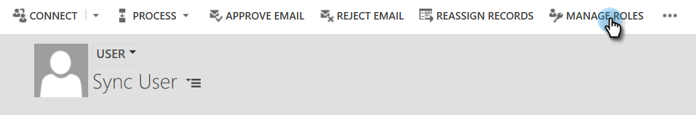
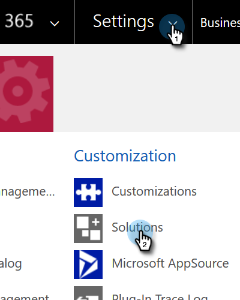

# Problemen met validatie synchroniseren van dynamiek verhelpen {#fix-dynamics-validation-sync-issues}

## Resultaten van gereedschap Sync valideren {#validate-sync-tool-results}

Wanneer u de Dynamica in werking stelt bevestigt Synchronisatie, produceert het een rapport. Als er een  naast een stap is, zie de opties hieronder om het probleem te identificeren en te bevestigen. Voer vervolgens de validatiestappen opnieuw uit totdat het resultaat alleen groene vinkjes weergeeft.

## URL is geldig {#url-is-valid}

Als u een  hier hebt, verifieer dat URL geldig is. Vind het hier in de Middelen van de Ontwikkelaar en bekijk de Dienst van de Organisatie. De URL kan om een aantal redenen ongeldig zijn.

1. Meld u aan bij Dynamics. Klik het pictogram van Montages en selecteer **Geavanceerde Montages**.

   

1. Klik Montages en selecteer **Aanpassingen**.

   

1. Klik {de Middelen van de Ontwikkelaar 0} **.**

   

1. De URL van de Dienst van de Organisatie kan onder de Eindpunten van de Dienst worden gevonden.

   

## Gebruikersnaam en wachtwoord zijn geldig {#username-and-password-are-valid}

Als u een  hier hebt, verifieer dat uw geloofsbrieven van Microsoft Dynamics geldig zijn. Voor de authentificatie van S2S van het Web API, moet de gebruikersbenaming in Marketo het [&#x200B; e-mailadres &#x200B;](https://docs.microsoft.com/en-us/power-platform/admin/manage-application-users#view-or-edit-the-details-of-an-application-user) van de Gebruiker van de Toepassing in CRM aanpassen. Voor andere typen moet deze overeenkomen met de gebruikersnaam voor de synchronisatiegebruiker.

## De gebruiker synchroniseren wordt toegewezen aan de Marketo Sync-gebruikersrol {#sync-user-is-assigned-to-the-marketo-sync-user-role}

Als u een  hier hebt, zou het één van de drie hieronder kwesties kunnen zijn.

**Optie één - verifieer dat de Rol van de Gebruiker van de Synchronisatie van Marketo in Microsoft Dynamics** wordt gecontroleerd:

1. In Dynamiek, klik het pictogram van Montages en selecteer **Geavanceerde Montages**.

   

1. Klik **Montages** en selecteer **Veiligheid**.

   

1. Klik **Gebruikers.**

   

1. Klik op de koppeling voor de synchronisatiegebruiker.

   

1. Klik **leiden Rollen**.

   

1. Controleer of de gebruikersrol Marketo Sync is ingeschakeld. Als niet, controleer het en klik **OK.**

   

**Optie Twee - bevestig Toestemming van de Verlening**:

1. Herzie de [&#x200B; Toestemming van de Verlening voor Identiteitskaart van de Cliënt en Registratie van de Toepassing &#x200B;](/help/marketo/product-docs/crm-sync/microsoft-dynamics-sync/sync-setup/grant-consent-for-client-id-and-app-registration.md) om app te bevestigen heeft admin toestemming om APIs te roepen.

**Optie Drie - de Gebruiker van de Synchronisatie**:

1. Controleer of de synchronisatiegebruiker is toegevoegd aan Marketo Config.

## Marketo-oplossing is correct geïnstalleerd {#marketo-solution-is-properly-installed}

Als u een  hier hebt, ga naar Microsoft Dynamics om te verifiëren de installatie van Marketo daar is. Zie Stap 1 van de Microsoft Dynamics-installatiedocumentatie.

1. In Dynamiek, klik het pictogram van Montages en selecteer **Geavanceerde Montages**.

   

1. Klik **Montages** en selecteer **Oplossingen.**

   

1. Controleer of de oplossing in de lijst staat.

   

## Alle stappen in de oplossing worden toegelaten {#all-steps-in-the-solution-are-enabled}

Als u een  hier hebt, verifieer dat geen van de standaardstappen zijn gedeactiveerd. Alle stappen worden automatisch ingeschakeld bij de installatie, maar kunnen tijdens een aanpassing worden gedeactiveerd.

## De synchronisatiegebruiker wordt toegewezen aan de Marketo-oplossing {#sync-user-is-assigned-to-the-marketo-solution}

Als u een  hier hebt, zorg ervoor de gebruiker van de Synchronisatie op de Standaard pagina van Marketo in Microsoft Dynamics wordt toegewezen.

1. In Dynamiek, klik het pictogram van Montages en selecteer **Geavanceerde Montages**.

   

1. Klik **Montages** en selecteer **Marketo Config**.

   

1. Controleer of de synchronisatiegebruiker als standaardwaarde is toegewezen.

   

## Gebruikersnamen en wachtwoord synchroniseren {#sync-user-matches-username-and-password}

Als u een  hier hebt, ben zeker om de juiste synchronisatiegebruiker op het gebied van de Gebruiker van Marketo in de Standaard de opstellingsstap van Marketo Config in Microsoft Dynamics toe te wijzen.

>[!MORELIKETHIS]
>
>[&#x200B; bevestigt de Synchronisatie van Microsoft Dynamics &#x200B;](/help/marketo/product-docs/crm-sync/microsoft-dynamics-sync/sync-setup/validate-microsoft-dynamics-sync.md)
