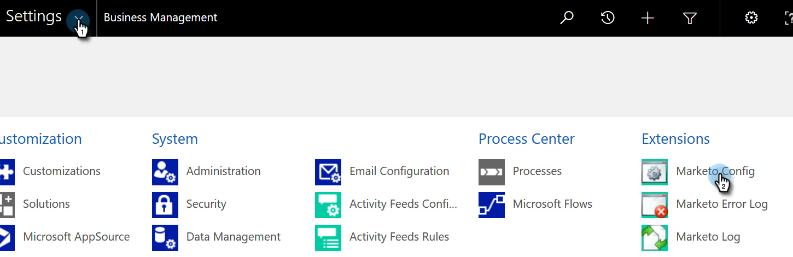

# Problemen met validatie synchroniseren van dynamiek verhelpen {#fix-dynamics-validation-sync-issues}

## Resultaten van gereedschap Sync valideren {#validate-sync-tool-results}

Wanneer u de Dynamica in werking stelt bevestigt Synchronisatie, produceert het dit rapport. Als er naast een stap een  is, zie hieronder om het probleem te identificeren en te bevestigen. Voer vervolgens de validatiestappen opnieuw uit totdat het resultaat alleen maar vinkjes weergeeft.

## URL is geldig {#url-is-valid}

Als u hier een  hebt, verifieer dat URL geldig is. Vind het hier in de Middelen van de Ontwikkelaar en bekijk de Dienst van de Organisatie. De URL kan om een aantal redenen ongeldig zijn.

1. Meld u aan bij Dynamics. Klik op het pictogram Instellingen en selecteer **Geavanceerde instellingen**.

   

1. Klik op Instellingen en selecteer **Aanpassingen**.

   

1. Klik op Bronnen voor **ontwikkelaars**.

   

1. De URL van de Dienst van de Organisatie kan onder de Eindpunten van de Dienst worden gevonden.

   

## Gebruikersnaam en wachtwoord zijn geldig {#username-and-password-are-valid}

Als u  verifieer dat uw gebruikersbenaming en wachtwoord van de Dynamiek van Microsoft geldig zijn.

## De gebruiker synchroniseren is toegewezen aan de rol Gebruiker markeren om te synchroniseren {#sync-user-is-assigned-to-the-marketo-sync-user-role}

Als u  -hier hebt, moet u verifiëren dat de rol van de Gebruiker van de Marketo van de Synchronisatie in de Dynamiek van Microsoft wordt gecontroleerd. Zie Stap 2 van de de installatiedocumentatie van de Dynamica van Microsoft.

1. Klik in Dynamiek op het pictogram Instellingen en selecteer **Geavanceerde instellingen**.

   

1. Klik op **Instellingen** en selecteer **Beveiliging**.

   

1. Klik op **Gebruikers.**

   

1. Klik op de koppeling voor de synchronisatiegebruiker.

   

1. Klik op Rollen **beheren**.

   

1. Controleer of de rol Marketo Sync User is ingeschakeld. Als dat niet het geval is, controleert u het en klikt u op **OK.**

   

## Marketo-oplossing is correct geïnstalleerd {#marketo-solution-is-properly-installed}

Als u  ga naar de Dynamica van Microsoft om de installatie van Marketo te verifiëren daar is. Zie Stap 1 van de de opstellingsdocumentatie van de Dynamica van Microsoft.

1. Klik in Dynamiek op het pictogram Instellingen en selecteer **Geavanceerde instellingen**.

   

1. Klik op **Instellingen **en selecteer **Oplossingen.**

   

1. Controleer of de oplossing in de lijst staat.

   

## Alle stappen in de oplossing worden toegelaten {#all-steps-in-the-solution-are-enabled}

Als u een  hier hebt, verifieer dat geen van de standaardstappen zijn gedeactiveerd. Alle stappen worden automatisch ingeschakeld bij de installatie, maar kunnen tijdens een aanpassing worden gedeactiveerd.

## De synchronisatiegebruiker wordt toegewezen aan de oplossing Marketo {#sync-user-is-assigned-to-the-marketo-solution}

Als u hebt  zorg ervoor de gebruiker van de Synchronisatie op de Marketo Standaard pagina in de Dynamiek van Microsoft wordt toegewezen.

1. Klik in Dynamiek op het pictogram Instellingen en selecteer **Geavanceerde instellingen**.

   

1. Klik op **Instellingen **en selecteer **Marketo Config**.

   

1. Controleer of de synchronisatiegebruiker als standaardwaarde is toegewezen.

   

## Gebruikersnamen en wachtwoord synchroniseren {#sync-user-matches-username-and-password}

Als u hebt  - hier, ben zeker om de juiste synchronisatiegebruiker op het gebied van de Gebruiker van het Marketo in de Standaardopstellingsstap van Config van het Marketo in de Dynamiek van Microsoft toe te wijzen.

>[!MORELIKETHIS]
>
>[Synchronisatie van Microsoft-dynamiek valideren](../../../../../product-docs/crm-sync/microsoft-dynamics-sync/sync-setup/validate-microsoft-dynamics-sync.md)

