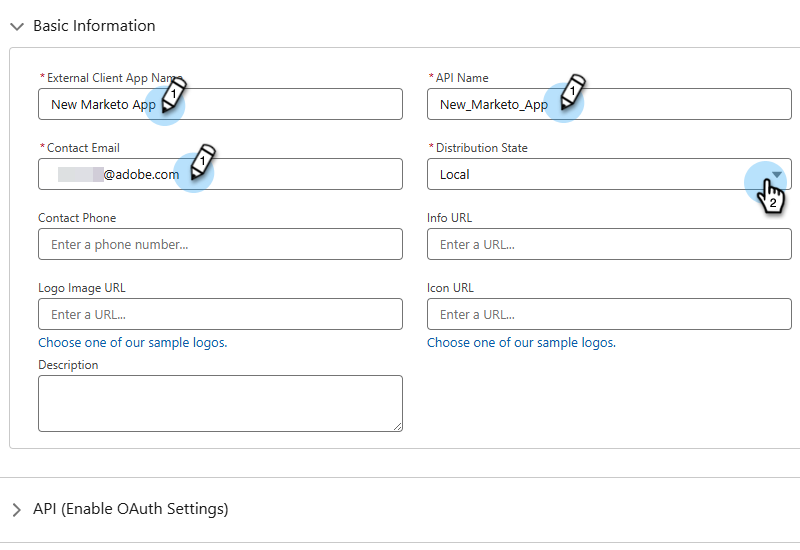

# Aanmelden met OAuth 2.0 {#log-in-using-oauth-2-0}

Salesforce gebruikt het protocol OAuth om gebruikers van toepassingen toe te staan om tot gegevens veilig toegang te hebben (de toepassing voor authentiek te verklaren gebruikend OAuth 2.0) zonder het moeten login geloofsbrieven openbaren. Hieronder vindt u de stappen die moeten worden uitgevoerd om Marketo Engage veilig te verbinden en te synchroniseren met Salesforce.

>[!IMPORTANT]
>
>Als u Marketo en [!DNL Salesforce] wilt verbinden met gebruik van OAuth, meldt u zich aan bij Marketo via een privébrowser (incognito) om te voorkomen dat u verbinding maakt met [!DNL Salesforce] met de verkeerde gebruikersnaam.

## Externe clienttoepassing instellen {#set-up-external-client-app}

>[!NOTE]
>
>Vanaf September 2025, begon Salesforce gebruik van [&#x200B; Verbonden Apps &#x200B;](https://help.salesforce.com/s/articleView?id=005132365&type=1){target="_blank"} te beperken. Voor bestaande gebruikers die op basis van onze documentatie een Connected App hebben ingesteld, kunt u de machtiging &quot;Uninstalled Connected Apps&quot; goedkeuren toevoegen aan het profiel van de Marketo Sync-gebruiker of een nieuwe externe Client App maken aan de hand van de onderstaande instructies.

1. In Salesforce, klik het tandwielpictogram en selecteer **Opstelling**.

   

1. In het Snelle vakje van de Vondst, type `App Manager`, dan uitgezochte **Manager van de App**.

   

1. Klik **Nieuwe Externe toepassing van de Cliënt**.

   

1. Vul de details onder _BasisInformatie_ in. Plaats _Staat van de Distributie_ aan **Lokale**.

   

1. Breid **API (laat OAuth Montages toe)** sectie uit en selecteer **[!UICONTROL Enable OAuth]** checkbox. Voor _Callback URL_, ga `https://app.marketo.com/salesforce/getSfdcOAuthTokensRedirect` in. Selecteer alle beschikbare OAuth-bereiken en klik op de pijl-rechts om deze toe te voegen.

   

1. Onder _Inschakeling van de Stroom_, zorg ervoor geen dozen worden geselecteerd.

   

1. Onder _Veiligheid_, zorg ervoor slechts **geheim voor de Stroom van de Server van het Web** vereist en **vereist geheim voor het Vernieuwen Symbolische Stroom** wordt geselecteerd.

   

1. Skip de laatste vier secties en klik **creeer**.

   

1. Nadat de nieuwe Externe Cliënt App wordt gecreeerd, klik het **lusje van Montages** en breid de **sectie van de Montages van de OAuth** uit.

   

1. Klik op de knop **Consumentencode en Consumentengeheim** en vraag een nieuw tabblad om te openen. Kopieer en sla beide getallen op (u hebt ze later nodig voor gebruik in Marketo Engage).

   

## Marketo instellen {#set-up-marketo}

>[!PREREQUISITES]
>
>* API-toegang moet zijn ingeschakeld voor de Salesforce Sync-gebruiker (als u een Salesforce Professional Edition-gebruiker bent, is deze toegang standaard niet beschikbaar. Neem contact op met uw Salesforce Account Executive).
>* Marketo Sync-gebruiker moet in Salesforce worden gemaakt.
>* Voor bestaande klanten is de functie &quot;OAuth inschakelen voor SFDC-synchronisatie&quot; ingeschakeld op het abonnement van de klant.
>* Pop-upblokkeerprogramma&#39;s zijn uitgeschakeld.
>* Connected App wordt gemaakt en de knoppen [!UICONTROL Consumer Key] en [!UICONTROL Consumer Secret] zijn beschikbaar voor gebruik.

>[!CAUTION]
>
>Verberg alle velden die u in Marketo niet nodig hebt voordat u op **[!UICONTROL Sync Fields]** klikt. Nadat u op Velden synchroniseren hebt geklikt, worden alle velden die de gebruiker kan zien in SFDC permanent gemaakt in Marketo en kunnen deze niet meer worden verwijderd.

1. Klik in de sectie Marketo Admin op **[!UICONTROL CRM]** en vervolgens op **[!UICONTROL Sync with Salesforce]** .

   

1. Voeg de gegevens Consumentencode en Consumentengeheim toe die u eerder hebt opgenomen en klik en **[!UICONTROL Save]** .

   

1. Klik op de synchronisatiepagina van Marketo Salesforce op de knop **[!UICONTROL Login with Salesforce]** .

   

   >[!CAUTION]
   >
   >Als u de velden Gebruikersnaam/Wachtwoord/Token ziet en niet de knop Aanmelden met Salesforce, is uw Marketo-abonnement ingeschakeld voor Basisverificatie. Gelieve te verwijzen naar [&#x200B; Opstelling Marketo met BasisAuthentificatie &#x200B;](/help/marketo/product-docs/crm-sync/salesforce-sync/setup/enterprise-unlimited-edition/step-3-of-3-connect-marketo-and-salesforce-enterprise-unlimited.md){target="_blank"}. Wanneer de synchronisatie begint met het gebruik van een set aanmeldingsgegevens, worden de Salesforce-gegevens of het abonnement niet meer gewijzigd. Om Oauth 2.0 opstelling voor uw authentificatie van Salesforce te hebben, contacteer [&#x200B; de Steun van Marketo &#x200B;](https://nation.marketo.com/t5/support/ct-p/Support){target="_blank"}.

1. Er wordt een pop-up weergegeven met de aanmeldingspagina voor verkopers. Sleutel in uw aanmeldingsgegevens voor &quot;Marketo Sync User&quot; (Gebruiker synchroniseren) en meld u aan.

   

1. Voer de verificatiecode in die je hebt ontvangen via e-mail (verzonden door Salesforce) en klik op **[!UICONTROL Verify]** .

   

1. Na succesvolle verificatie wordt de toegangspagina weergegeven met het verzoek om toegang. Klik op **[!UICONTROL Allow]**.

   

1. Over een paar minuten verschijnt er een pop-up in Marketo. Klik op **[!UICONTROL Confirm Credentials]**.

   

1. Klik op **[!UICONTROL Start Salesforce Sync]** als de veldsynchronisatie is voltooid.

   

1. Klik op **[!UICONTROL Start Sync]**.

   

Uw Synchronisatie tussen Marketo en [!DNL Salesforce] wordt nu uitgevoerd.

>[!MORELIKETHIS]
>
>* [&#x200B; Stap 1 van 3: Voeg de Gebieden van Marketo aan Salesforce (Onderneming/Onbeperkt) toe &#x200B;](/help/marketo/product-docs/crm-sync/salesforce-sync/setup/enterprise-unlimited-edition/step-1-of-3-add-marketo-fields-to-salesforce-enterprise-unlimited.md){target="_blank"}
>* [&#x200B; Stap 2 van 3: Creeer een Gebruiker van Salesforce voor Marketo (Onderneming/Onbeperkt) &#x200B;](/help/marketo/product-docs/crm-sync/salesforce-sync/setup/enterprise-unlimited-edition/step-2-of-3-create-a-salesforce-user-for-marketo-enterprise-unlimited.md){target="_blank"}
>* [&#x200B; installeer het Pakket van Insight van de Verkoop van Marketo in Salesforce AppExchange &#x200B;](/help/marketo/product-docs/marketo-sales-insight/msi-for-salesforce/installation/install-marketo-sales-insight-package-in-salesforce-appexchange.md){target="_blank"}
>* [&#x200B; vorm Marketo Verkoop Insight in de Onderneming van Salesforce/Onbeperkt &#x200B;](/help/marketo/product-docs/marketo-sales-insight/msi-for-salesforce/configuration/configure-marketo-sales-insight-in-salesforce-enterprise-unlimited.md){target="_blank"}
