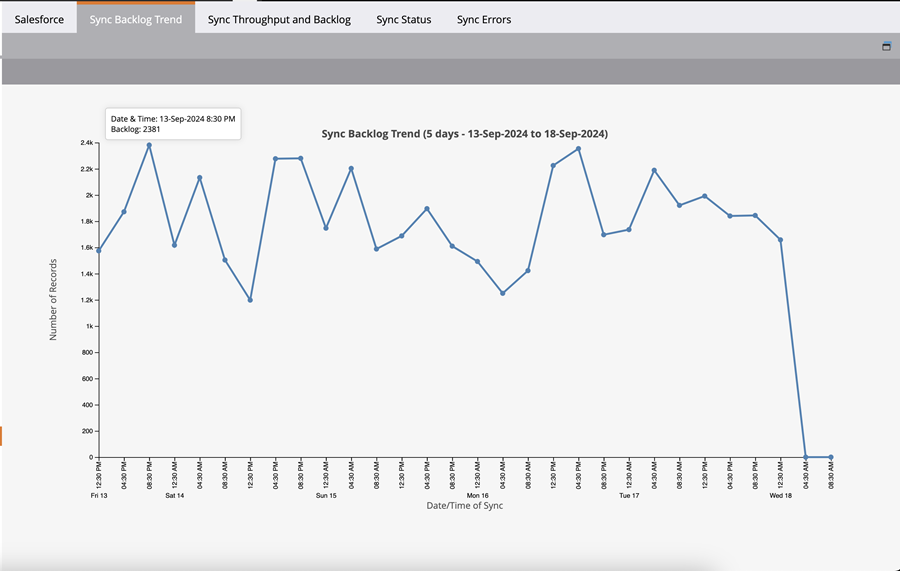

# Salesforce Sync Backlog Metrics  {#salesforce-sync-backlog-metrics}

De synchronisatieachterstand is de naam die wordt gebruikt voor de records die moeten worden gesynchroniseerd. Er worden records gearchiveerd die gesynchroniseerd moeten worden van Salesforce naar Marketo Engage, en andersom. Als u ervoor zorgt dat de back-up onder controle blijft, verloopt de synchronisatie vlot en verloopt de tijd. De achterstand heeft betrekking op de getallen die in afwachting zijn van een synchronisatie en niet op de getallen die worden uitgevoerd door stroomstappen te synchroniseren, zoals de stroomstappen &#39;Lead synchroniseren naar SFDC&#39;.

## Toegang krijgen {#how-to-access}

1. In Marketo Engage, ga naar het **Admin** gebied.

   

1. Selecteer **Salesforce**.

   

## Trend bij synchroniseren van back-up {#sync-backlog-trend}

De trend van de achterstand weerspiegelt veranderingen in de achterstand die in de afgelopen vijf dagen is geregistreerd. De achterstand wordt getoond in een 4-uurs tijdinterval spreidt zich over 5 dagen uit. Daarom zal de grafiek 6 intervallen per dag tijden 5 dagen tonen, die 30 intervallen evenaart.

Backlog wordt waargenomen bij een bepaald 4-uurs tijdinterval op de x-as. Deze waarde is voor alle objecten die gesynchroniseerd zijn. Dit is het totaal van de achterstand in Salesforce en Marketo Engage die wacht op synchronisatie.

## Doorvoer en back-up synchroniseren {#sync-throughput-and-backlog}

De statistieken geven de doorvoer en de status van de achterstand weer voor elk objecttype dat gedurende de laatste 24 uur gesynchroniseerd is. De objecttypen omvatten alle objecten die gesynchroniseerd zijn, zoals Lead, Contact, Account, Opportunity, Campagne, User en Custom Objects. De productiestatistieken worden automatisch vernieuwd om de 15 minuten, maar u kunt manueel verfrissen gebruikend het verfrissen pictogram. De achterstand wordt elk uur opgehaald.

>[!NOTE]
>
>Statistieken worden doorlopend bijgewerkt, niet per kalenderdag.

<table><thead>
  <tr>
    <th>Veld</th>
    <th>Beschrijving</th>
  </tr></thead>
<tbody>
  <tr>
    <td>Max records gesynchroniseerd / uur</td>
    <td>Het maximumaantal records dat per uur (maximale doorvoer) is gesynchroniseerd in de laatste 24 uur voor het objecttype. De periode van 24 uur rolt met tijd, niet de kalenderdag.</td>
  </tr>
  <tr>
    <td>Min. records gesynchroniseerd / uur</td>
    <td>Het minimumaantal records dat per uur (minimale doorvoer) is gesynchroniseerd in de laatste 24 uur voor het objecttype. De periode van 24 uur rolt met tijd, niet de kalenderdag.</td>
  </tr>
  <tr>
    <td>Gemiddelde records gesynchroniseerd / uur</td>
    <td>Het gemiddelde aantal records dat per uur (minimale doorvoer) is gesynchroniseerd in de laatste 24 uur voor het objecttype. De periode van 24 uur rolt met tijd, niet de kalenderdag. Dit wordt berekend als het totale aantal records dat in de laatste 24 uur is gesynchroniseerd.</td>
  </tr>
  <tr>
    <td>Back-up synchroniseren</td>
    <td>The backlog of records pending sync for the object type. Dit is het totaal van de achterstand bij synchronisatie in beide richtingen (van Salesforce naar Marketo Engage en omgekeerd). De achterstand van Salesforce wordt verkregen gebruikend een API vraag aan Salesforce, en de achterstand van Marketo Engage wordt berekend gebruikend de statistieken die uit het logboek van veranderingsgegevens worden verkregen. Dit wordt elk uur berekend. De volgende twee gebieden in deze lijst informeren wanneer de achterstand en het volgende programma voor berekening het laatst werd berekend, respectievelijk.</td>
  </tr>
  <tr>
    <td>Geschatte achterstand (tijd)</td>
    <td>Schatting van de tijd die nodig is om de achterstand per objecttype te synchroniseren. Berekend als 'Back-up/Gemiddeld synchroniseren records gesynchroniseerd per uur'.</td>
  </tr>
  <tr>
    <td>Backlog laatst opgehaald</td>
    <td>De tijd van de laatste backlogberekening.</td>
  </tr>
  <tr>
    <td>Backlog volgende fetch</td>
    <td>De tijd van de volgende backlogberekening.</td>
  </tr>
  <tr>
    <td>Backlogstatus</td>
    <td>Dit toont aan of de achterstand in de afgelopen 6 uur is gegroeid. Het wordt als "Groei"beschouwd als de huidige achterstand groter is dan de achterstand die zes uur geleden is geregistreerd. Anders wordt het weergegeven als 'Normaal'. Dit is gericht op het tonen van als de synchronisatieproductie met de achterstand inhaalt.</td>
  </tr>
</tbody></table>

## Wat veroorzaakt synchronisatiebacklogs {#what-causes-sync-backlogs}

Ongeacht of de update aan de Marketo Engage-zijde of aan de CRM-zijde wordt uitgevoerd, wordt de record opnieuw gesynchroniseerd om de informatie aan de andere kant via de normale Marketo Engage naar CRM-synchronisatiecyclus bij te werken. Wanneer een update aan een verslag op Salesforce wordt gemaakt, produceert het een Stempel van de Tijd van de Wijziging van het Systeem, die als &quot;SysModStamp wordt bedoeld.&quot; Hiermee wordt een synchronisatie-wijziging in de wachtrij geplaatst.

Wanneer een grote hoeveelheid updates wordt gemaakt (zoals van een veranderend gebied), worden vele verslagen veranderd, veroorzakend nieuwe SysModStamps. Een groot aantal updates van het persoonrecord moet dan opnieuw worden gesynchroniseerd tussen Marketo Engage en uw CRM, waardoor soms een kortstondige achterstand ontstaat.

## Aanbevolen procedures voor het beheren van synchronisatiebacklogs {#best-practices}

**Gebieden zichtbaar aan de Gebruiker van de Synchronisatie**: Zorg ervoor dat de gebieden zichtbaar aan synchronisatie slechts die zijn die moeten worden gesynchroniseerd en waarde aan marketing inspanningen hebben. Bij elke update van een record in Salesforce die het laatst gewijzigde tijdstempel bijwerkt, wordt een record in de wachtrij geplaatst van de synchronisatieachterstand. Hierdoor kan het langer duren voordat belangrijke velden gesynchroniseerd raken. Als de onnodige velden verborgen zijn voor de synchronisatiegebruiker, wordt bij het bijwerken van deze velden een overgeslagen waarde weergegeven die veel sneller is dan bij een update. Het werk met uw Admin van Salesforce om beste praktijken [&#x200B; hier &#x200B;](https://nation.marketo.com/t5/marketo-whisperer-blogs/best-practices-for-determining-which-fields-to-sync-with-marketo/ba-p/247449){target="_blank"} te herzien en bij te werken welke gebieden aan de Gebruiker van de Synchronisatie van Marketo zichtbaar zijn.

**Verberg of filter onnodige verslagen**: Als een verslag niet verhandelbaar is, kan het synchronisatiemiddelen verspillen. Als de synchronisatiegebruiker het niet kan zien, verspilt het geen middelen die proberen om het te synchroniseren. [&#x200B; de Steun van Marketo Engage &#x200B;](https://nation.marketo.com/t5/support/ct-p/Support#_blank){target="_blank"} kan vestiging een synchronisatiefilter helpen om verslagen te remmen die op extra criteria worden gebaseerd synchroniseren. Meer informatie over vestiging kan een Filter van de Synchronisatie van de Douane [&#x200B; hier worden gevonden &#x200B;](https://nation.marketo.com/t5/product-blogs/instructions-for-creating-a-custom-sync-rule/ba-p/242758){target="_blank"}. Het wordt sterk geadviseerd om indexgebieden binnen Salesforce te gebruiken (contactverkopers voor verdere informatie).

**bulkupdates van het Programma tijdens niet-kritieke uren**: Herzie uw patronen van de gegevenssynchronisatie om niet-kritieke periodes te identificeren. Controleer of bulkupdates indien mogelijk in deze niet-kritieke perioden kunnen worden gepland.

**vaak bijgewerkte gebieden**: Sommige gebieden zijn aan frequente updates vatbaar. Bijvoorbeeld valutavelden die aan valutawijzigingen zijn onderworpen. Controleer of deze moeten worden gesynchroniseerd of dat de velden anders moeten worden ontworpen. Als u andere velden hebt die vaak worden bijgewerkt en niet nodig zijn, verbergt u deze voor de synchronisatiegebruiker. Bespreek de integratie met uw SFDC-beheerprogramma&#39;s die mogelijk velden bijwerken.

**de voorwerpen van de Douane**: Herzie periodiek [&#x200B; douanevoorwerpen &#x200B;](https://experienceleague.adobe.com/nl/docs/marketo/using/product-docs/crm-sync/salesforce-sync/sfdc-sync-details/sfdc-sync-custom-object-sync){target="_blank"} toegelaten om die te synchroniseren en onbruikbaar te maken die niet meer moeten worden gesynchroniseerd.

**Activiteiten**: [&#x200B; Overzicht als om het even welke activiteiten &#x200B;](https://experienceleague.adobe.com/nl/docs/marketo/using/product-docs/crm-sync/salesforce-sync/setup/optional-steps/customize-activities-sync){target="_blank"} synchronisatie toeliet die van synchronisatie kan worden verwijderd.  Deze activiteiten worden slechts eenmaal per dag gesynchroniseerd per lead.

**de fouten van de Synchronisatie van het Overzicht**: De behandeling van de uitzondering kan de synchronisatie vertragen. Door gebruikersmeldingen te controleren en fouten op te lossen, kunt u de synchronisatiestatus verbeteren.

**Steun van het Contact**: Als u alle bovengenoemde beste praktijken volgt en nog significante backlogs ervaren, contacteer [&#x200B; Steun van Marketo Engage &#x200B;](https://nation.marketo.com/t5/support/ct-p/Support#_blank){target="_blank"}.
