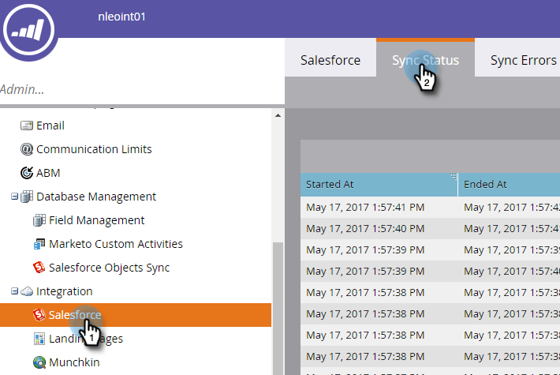

# Salesforce Sync Status {#salesforce-sync-status}

Gebruik het statusdashboard synchroniseren om synchronisatiestatussen weer te geven als onderdeel van de synchronisatiestappen en de successtatus.

De synchronisatiestappen weerspiegelen de bewerkingen van duw- of trekbewerkingen van elk objecttype voor het objectschema en de gegevens zelf. Statistische gegevens betreffen nieuwe records, updates, verwijderingen en mislukte aantallen tijdens het synchroniseren. Gebruikers kunnen filteren op datum, bewerkingstype of objecttype. Het statusdashboard voor synchronisatie toont de status van synchronisatiecycli in de afgelopen vijf dagen.

>[!NOTE]
>
>Beheerdersmachtigingen vereist

## Synchronisatiestatus weergeven {#view-sync-status}

1. Klik op **[!UICONTROL Admin]**.

   

1. Onder [!UICONTROL Integration], klik **Salesforce**, toen het **[!UICONTROL Sync Status]** lusje.

   

Standaard worden stats gesorteerd op basis van de status die het laatst is gestart. U kunt sorteren op Begonnen bij of Geëindigd bij (van meest recent aan oudst) door het soortpictogram te klikken.

## Synchronisatiestatus filter {#filter-sync-status}

1. Klik op het filterpictogram helemaal rechts van de pagina om de gegevens te filteren.

   

1. Selecteer de datum en het tijdbereik en klik vervolgens op de vervolgkeuzelijst(en) waarop u wilt filteren op [!UICONTROL Object Type] , [!UICONTROL Operation Type] en/of [!UICONTROL Status Type] .

   

1. Klik op **[!UICONTROL Apply]**.

   

**OPTIONELE STAP**: Om synchronisatiefouten uit te voeren, klik **[!UICONTROL Export]**. De gegevens worden geëxporteerd als een CSV.

## Statusvelden synchroniseren {#sync-status-fields}

<table>
 <colgroup>
  <col>
  <col>
  <col>
 </colgroup>
 <tbody>
  <tr>
   <th>Veld</th>
   <th>Beschrijving</th>
   <th>Enumwaarden</th>
  </tr>
  <tr>
   <td colspan="1">Gestart om</td>
   <td colspan="1">De begindatum/tijd van de synchronisatiecyclus (tijdzone van de gebruiker)</td>
   <td colspan="1"></td>
  </tr>
  <tr>
   <td colspan="1">Beëindigd bij</td>
   <td colspan="1">Einddatum/tijd van synchronisatiecyclus (tijdzone van gebruiker)</td>
   <td colspan="1"></td>
  </tr>
  <tr>
   <td colspan="1">Object</td>
   <td colspan="1">Objecttype</td>
   <td colspan="1">Contact, Persoon, Taak, Opportunity, Lead, Overige zoals hieronder</td>
  </tr>
  <tr>
   <td colspan="1">Bewerking</td>
   <td colspan="1">Type bewerking</td>
   <td colspan="1">Bewerkingstypen zoals hieronder</td>
  </tr>
  <tr>
   <td colspan="1">Status</td>
   <td colspan="1">Status van de partij</td>
   <td colspan="1">Voltooid, Mislukt, Niet voltooid, In proces, Opgeschoond*</td>
  </tr>
  <tr>
   <td colspan="1">Nieuw</td>
   <td colspan="1">Aantal nieuwe records</td>
   <td colspan="1"></td>
  </tr>
  <tr>
   <td colspan="1">Bijgewerkt</td>
   <td colspan="1">Aantal bijgewerkte records</td>
   <td colspan="1"></td>
  </tr>
  <tr>
   <td colspan="1">Verwijderd</td>
   <td colspan="1">Aantal verwijderde records</td>
   <td colspan="1"></td>
  </tr>
  <tr>
   <td colspan="1">Mislukt item</td>
   <td colspan="1">Aantal records waarvan synchronisatie is mislukt</td>
   <td colspan="1"> </td>
  </tr>
  <tr>
   <td colspan="1">Overgeslagen</td>
   <td colspan="1">Aantal records overgeslagen omdat er geen wijzigingen zijn aangebracht in de relevante velden voor de synchronisatie</td>
   <td colspan="1"></td>
  </tr>
 </tbody>
</table>

&#42; Gegevens keerden aan vorige staat van integriteit na de mislukking van de synchronisatiestap terug.

## Objecttype {#object-type}

<table>
 <colgroup>
  <col>
 </colgroup>
 <tbody>
  <tr>
   <td colspan="1">Account</td>
  </tr>
  <tr>
   <td colspan="1">Accounttype</td>
  </tr>
  <tr>
   <td colspan="1">Aangepaste objecten</td>
  </tr>
  <tr>
   <td colspan="1">Campaign</td>
  </tr>
  <tr>
   <td colspan="1">Campagne-lidstatus</td>
  </tr>
  <tr>
   <td colspan="1">Contact</td>
  </tr>
  <tr>
   <td colspan="1">E-mailsjabloon</td>
  </tr>
  <tr>
   <td colspan="1">Gebeurtenis</td>
  </tr>
  <tr>
   <td colspan="1">Persoon (lead)</td>
  </tr>
  <tr>
   <td colspan="1">Opportunity</td>
  </tr>
  <tr>
   <td colspan="1">Functie contactpersoon opportunity</td>
  </tr>
  <tr>
   <td colspan="1">Taak</td>
  </tr>
  <tr>
   <td colspan="1">Gebruiker</td>
  </tr>
 </tbody>
</table>

## Type bewerking {#operation-type}

<table>
 <colgroup>
  <col>
  <col>
  <col>
  <col>
 </colgroup>
 <tbody>
  <tr>
   <th>Type bewerking</th>
   <th>Gevonden tegen deze objecten</th>
   <th>Opmerkingen</th>
   <th>Type bewerking</th>
  </tr>
  <tr>
   <td colspan="1">Init link to Program</td>
   <td colspan="1">Campaign</td>
   <td colspan="1">Campagnes koppelen aan programma's</td>
   <td colspan="1">Bijwerken</td>
  </tr>
  <tr>
   <td colspan="1">Pull-omzettingen</td>
   <td colspan="1">Persoon (lead)*</td>
   <td colspan="1">Zet handelingen van SFDC om in Marketo. Eenheden (getallen) zijn leads die worden geconverteerd naar contactpersonen</td>
   <td colspan="1">Bijwerken, Mislukt item of Overgeslagen</td>
  </tr>
  <tr>
   <td colspan="1">Verwijderen verwijderen</td>
   <td colspan="1">Contact, Persoon (lead), Opportunity, Campagne, Campagne leden, opportunity Contact, Custom Objects, Campaigns, Campagne Member Status, Opportunity Contact Role</td>
   <td colspan="1">Verwijderde records van SFDC die worden gesynchroniseerd met Marketo</td>
   <td colspan="1">Verwijderd, mislukt item of overgeslagen</td>
  </tr>
  <tr>
   <td colspan="1">Updates uitvoeren</td>
   <td colspan="1">Taak, Persoon (lead), Person (lead) Wachtrij, Contact, Gebeurtenis, Opportunity, Account, Accounttype, Campagne-leden, Aangepaste objecten, Campagnes, Campagne-lidstatus, Gebeurtenissen, Personstatus, Opportunity, Opportunity Contactrol</td>
   <td colspan="1">Updates of nieuwe records in SFDC gesynchroniseerd met Marketo, Pull Events as Activity</td>
   <td colspan="1">Nieuw, Bijgewerkt, Mislukt item of Overgeslagen</td>
  </tr>
  <tr>
   <td colspan="1">Nieuwe duwen</td>
   <td colspan="1">Taken, e-mailsjablonen</td>
   <td colspan="1">Pushtaken (activiteiten)</td>
   <td colspan="1"></td>
  </tr>
  <tr>
   <td colspan="1">Push-updates</td>
   <td colspan="1">Taken, E-mailsjablonen, Person, Contact, Campagnes</td>
   <td colspan="1">Updates naar SFDC verscherpen en ook verwijderen</td>
   <td colspan="1">Bijwerken, Mislukt item of Overgeslagen</td>
  </tr>
  <tr>
   <td colspan="1">Schema synchroniseren</td>
   <td colspan="1">Campagneleden, aangepaste objecten, campagnes, status van campagnerelid, taken, persoon, opportuniteit, rol van contactpersoon voor opportunity, gebruikers</td>
   <td colspan="1">Hiermee synchroniseert u metagegevens voor verschillende objecten om te bepalen welke nieuwe velden in de volgende cyclus moeten worden gesynchroniseerd</td>
   <td colspan="1"></td>
  </tr>
  <tr>
   <td colspan="1">Synchroniseren met programma</td>
   <td colspan="1">Campagnes</td>
   <td colspan="1">Syncs Marketo-programma met SFDC-campagnes</td>
   <td colspan="1">Nieuw, Updates, Mislukt of Overgeslagen</td>
  </tr>
  <tr>
   <td colspan="1">Activiteiten bijwerken</td>
   <td colspan="1">Taken</td>
   <td colspan="1">Activiteiten uit Salesforce weghalen</td>
   <td colspan="1"></td>
  </tr>
  <tr>
   <td colspan="1">FKS bijwerken</td>
   <td colspan="1">Alles</td>
   <td colspan="1">Externe sleutel van alle objecten bijwerken</td>
   <td colspan="1">NVT</td>
  </tr>
 </tbody>
</table>

&#42; het brandmerken configuratie op het abonnementsniveau beslist het etiket - &quot;Lood&quot;of &quot;Persoon&quot;in het rapport.
