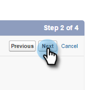

# Stap 1 van 3: Marketo-velden toevoegen aan Salesforce (Enterprise/Onbeperkt) {#step-of-add-marketo-fields-to-salesforce-enterprise-unlimited}

>[!PREREQUISITES]
>
>U moet toegang hebben tot de Salesforce API&#39;s om te kunnen synchroniseren tussen Marketo en Salesforce.

Marketo gebruikt een set velden om bepaalde soorten marketinggerelateerde informatie vast te leggen. Volg onderstaande instructies als u deze gegevens in Salesforce wilt bewaren.

1. Maak drie aangepaste velden in Salesforce voor de lead- en contactobjecten: Score, Acquisition Program en Acquisition Date.
1. Wijs deze douanevelden tussen lood en contacten toe zodat bij omzetting in Salesforce, de waarden zich overbrengen.
1. U kunt desgewenst andere aanvullende velden maken (zie de tabel hieronder).

Al deze aangepaste velden zijn optioneel en zijn niet vereist voor synchronisatie tussen Marketo en Salesforce. Als beste praktijken, adviseren wij dat u gebieden voor Score, het Programma van de Aankoop, en de Datum van de Aankoop creeert.

## Marketo-velden toevoegen aan Salesforce {#add-marketo-fields-to-salesforce}

Voeg drie aangepaste velden toe aan de lead- en contactobjecten in de bovenstaande Salesforce-lijst. Zie de tabel met beschikbare velden aan het einde van deze sectie voor meer informatie.

Voer de volgende stappen uit voor elk van de drie aangepaste velden om deze toe te voegen. Begin met score.

1. Meld u aan bij Salesforce en klik op **Setup**.

   

1. Klik in het menu Build aan de linkerkant op **Customize** en selecteer **Leads**. Klik **Velden**.

   

1. Klik op **Nieuw** in de sectie Aangepaste velden en relaties onder aan de pagina.

   

1. Kies het juiste veldtype (voor Score — Number); Overnameprogramma — tekst; Aankoopdatum — Datum/tijd).

   

1. Klik **Volgende**.

   

1. Voer het veldlabel, de lengte en de veldnaam voor het veld in, zoals in de onderstaande tabel wordt weergegeven.

<table> 
 <thead> 
  <tr> 
   <th> 
    

      Veldlabel 
    
</th> 
   <th> 
    

      Veldnaam 
    
</th> 
   <th> 
    

      Gegevenstype 
    
</th> 
   <th> 
    

      Veldkenmerken 
    
</th> 
  </tr> 
 </thead> 
 <tbody> 
  <tr> 
   <td>Score</td> 
   <td>mkto71_Lead_Score</td> 
   <td>Getal</td> 
   <td>Lengte 10 Decimale plaatsen 0 </td> 
  </tr> 
  <tr> 
   <td>Aankoopdatum</td> 
   <td>mkto71_Acquisition_Date</td> 
   <td>Datum/tijd</td> 
   <td> </td> 
  </tr> 
  <tr> 
   <td>Overnameprogramma</td> 
   <td>mkto71_Acquisition_Program</td> 
   <td>Tekst</td> 
   <td>Lengte 255</td> 
  </tr> 
 </tbody> 
</table>

>[!NOTE]
>
>Salesforce voegt __c aan de Namen van het Gebied toe wanneer het hen gebruikt om API Namen tot stand te brengen.

>[!NOTE]
>
>Tekst- en nummervelden vereisen een lengte, maar datum-/tijdvelden niet. Een beschrijving is optioneel.

1. Klik **Volgende**.

   

1. Geef de toegangsinstellingen op en klik op **Volgende**:

   * Alle rollen instellen op **Zichtbaar** en **Alleen-lezen**

   * Schakel het selectievakje **Alleen-lezen** voor het profiel van de synchronisatiegebruiker uit:

      * Als u een gebruiker met het profiel van een _Systeembeheerder_ als synchronisatiegebruiker hebt, schakelt u het selectievakje **Alleen-lezen** voor het beheerprofiel van het systeem uit (zoals hieronder wordt weergegeven).
      * Als u een _aangepast profiel_ voor de synchronisatiegebruiker hebt gemaakt, schakelt u het selectievakje **Alleen-lezen** voor dat aangepaste profiel uit

   

1. Kies de paginalay-outs die het veld moeten weergeven.

   

1. Klik **Opslaan &amp; Nieuw** om terug te gaan en elk van de andere twee aangepaste velden te maken. Klik **Save** met u wordt gedaan met alle drie.

   

1. Klik in het menu Build aan de linkerkant op **Customize** en selecteer Contactpersonen. Klik op Velden.
1. Voer stap 3 tot en met 10 voor de gebieden van de Score, van de Verwervingsdatum, en van het Programma van de Verwerving op het contactvoorwerp uit, enkel zoals u voor het loodvoorwerp deed.
1. U kunt de bovenstaande procedure ook gebruiken voor extra aangepaste velden uit deze tabel.

<table> 
 <thead> 
  <tr> 
   <th> 
    

      Veldlabel 
    
</th> 
   <th> 
    

      Veldnaam 
    
</th> 
   <th> 
    

      Gegevenstype 
    
</th> 
   <th> 
    

      Veldkenmerken 
    
</th> 
  </tr> 
 </thead> 
 <tbody> 
  <tr> 
   <td>Id van overnameprogramma</td> 
   <td>mkto71_Acquisition_Program_Id</td> 
   <td>Getal</td> 
   <td>Lengte 18 Decimale plaatsen 0 </td> 
  </tr> 
  <tr> 
   <td>Oorspronkelijke verwijzing</td> 
   <td>mkto71_Original_Referrer</td> 
   <td>Tekst</td> 
   <td>Lengte 255</td> 
  </tr> 
  <tr> 
   <td>Originele zoekengine</td> 
   <td>mkto71_Original_Search_Engine</td> 
   <td>Tekst</td> 
   <td>Lengte 255</td> 
  </tr> 
  <tr> 
   <td>Oorspronkelijke zoekterm</td> 
   <td>mkto71_Original_Search_Phrase</td> 
   <td>Tekst</td> 
   <td>Lengte 255</td> 
  </tr> 
  <tr> 
   <td>Originele broninformatie</td> 
   <td>mkto71_Original_Source_Info</td> 
   <td>Tekst</td> 
   <td>Lengte 255</td> 
  </tr> 
  <tr> 
   <td>Oorspronkelijk brontype</td> 
   <td>mkto71_Original_Source_Type</td> 
   <td>Tekst</td> 
   <td>Lengte 255</td> 
  </tr> 
  <tr> 
   <td>Overgenomen stad</td> 
   <td>mkto71_Inferred_City</td> 
   <td>Tekst</td> 
   <td>Lengte 255</td> 
  </tr> 
  <tr> 
   <td>Afgeleid bedrijf</td> 
   <td>mkto71_Inferred_Company</td> 
   <td>Tekst</td> 
   <td>Lengte 255</td> 
  </tr> 
  <tr> 
   <td>Afgeleid land</td> 
   <td>mkto71_Inferred_Country</td> 
   <td>Tekst</td> 
   <td>Lengte 255</td> 
  </tr> 
  <tr> 
   <td>Overgenomen metropolitaans gebied</td> 
   <td>mkto71_Inferred_Metropolitan_Area</td> 
   <td>Tekst</td> 
   <td>Lengte 255</td> 
  </tr> 
  <tr> 
   <td>Gebiedscode afgeleide telefoon</td> 
   <td>mkto71_Inferred_Phone_Area_Code</td> 
   <td>Tekst</td> 
   <td>Lengte 255</td> 
  </tr> 
  <tr> 
   <td>Postcode</td> 
   <td>mkto71_Inferred_Postal_Code</td> 
   <td>Tekst</td> 
   <td>Lengte 255</td> 
  </tr> 
  <tr> 
   <td>Gebied van de betrokken staat</td> 
   <td>mkto71_Inferred_State_Region</td> 
   <td>Tekst</td> 
   <td>Lengte 255</td> 
  </tr> 
 </tbody> 
</table>

## Aangepaste velden toewijzen voor conversies {#map-custom-fields-for-conversions}

Een aangepast veld op het hoofdobject in Salesforce moet worden toegewezen aan een contactveld op het contactobject, zodat gegevens worden overgedragen wanneer een conversie plaatsvindt.

1. Klik in de rechterbovenhoek op **Setup**.

   

1. Typ &quot;Velden&quot; in de Nav-zoekopdracht zonder op Enter te drukken. Velden worden onder verschillende objecten weergegeven. Klik **Velden** onder Leads.

   

1. Ga naar de sectie Aangepaste velden en relaties voor lead en klik op **Velden voor lead toewijzen**.

   

1. Klik op de vervolgkeuzelijst naast het veld dat u wilt toewijzen.

   

1. Selecteer het overeenkomende aangepaste veld voor de contactpersoon.

   

1. Herhaal bovenstaande stappen voor alle andere velden die u hebt gemaakt.

1. Klik **Opslaan** wanneer u klaar bent.

   Gemakkelijk genoeg, toch?

>[!MORELIKETHIS]
>
>[Stap 2 van 3: Een Salesforce-gebruiker voor Marketo maken (Enterprise/Onbeperkt)](/help/marketo/product-docs/crm-sync/salesforce-sync/setup/enterprise-unlimited-edition/step-2-of-3-create-a-salesforce-user-for-marketo-enterprise-unlimited.md)
