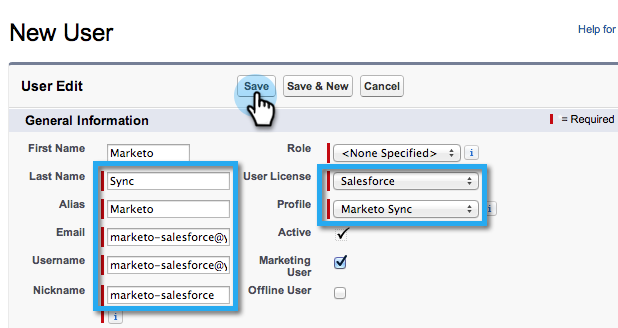

# Stap 2 van 3: Een [!DNL Salesforce] gebruiker voor Marketo maken (Enterprise/Onbeperkt) {#step-of-create-a-salesforce-user-for-marketo-enterprise-unlimited}

>[!NOTE]
>
>Deze stappen moeten worden uitgevoerd door een [!DNL Salesforce] beheerder

>[!PREREQUISITES]
>
>[&#x200B; Stap 1 van 3: Voeg de Gebieden van Marketo aan  [!DNL Salesforce]  toe (Onderneming/Onbeperkt) &#x200B;](/help/marketo/product-docs/crm-sync/salesforce-sync/setup/enterprise-unlimited-edition/step-1-of-3-add-marketo-fields-to-salesforce-enterprise-unlimited.md)

In dit artikel stelt u gebruikersmachtigingen in in het [!DNL Salesforce] -profiel en maakt u een Marketo- [!DNL Salesforce] -integratieaccount.

## Een profiel maken {#create-a-profile}

1. Klik op **[!UICONTROL Setup]**.

   

1. Typ &quot;profielen&quot; in de zoekbalk Nav en klik op de koppeling **[!UICONTROL Profiles]** .

   

1. Klik op **[!UICONTROL New]** .

   

1. Selecteer **[!UICONTROL Standard User]** , geef het profiel &quot;Marketo-Salesforce Sync&quot; een naam en klik op **[!UICONTROL Save]** .

   

## Profielmachtigingen instellen {#set-profile-permissions}

1. Klik op **[!UICONTROL Edit]** om de beveiligingsmachtigingen in te stellen.

   

1. Controleer of onder de sectie **[!UICONTROL Administrative Permissions]** de volgende vakken zijn ingeschakeld:

   * [!UICONTROL API Enabled]
   * [!UICONTROL Edit HTML Templates]
   * [!UICONTROL Manage Public Documents]
   * [!UICONTROL Manage Public Templates]

   

   >[!TIP]
   >
   >Controleer het vakje **[!UICONTROL Password Never Expires]** .

1. Controleer of onder de sectie [!UICONTROL General User Permissions] de volgende vakken zijn ingeschakeld:

   * [!UICONTROL Convert Leads]
   * [!UICONTROL Edit Events]
   * [!UICONTROL Edit Tasks]

   

1. Controleer in de sectie [!UICONTROL Standard Object Permissions] of [!UICONTROL Read, Create, Edit, and Delete] -machtigingen zijn gecontroleerd op:

   * [!UICONTROL Accounts]
   * [!UICONTROL Campaigns]
   * [!UICONTROL Contacts]
   * [!UICONTROL Leads]
   * [!UICONTROL Opportunities]

   >[!NOTE]
   >
   >Rechten verlenen aan de [!UICONTROL Campaigns] als u Campagne Sync wilt gebruiken.

   

1. Als u klaar bent, klikt u op **[!UICONTROL Save]** onder aan de pagina.

   

## Veldmachtigingen instellen {#set-field-permissions}

1. Bespreek met uw marketers welke aangepaste velden nodig zijn voor synchronisatie.

   >[!NOTE]
   >
   >Met deze stap voorkomt u dat velden die u niet nodig hebt, worden weergegeven in Marketo, waardoor de synchronisatie minder rommelig wordt en sneller verloopt.

1. Ga naar de sectie **[!UICONTROL Field-Level Security]** in de pagina met profieldetails. Klik op **[!UICONTROL View]** om de toegankelijkheid voor de objecten te bewerken:

   * [!UICONTROL Lead]
   * [!UICONTROL Contact]
   * [!UICONTROL Account]
   * [!UICONTROL Opportunity]

   >[!TIP]
   >
   >U kunt andere voorwerpen op de behoeften van uw organisatie vormen.

   

1. Klik voor elk object op **[!UICONTROL Edit]** .

   

1. Zoek de overbodige velden. Controleer of **[!UICONTROL Read Access]** en **[!UICONTROL Edit Access]** zijn uitgeschakeld. Klik op **[!UICONTROL Save]** wanneer u klaar bent.

   >[!NOTE]
   >
   >Bewerk alleen de toegankelijkheid voor de aangepaste velden.

   

1. Nadat u alle overbodige velden hebt uitgeschakeld, moet u **[!UICONTROL Read Access and Edit Access]** controleren op de volgende objectvelden. Klik op **[!UICONTROL Save]** wanneer u klaar bent.

<table>
 <tbody>
  <tr>
   <th>Object</th>
   <th>Velden</th>
  </tr>
  <tr>
   <td>Account</td>
   <td>Tekstveld</td>
  </tr>
  <tr>
   <td>Gebeurtenis</td>
   <td>Alle velden</td>
  </tr>
  <tr>
   <td>Taak</td>
   <td>Alle velden</td>
  </tr>
 </tbody>
</table>

## Marketo-Salesforce-synchronisatieaccount maken {#create-marketo-salesforce-sync-account}

>[!TIP]
>
>Maak een toegewijde [!DNL Salesforce] -account (bijvoorbeeld <marketo@yourcompany.com> ) om onderscheid te maken tussen de wijzigingen die door Marketo en andere [!DNL Salesforce] -gebruikers zijn aangebracht.

1. Typ &quot;Gebruikers beheren&quot; in de zoekbalk Nav en klik op **[!UICONTROL Users]** . Klik op **[!UICONTROL New User]** .

   

1. Vul de vereiste velden in. Selecteer vervolgens de **[!UICONTROL User License: Salesforce]** en het profiel die u eerder hebt gemaakt. Klik op **[!UICONTROL Save]** wanneer u klaar bent.

   

Stap 2 van 3 is voltooid.

>[!NOTE]
>
>[&#x200B; Stap 3 van 3: Verbind Marketo en  [!DNL Salesforce]  (Onderneming/Onbeperkt) &#x200B;](/help/marketo/product-docs/crm-sync/salesforce-sync/setup/enterprise-unlimited-edition/step-3-of-3-connect-marketo-and-salesforce-enterprise-unlimited.md)
