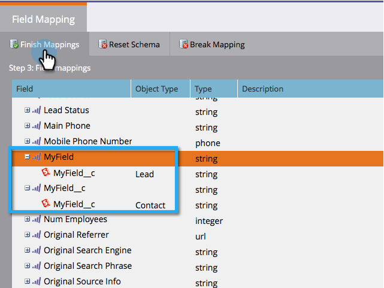

# Aanvankelijke veldtoewijzingen bewerken {#edit-initial-field-mappings}

>[!NOTE]
>
>Deze functie is alleen toegankelijk vóór de eerste synchronisatie met Salesforce. Wanneer de **[!UICONTROL Sync Now]** wordt ingedrukt, kan dit niet meer worden gedaan.

Tijdens de eerste synchronisatie met Salesforce combineert Marketo Engage automatisch aangepaste velden met dezelfde naam tot één veld aan Marketo-zijde, zodat de gegevens kunnen worden uitgewisseld met objecten Lead en Contact in de CRM. In dit artikel wordt uitgelegd hoe u deze toewijzingen kunt aanpassen.

## Niet-toegewezen velden toewijzen {#map-unmapped-fields}

Wanneer u een veld ziet in het dialoogvenster [!UICONTROL Unmapped Fields] , betekent dit dat het niet is toegewezen aan een vergelijkbaar veld op de lead of contactpersoon in Salesforce. U kunt dat herstellen.

1. Klik op **[!UICONTROL Edit Mappings]**.

1. Open de **[!UICONTROL Unmapped Custom Fields]** map.

   

1. Sleep een niet-toegewezen aangepast veld naar een ander veld om de velden samen toe te wijzen.

   >[!NOTE]
   >
   >U kunt alleen aangepaste veldtoewijzingen bewerken. Standaardveldtoewijzingen kunnen niet worden gewijzigd.

   

1. Klikken **[!UICONTROL Finish Mappings]** als u klaar bent.

   

## Bestaande toewijzing verbreken {#break-existing-mapping}

Als u velden met dezelfde naam op de lead en het contactobject hebt, wijst Marketo deze automatisch toe. U kunt ze anders vinden en verschillende gegevens bevatten. Breek de afbeelding zo uit.

1. Klik op **[!UICONTROL Edit Mappings]**.

   

1. Een toegewezen veld markeren en klikken **[!UICONTROL Break Mapping]** om de velden te scheiden.

   

1. Klikken **[!UICONTROL Finish Mappings]** als je klaar bent.

   

   Mooi! U bent bijna klaar met de eerste synchronisatie.

## Schema opnieuw instellen {#reset-schema}

1. Als u enkele wijzigingen aanbrengt in het schema in Salesforce terwijl u aan de toewijzingen werkt, kunt u de wijzigingen terugtrekken door op **[!UICONTROL Reset Schema]**.

   * Alle toewijzingswijzigingen worden opnieuw ingesteld.
   * Als u het schema opnieuw instelt, worden alleen velden toegevoegd en niet verwijderd (zelfs als u deze verbergt voor de synchronisatiegebruiker).

   
