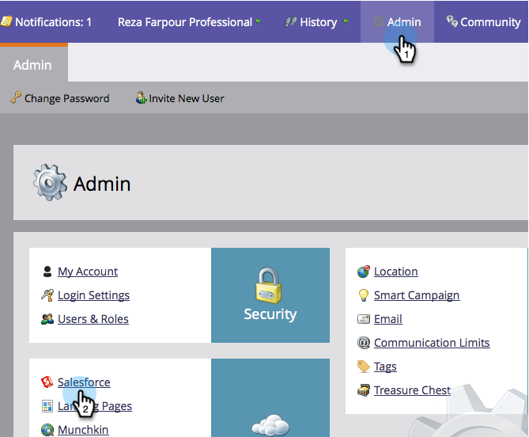

# Campagne synchroniseren inschakelen/uitschakelen {#enable-disable-campaign-sync}

>[!NOTE]
>
>**vereiste toestemmingen Admin**

Met deze optie kan Marketo Engage het lidmaatschap en de status van zijn programma synchroniseren met Salesforce-campagnes en omgekeerd.

1. Ga naar **[!UICONTROL Admin]** en klik op **[!DNL Salesforce]** .

   

1. Klik op **[!UICONTROL Edit Sync Settings]**.

   

1. Controleer **[!UICONTROL Enable Salesforce Campaign Sync]** en klik op **[!UICONTROL Save]** .

   

Daar heb je het. Geef de synchronisatie gewoon wat tijd om de gegevens van Salesforce op te halen en je kunt er goed aan doen.

>[!MORELIKETHIS]
>
>* [ Synchronisatie van SFDC: De Synchronisatie van de Campagne ](/help/marketo/product-docs/crm-sync/salesforce-sync/sfdc-sync-details/sfdc-sync-campaign-sync.md){target="_blank"}
>* [ plaats de StandaardNaam van de Lood en de Waarden van het Bedrijf ](/help/marketo/product-docs/crm-sync/salesforce-sync/setup/optional-steps/set-default-person-last-name-and-company-name.md){target="_blank"}
>* [ pas de Synchronisatie van Activiteiten ](/help/marketo/product-docs/crm-sync/salesforce-sync/setup/optional-steps/customize-activities-sync.md){target="_blank"} aan
