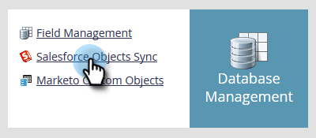

# Aangepaste objectsynchronisatie inschakelen/uitschakelen {#enable-disable-custom-object-sync}

Aangepaste objecten die in uw Salesforce-instantie zijn gemaakt, kunnen ook deel uitmaken van het Marketo Engage. Hier is hoe u het kunt instellen.

## Aangepaste objectsynchronisatie inschakelen/uitschakelen {#enable-disable-custom-object-sync-1}

>[!NOTE]
>
>**Beheerdersmachtigingen vereist**

1. Klik op **[!UICONTROL Admin]**.

   

1. Klik in het menu Database Management op **[!UICONTROL Salesforce Objects Sync]**.

   

1. Als dit uw eerste aangepaste object is, klikt u op **[!UICONTROL Sync schema]**. Anders klikken **[!UICONTROL Refresh Schema]** om ervoor te zorgen dat u over de nieuwste informatie beschikt.

   

1. Als de algemene synchronisatie wordt uitgevoerd, moet u deze uitschakelen door op **[!UICONTROL Disable Global Sync]**.

   

   >[!NOTE]
   >
   >Een synchronisatie van het schema van aangepaste Salesforce-objecten kan een paar minuten duren.

1. Klik op **[!UICONTROL Refresh Schema]**.

   

1. Selecteer het object dat u wilt synchroniseren en klik **[!UICONTROL Enable Sync]**.

   >[!TIP]
   >
   >Marketo kan een aangepast object alleen synchroniseren als het een directe relatie heeft met het object Lead, Contact of Account in Salesforce.

   

1. Klikken **[!UICONTROL Enable Sync]** opnieuw.

   

1. Ga terug naar de **[!DNL Salesforce]** en klik op **[!UICONTROL Enable Sync]**.

   

## Aangepaste objecten gebruiken {#using-your-custom-objects}

>[!NOTE]
>
>U kunt geen aangepaste objecten gebruiken in slimme campagnes met triggers.

1. Sleep in de slimme lijst over de **[!UICONTROL Has Opportunity]** filter en instellen op **[!UICONTROL true]**.

   

1. Gebruik vervolgens filterbeperkingen om de focus te beperken.

   

   Uitstekend! U kunt de gegevens van dit aangepaste object nu gebruiken in slimme campagnes en slimme lijsten.

>[!MORELIKETHIS]
>
>[Aangepast objectveld toevoegen/verwijderen als slimme lijst/triggerbeperkingen](/help/marketo/product-docs/crm-sync/salesforce-sync/setup/optional-steps/add-remove-custom-object-field-as-smart-list-trigger-constraints.md){target="_blank"}
