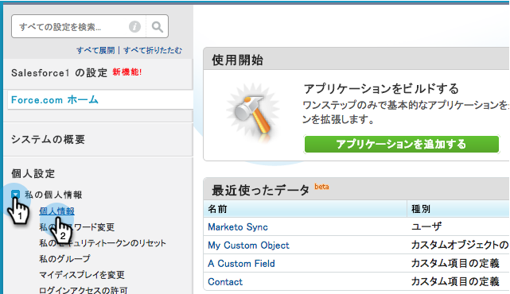

# Niet-Engelse aangepaste objectsynchronisatie inschakelen {#enable-non-english-custom-object-sync}

Als uw Marketo-synchronisatiegebruiker is ingesteld op een andere taal dan Engels, treedt er mogelijk een fout op wanneer u probeert een aangepaste objectsynchronisatie in te schakelen.

## De fout {#the-error}

## Aan de slag {#getting-around-it}

1. Meld u aan bij [!DNL Salesforce] met behulp van de markering om de gebruiker te synchroniseren.

   

1. Ga onder de gebruikersnaam naar **[!UICONTROL Setup]** .

   

1. Klik onder **[!UICONTROL Personal Information]** op **[!UICONTROL My Personal Information]** .

   

1. Klik op **[!UICONTROL Edit]**.

   

1. Wijzig **[!UICONTROL Language]** in **[!UICONTROL English]** .

   

1. Klik op **[!UICONTROL Save]**.

   

1. Klik nogmaals onder **[!UICONTROL Admin]** > **[!UICONTROL Salesforce]** > **[!UICONTROL Objects]** in Marketo op **[!UICONTROL Refresh Schema]** .

   

1. Hierdoor wordt de lijst met objecten in het Engels weergegeven. Selecteer nu het gewenste object en klik op **[!UICONTROL Enable Sync]** .

   

1. Het aangepaste object is nu ingeschakeld en gesynchroniseerd.

   

1. Ga nu terug naar [!DNL Salesforce] en gebruik de bovenstaande stappen om de synchronisatiegebruiker terug te sturen naar de voorkeurstaal.

>[!NOTE]
>
>Vergeet niet het schema een laatste keer vernieuwen om de objecten weer in uw taal te plaatsen.
