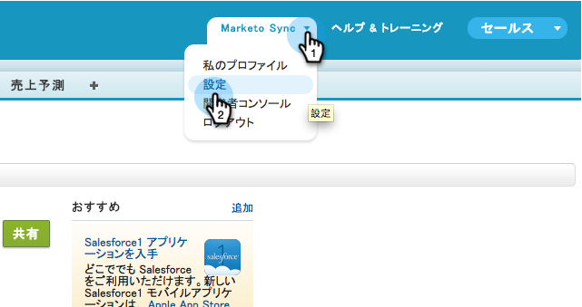
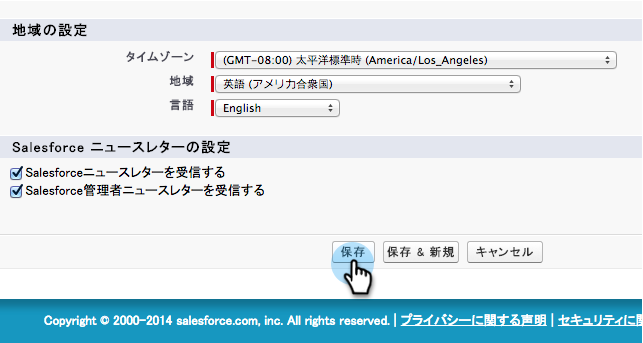

# Niet-Engelse aangepaste objectsync {#enable-non-english-custom-object-sync} inschakelen

Als uw Marketo-synchronisatiegebruiker is ingesteld op een andere taal dan Engels, treedt er mogelijk een fout op wanneer u probeert een aangepaste objectsynchronisatie in te schakelen.

## De fout {#the-error}

## Aan de {#getting-around-it}

1. Meld u aan bij Salesforce met behulp van de markering om de gebruiker te synchroniseren.

   

1. Ga onder de gebruikersnaam naar **Setup**.

   

1. Onder **Persoonlijke Informatie**, klik **Mijn Persoonlijke Informatie**.

   

1. Klik **Bewerken**.

   

1. Wijzig **Taal** in **Engels**.

   

1. Klik **Opslaan**.

   

1. Ga terug in Marketo, onder **Admin > Salesforce > Objecten** klik **Schema vernieuwen**.

   

1. Hierdoor wordt de lijst met objecten in het Engels weergegeven. Selecteer nu het object van uw keuze en klik op **Sync inschakelen**.

   

1. Het aangepaste object is nu ingeschakeld en gesynchroniseerd.

   

1. Ga nu terug naar Salesforce en gebruik de bovenstaande stappen om de synchronisatiegebruiker terug te sturen naar de voorkeurstaal.

>[!NOTE]
>
>Vergeet niet het schema een laatste keer vernieuwen om de objecten weer in uw taal te plaatsen.
