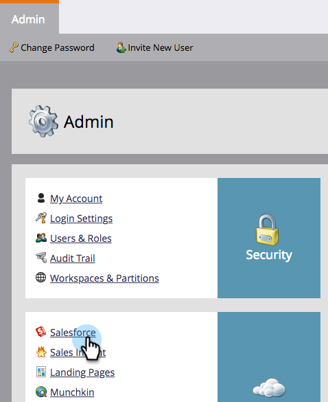

# E-mailberichten uitschakelen naar eigenaar van lead {#turn-off-email-notifications-to-lead-owner}

U kunt de automatische e-mailmeldingen uitschakelen die naar Lead-eigenaars in Salesforce worden verzonden bij toewijzing van leads. Zo gaat het.

1. Ga naar **[!UICONTROL Admin]**.

   

1. Klik op **[!DNL Salesforce]**.

   

1. Onder **[!UICONTROL Sync Options]**, klikt u op **[!UICONTROL Edit]**.

   

1. Schakel het selectievakje **[!UICONTROL Send email notification to owner in Salesforce upon lead assignment]** doos. Klik op **[!UICONTROL Save]**.

   
