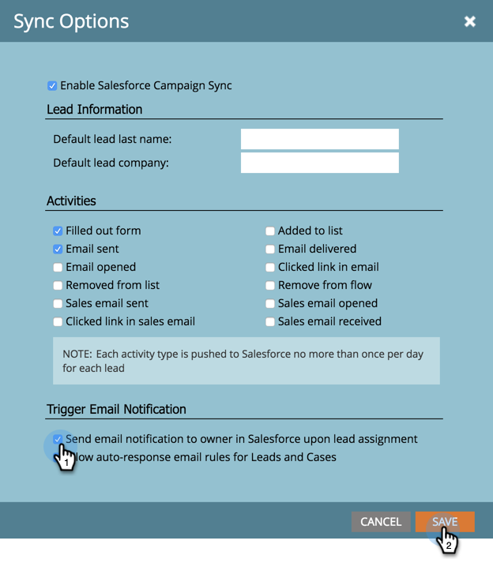

# E-mailberichten uitschakelen naar eigenaar van lead {#turn-off-email-notifications-to-lead-owner}

U kunt de automatische e-mailmeldingen die naar Lead-eigenaars worden verzonden in [!DNL Salesforce] uitschakelen bij Toewijzing lead. Zo gaat het.

1. Ga naar **[!UICONTROL Admin]** .

   

1. Klik op **[!DNL Salesforce]**.

   

1. Klik onder **[!UICONTROL Sync Options]** op **[!UICONTROL Edit]** .

   

1. Schakel het selectievakje **[!UICONTROL Send email notification to owner in Salesforce upon lead assignment]** uit. Klik op **[!UICONTROL Save]**.

   
