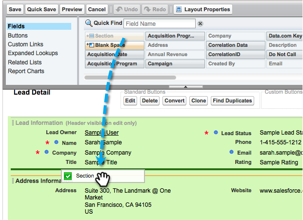

# Stap 2 van 3: Een Salesforce-gebruiker voor Marketo maken (Professional) {#step-of-create-a-salesforce-user-for-marketo-professional}

>[!NOTE]
>
>Deze stappen moeten door een beheerder van Salesforce worden voltooid.

>[!PREREQUISITES]
>
>[Stap 1 van 3: Voeg Marketo-velden toe aan Salesforce (Professional)](/help/marketo/product-docs/crm-sync/salesforce-sync/setup/professional-edition/step-1-of-3-add-marketo-fields-to-salesforce-professional.md){target="_blank"}

In dit artikel past u veldmachtigingen aan met een Salesforce Page Layout en maakt u een Marketo-Salesforce synchronisatiegebruiker.

## Paginalay-outs instellen {#set-page-layouts}

Salesforce Professional stelt toegankelijkheid op veldniveau in met paginalay-outs, in tegenstelling tot de profielen van Salesforce Enterprise/Unlimited. Als u deze stappen uitvoert, kan de Marketo-synchronisatiegebruiker de aangepaste velden bijwerken.

1. Typ &quot;[!UICONTROL page layouts]&quot; in de zoekbalk van Nav zonder op **[!UICONTROL Enter]** en klik op **[!UICONTROL Page Layout]** krachtens **[!UICONTROL Leads]**.

   

1. Klikken **[!UICONTROL Edit]** naast Lay-out lead.

   

1. Klik en sleep een nieuwe **[!UICONTROL Section]** in de pagina-indeling.

   

1. Voer &quot;Marketo&quot; in voor **[!UICONTROL Section Name]** en klik op **[!UICONTROL OK]**.

   

1. Klik en sleep het veld **[!UICONTROL Acquisition Date]** in de **Marketo** sectie.

   

1. Herhaal bovenstaande stap voor de volgende velden:

   * Overnameprogramma
   * Id van overnameprogramma
   * E-mail uitschakelen
   * Overgenomen stad
   * Afgeleid bedrijf
   * Afgeleid land
   * Overgenomen metropolitaans gebied
   * Gebiedscode afgeleide telefoon
   * Postcode
   * Gebied van de betrokken staat
   * Leadscore
   * Oorspronkelijke verwijzing
   * Originele zoekengine
   * Oorspronkelijke zoekterm
   * Originele broninformatie
   * Oorspronkelijk brontype

   >[!NOTE]
   >
   >Deze velden moeten in de paginalay-out staan, zodat Marketo ze kan lezen/schrijven.

   >[!TIP]
   >
   >Maak twee kolommen voor de velden door naar de rechterkant van de pagina te slepen. U kunt velden van de ene naar de andere zijde verplaatsen om de kolomlengte in evenwicht te brengen.

1. Klikken **[!UICONTROL Save]** als u klaar bent met het toevoegen van velden.

   

1. Herhaal alle bovenstaande stappen voor de Salesforce **[!UICONTROL Contact Page Layout]**.

   

1. Vergeet niet te klikken **[!UICONTROL Save]** als u klaar bent met de **[!UICONTROL Contact Page Layout]**.

   

   >[!NOTE]
   >
   >Zorg ervoor dat de **[!UICONTROL All-Day Event]** veld is toegevoegd aan de **[!UICONTROL Event Page Layout]**.

## Synchronisatiegebruiker maken {#create-sync-user}

Marketo heeft aanmeldingsgegevens nodig om toegang te krijgen tot Salesforce. Dit kunt u het beste doen met een toegewijde gebruiker die is gemaakt met de onderstaande stappen.

>[!NOTE]
>
>Als uw organisatie geen extra licenties voor Salesforce heeft, kunt u een bestaande marketinggebruiker gebruiken met het profiel Systeembeheerder.

1. Voer &quot;gebruikers&quot; in op de zoekbalk Nav en klik op **[!UICONTROL Users]** krachtens **[!UICONTROL Manage Users]**.

   

1. Klik op **[!UICONTROL New User]**.

   

1. Vul de vereiste gebieden in, selecteer **[!UICONTROL User License: Salesforce]**, stelt u de **[!UICONTROL Profile: System Administrator]**, controle **[!UICONTROL Marketing User]** en klik op **[!UICONTROL Save]**.

   

   >[!TIP]
   >
   >Controleer of het e-mailadres dat u invoert, geldig is. U moet zich aanmelden als de synchronisatiegebruiker om het wachtwoord opnieuw in te stellen.

Uitstekend! Nu hebt u een account dat Marketo kan gebruiken om verbinding te maken met Salesforce. Laten we het doen.

>[!MORELIKETHIS]
>
>[Stap 3 van 3: Connect Marketo en Salesforce (Professional)](/help/marketo/product-docs/crm-sync/salesforce-sync/setup/professional-edition/step-3-of-3-connect-marketo-and-salesforce-professional.md){target="_blank"}
