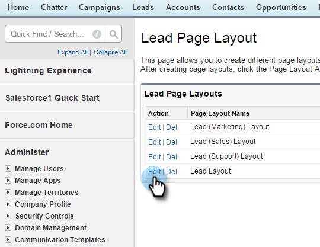

# Stap 2 van 3: Een Salesforce-gebruiker maken voor markeren (Professional) {#step-of-create-a-salesforce-user-for-marketo-professional}

>[!NOTE]
>
>Deze stappen moeten door een beheerder van Salesforce worden voltooid

>[!PREREQUISITES]
>
>* [Stap 1 van 3: Marketo-velden toevoegen aan Salesforce (Professional)](step-1-of-3-add-marketo-fields-to-salesforce-professional.md)

>

In dit artikel past u de veldmachtigingen aan met een Salesforce Page Layout en maakt u een synchronisatiegebruiker Marketo-Salesforce.

## Paginalay-outs {#set-page-layouts} instellen

Salesforce Professional stelt toegankelijkheid op veldniveau in met paginalay-outs, in tegenstelling tot de profielen van Salesforce Enterprise/Unlimited. Als u deze stappen uitvoert, kan de Marketo de gebruiker synchroniseren om de aangepaste velden bij te werken.

1. Typ **paginalay-outs** in de zoekbalk Nav zonder op **Enter** te drukken en klik **Paginalay-out** onder **Leads**.

   

1. Klik **Bewerken** naast Lay-out.

   

1. Klik en sleep een nieuwe **Sectie** in de paginalay-out.

   

1. Voer &quot;Marketo&quot; in voor **Sectienaam** en klik op **OK**.

   

1. Klik en sleep het gebied **Verwervingsdatum** in **Marketo** sectie.

   

1. Herhaal bovenstaande stap voor de volgende velden:

   * Overnameprogramma
   * Id van overnameprogramma
   * E-mail uitschakelen
   * Overgenomen stad
   * Overgenomen onderneming
   * Overgenomen land
   * Overgenomen metropolitaans gebied
   * Gebiedscode afgeleide telefoon
   * Postcode
   * Gebied van de betrokken staat
   * Loodscore
   * Oorspronkelijke verwijzing
   * Originele zoekengine
   * Oorspronkelijke zoekterm
   * Originele broninformatie
   * Oorspronkelijk brontype

   >[!NOTE]
   >
   >Deze velden moeten in de paginalay-out staan, zodat Marketo ze kan lezen/schrijven.

   >[!TIP]
   >
   >Maak twee kolommen voor de velden door naar de rechterkant van de pagina te slepen. U kunt velden van de ene naar de andere zijde verplaatsen om de kolomlengte in evenwicht te brengen.

1. Klik **Opslaan** wanneer u klaar bent met het toevoegen van velden.

   

1. Herhaal alle bovenstaande stappen voor de Salesforce **Contactpagina-indeling**.

   

1. Vergeet niet **Opslaan** te klikken wanneer u klaar bent met **Pagina-indeling van contact**.

   

   >[!NOTE]
   >
   >**Herinnering**
   >
   >
   >Zorg ervoor dat het veld **All-Day Event** is toegevoegd aan **Layout gebeurtenispagina**.

## Synchronisatiegebruiker {#create-sync-user} maken

Marketo heeft referenties nodig om toegang te krijgen tot Salesforce. Dit kunt u het beste doen met een toegewijde gebruiker die is gemaakt met de onderstaande stappen.

>[!NOTE]
>
>Als uw organisatie geen extra licenties voor Salesforce heeft, kunt u een bestaande **Marketing-gebruiker** gebruiken met het profiel **Systeembeheerder**.

1. Voer &quot;gebruikers&quot; in de zoekbalk Nav in en klik op **Gebruikers** onder **Gebruikers beheren**.

   

1. Klik **Nieuwe Gebruiker**.

   

1. Vul de vereiste gebieden in, selecteer **Vergunning van de Gebruiker: Salesforce**, plaats **Profiel: Systeembeheerder**, schakel **Gebruiker op de markt brengen** in en klik **Opslaan**.

   

   >[!TIP]
   >
   >Controleer of het e-mailadres dat u invoert, geldig is. U moet zich aanmelden als de synchronisatiegebruiker om het wachtwoord opnieuw in te stellen.

Uitstekend! Nu hebt u een account dat Marketo kan gebruiken om verbinding te maken met Salesforce. Laten we het doen.

>[!NOTE]
>
>**Verwante artikelen**
>
>* [Stap 3 van 3: Connect Marketo en Salesforce (Professional)](step-3-of-3-connect-marketo-and-salesforce-professional.md)

>

