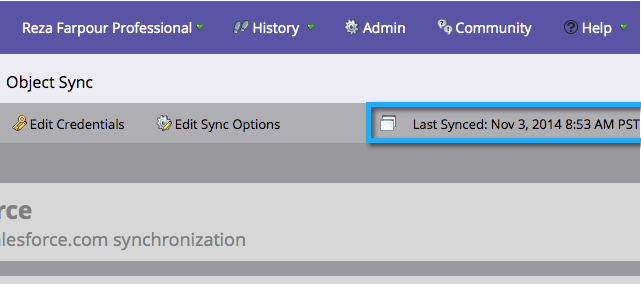

# Stap 3 van 3: Connect Marketo en [!DNL Salesforce] (Professional) {#step-of-connect-marketo-and-salesforce-professional}

In dit artikel configureert u Marketo Engage voor synchronisatie met de geconfigureerde Salesforce-instantie.

>[!PREREQUISITES]
>
>* [&#x200B; Stap 1 van 3: Voeg de Gebieden van Marketo aan Salesforce (Beroeps) toe &#x200B;](/help/marketo/product-docs/crm-sync/salesforce-sync/setup/professional-edition/step-1-of-3-add-marketo-fields-to-salesforce-professional.md){target="_blank"}
>* [&#x200B; Stap 2 van 3: Creeer een Gebruiker van Salesforce voor Marketo (Beroeps) &#x200B;](/help/marketo/product-docs/crm-sync/salesforce-sync/setup/professional-edition/step-2-of-3-create-a-salesforce-user-for-marketo-professional.md){target="_blank"}

## Synchronisatie van beveiligingstoken voor gebruiker ophalen {#retrieve-sync-user-security-token}

>[!TIP]
>
>Als u al een beveiligingstoken hebt, gaat u rechtstreeks door om Gebruikersreferenties synchroniseren en kudos in te stellen ter voorbereiding.

1. Meld u aan bij Salesforce met de Marketo Sync-gebruiker, klik op de naam van de synchronisatiegebruiker en vervolgens op **[!UICONTROL My Settings]** .

   

1. Typ &quot;reset&quot; in de zoekbalk Nav en klik op **[!UICONTROL Reset My Security Token]** .

   

1. Klik op **[!UICONTROL Reset Security Token]**.

   

   De beveiligingstoken wordt per e-mail naar u verzonden.

## Gebruikersreferenties synchroniseren instellen {#set-sync-user-credentials}

1. Ga in Marketo naar **[!UICONTROL Admin]** , selecteer **[!UICONTROL CRM]** en klik op **[!UICONTROL Sync with Salesforce.com]** .

   

   >[!NOTE]
   >
   >Ben zeker om [&#x200B; alle gebieden te verbergen u niet &#x200B;](/help/marketo/product-docs/crm-sync/salesforce-sync/sfdc-sync-details/hide-a-salesforce-field-from-the-marketo-sync.md){target="_blank"} in Marketo van de synchronisatiegebruiker alvorens **[!UICONTROL Sync Fields]** vereist te klikken. Als u op Velden synchroniseren klikt, worden alle velden die de gebruiker kan zien, permanent gemaakt in Marketo en kunnen deze niet worden verwijderd.

1. Ga de geloofsbrieven van de Gebruiker van de Synchronisatie van Salesforce in die in deel 2 van de configuratie van Salesforce ([&#x200B; worden gecreeerd Beroeps &#x200B;](/help/marketo/product-docs/crm-sync/salesforce-sync/setup/professional-edition/step-2-of-3-create-a-salesforce-user-for-marketo-professional.md), [&#x200B; Onderneming &#x200B;](/help/marketo/product-docs/crm-sync/salesforce-sync/setup/enterprise-unlimited-edition/step-2-of-3-create-a-salesforce-user-for-marketo-enterprise-unlimited.md)) en klik **[!UICONTROL Sync Fields]**.

   

   >[!NOTE]
   >
   >Schakel **[!UICONTROL Sandbox]** in als u een Marketo-sandbox synchroniseert met een Salesforce-sandbox.

1. Lees de waarschuwing en klik op **[!UICONTROL Confirm Credentials]** .

   

   >[!CAUTION]
   >
   >Als u over de [&#x200B; afbeeldingen wilt kijken en hen &#x200B;](/help/marketo/product-docs/crm-sync/salesforce-sync/setup/optional-steps/edit-initial-field-mappings.md){target="_blank"} aanpassen, is dit uw enige kans om dit te doen! Als u eenmaal op Salesforce Sync starten hebt geklikt, is het gelukt.

## [!DNL Salesforce] Sync starten {#start-salesforce-sync}

1. Klik op **[!UICONTROL Start Salesforce Sync]** om de permanente Marketo-Salesforce-synchronisatie te starten.

   

   >[!CAUTION]
   >
   >Marketo wordt niet automatisch gededupliceerd via een [!DNL Salesforce] -sync of wanneer u handmatig leads invoert.

1. Klik op **[!UICONTROL Start Sync]**.

   

   >[!NOTE]
   >
   >De tijd die nodig is om de eerste synchronisatie uit te voeren, is afhankelijk van de grootte en complexiteit van uw database.

## Sync controleren {#verify-sync}

Marketo geeft statusberichten weer voor de synchronisatie van [!DNL Salesforce] in het beheergebied. U kunt controleren of de synchronisatie correct werkt door deze stappen uit te voeren.

1. In Marketo, klik **[!UICONTROL Admin]**, toen **Salesforce**.

   

1. De synchronisatiestatus wordt in de rechterbovenhoek weergegeven. Er worden drie berichten weergegeven: **[!UICONTROL Last Synced]**, **[!UICONTROL Sync in Progress]** of **[!UICONTROL Failed]** .

   

   

   

Je hebt net een van de krachtigste functies van Marketo geconfigureerd, ga je gang!

>[!MORELIKETHIS]
>
>* [&#x200B; installeer het Pakket van Insight van de Verkoop van Marketo in Salesforce AppExchange &#x200B;](/help/marketo/product-docs/marketo-sales-insight/msi-for-salesforce/installation/install-marketo-sales-insight-package-in-salesforce-appexchange.md){target="_blank"}
>* [&#x200B; vorm Marketo Verkoop Insight in de Professionele Uitgave van Salesforce &#x200B;](/help/marketo/product-docs/marketo-sales-insight/msi-for-salesforce/configuration/configure-marketo-sales-insight-in-salesforce-professional-edition.md){target="_blank"}
