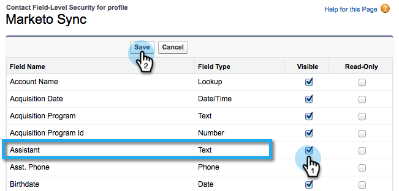

# Voeg een bestaand Salesforce-veld toe aan Marketo Sync {#add-an-existing-salesforce-field-to-the-marketo-sync}

>[!NOTE]
>
>**Beheerdersmachtigingen vereist**

Gewoonlijk worden nieuwe aangepaste velden in Salesforce automatisch gesynchroniseerd met Marketo. Als dat niet het geval is, zijn de velden mogelijk niet zichtbaar voor de gebruiker Marketo Sync. Zo kunt u dit oplossen.

1. Klik uw naam en selecteer dan **Opstelling**.

   

1. Typ **profiel** in de linkerzoekbalk en klik op **Profielen** onder **Gebruikers beheren**.

   

1. Klik op het gebruikersprofiel synchroniseren.

   

1. Onder **Veld-Vlakke Veiligheid** sectie, klik **Mening** naast het voorwerp dat het gebied bevat.

   

1. Klik **Bewerken**.

   

1. Schakel het selectievakje **Visible** in voor het veld dat u aan de synchronisatie wilt toevoegen en klik op **Save**.

   

   Zoet! Bij de volgende synchronisatiecyclus ziet Marketo het veld en begint de magie.

   >[!NOTE]
   >
   > Als het veld al waarden in Salesforce heeft, worden deze waarden pas gesynchroniseerd met Marketo wanneer de volgende record wordt bijgewerkt.
