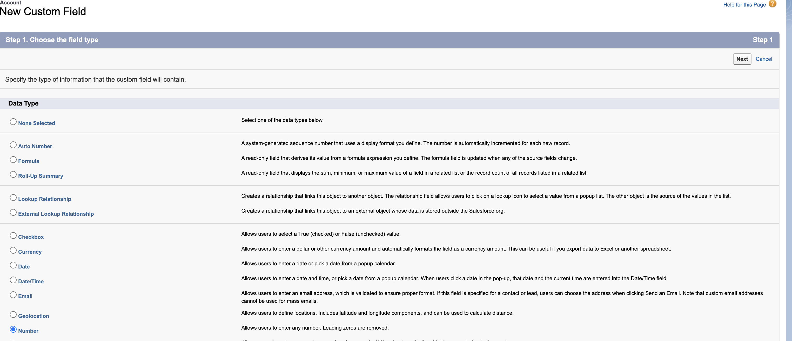

# Stap 1 van 3: Marketo-velden toevoegen aan [!DNL Veeva] CRM {#step-1-of-3-add-marketo-fields-to-veeva-crm}

>[!PREREQUISITES]
>
>Uw [!DNL Veeva] CRM-instantie moet toegang hebben tot Salesforce API&#39;s om gegevens te synchroniseren tussen Marketo Engage en [!DNL Veeva] CRM.

Marketo Engage gebruikt een set velden om bepaalde soorten marketinggerelateerde informatie vast te leggen. Volg onderstaande instructies als u deze gegevens in [!DNL Veeva] CRM wilt gebruiken.

`1.` Een aangepast veld maken in [!DNL Veeva] CRM op de contactobjecten: score

`2.` U kunt desgewenst aanvullende velden maken (zie de onderstaande tabel).

Al deze aangepaste velden zijn optioneel en zijn niet vereist voor het synchroniseren van Marketo Engage en [!DNL Veeva] CRM.

## Marketo-velden toevoegen aan [!DNL Veeva] CRM {#add-marketo-fields-to-veeva-crm}

Voeg een aangepast veld toe aan de objecten lead en contact in [!DNL Veeva] CRM zoals hierboven vermeld. Zie de tabel met beschikbare velden aan het einde van deze sectie voor meer informatie.

Voer de volgende stappen voor het gebied van de Score uit om het toe te voegen.

1. Meld u aan bij de [!DNL Veeva] CRM en klik op **[!UICONTROL Setup]** .

   

1. Klik op **[!UICONTROL Objects and Fields]** en selecteer **[!UICONTROL Object Manager]** .

   

1. Zoek in de zoekbalk naar &quot;Contact&quot;.

   

1. Klik op het object **[!UICONTROL Contact]** .

1. Selecteer **[!UICONTROL Fields and Relationships]** .

1. Klik op **[!UICONTROL New]**.

   

1. Kies het juiste veldtype (bij Score - nummer).

   

1. Klik op **[!UICONTROL Next]**.

   

1. Voer de **[!UICONTROL Field Label]** , **[!UICONTROL Length]** en **[!UICONTROL Field Name]** voor het veld in, zoals in de onderstaande tabel wordt getoond.

<table>
 <tbody>
  <tr>
   <th>Veldlabel
   <th>Veldnaam
   <th>Gegevenstype
   <th>Veldkenmerken
  </tr>
  <tr>
   <td>Score</td>
   <td>mkto71_Lead_Score</td>
   <td>Getal</td>
   <td>Lengte 10  
Decimalen 0</td>
  </tr>
 </tbody>
</table>

>[!NOTE]
>
>[!DNL Veeva] CRM voegt __c aan de Namen van het Gebied toe wanneer het hen gebruikt om API Namen tot stand te brengen.

>[!NOTE]
>
>Tekst- en nummervelden vereisen een lengte, maar datum-/tijdvelden niet. Een beschrijving is optioneel.

1. Klik op **[!UICONTROL Next]**.

   

1. Geef de toegangsinstellingen op en klik op **[!UICONTROL Next]** .

1. Stel alle rollen in op **[!UICONTROL Visible]** en **[!UICONTROL Read-Only]** .

1. Schakel het selectievakje **[!UICONTROL Read-Only]** uit voor het profiel van uw synchronisatiegebruiker:

* Als u een gebruiker hebt met het profiel van een systeembeheerder als synchronisatiegebruiker, schakelt u het selectievakje [!UICONTROL Read-Only] voor het profiel Systeembeheerder uit (zoals hieronder wordt weergegeven).
* Als u een aangepast profiel voor de synchronisatiegebruiker hebt gemaakt, schakelt u het selectievakje [!UICONTROL Read-Only] voor dat aangepaste profiel uit.

  

1. Kies de paginalay-outs die het veld moeten weergeven.

1. Klik op **[!UICONTROL Save & New]** om terug te gaan en elk van de andere twee aangepaste velden te maken.

1. Klik op **[!UICONTROL Save]** als u klaar bent met alle drie.

   

>[!NOTE]
>
>Door het veld aan het object Contact toe te voegen, worden deze ook toegevoegd aan het object Person Account.

OPTIONEEL: gebruik de bovenstaande procedure voor extra aangepaste velden uit de onderstaande tabel.

<table>
 <tbody>
  <tr>
   <th>Veldlabel
   <th>Veldnaam
   <th>Gegevenstype
   <th>Veldkenmerken
  </tr>
  <tr>
   <td>Overgenomen stad</td>
   <td>mkto71_Inferred_City</td>
   <td>Tekst</td>
   <td>Lengte 255</td>
  </tr>
  <tr>
   <td>Afgeleid bedrijf</td>
   <td>mkto71_Inferred_Company</td>
   <td>Tekst</td>
   <td>Lengte 255</td>
  </tr>
  <tr>
   <td>Afgeleid land</td>
   <td>mkto71_Inferred_Country</td>
   <td>Tekst</td>
   <td>Lengte 255</td>
  </tr>
  <tr>
   <td>Overgenomen metropolitaans gebied</td>
   <td>mkto71_Inferred_Metropolitan_Area</td>
   <td>Tekst</td>
   <td>Lengte 255</td>
  </tr>
  <tr>
   <td>Gebiedscode afgeleide telefoon</td>
   <td>mkto71_Inferred_Phone_Area_Code</td>
   <td>Tekst</td>
   <td>Lengte 255</td>
  </tr>
  <tr>
   <td>Postcode</td>
   <td>mkto71_Inferred_Postal_Code</td>
   <td>Tekst</td>
   <td>Lengte 255</td>
  </tr>
  <tr>
   <td>Gebied van de betrokken staat</td>
   <td>mkto71_Inferred_State_Region</td>
   <td>Tekst</td>
   <td>Lengte 255</td>
  </tr>
 </tbody>
</table>

>[!NOTE]
>
>Waarden in de velden die automatisch door Marketo worden toegewezen, zijn niet direct beschikbaar in [!DNL Veeva] CRM wanneer het nieuwe veld is gemaakt. Marketo synchroniseert de gegevens met [!DNL Veeva] CRM bij de volgende update van de record op elk systeem (een update van een van de velden die synchroon is tussen Marketo en [!DNL Veeva] CRM).
