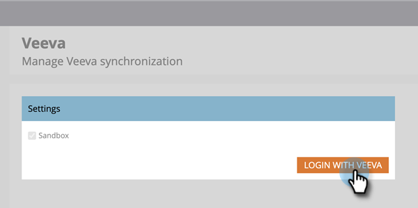

# Stap 3 van 3: Connect Marketo Engage en [!DNL Veeva] CRM {#step-3-of-3-connect-marketo-engage-and-veeva-crm}

In dit artikel configureert u Marketo Engage voor synchronisatie met de geconfigureerde [!DNL Veeva] CRM-instantie. **U zult [!DNL Salesforce] in sommige pop-ups** zien aangezien [!DNL Veeva] CRM op het [!DNL Salesforce] platform wordt voortgebouwd.

>[!PREREQUISITES]
>
>* [ Stap 1 van 3: Voeg de Gebieden van Marketo aan  [!DNL Veeva]](/help/marketo/product-docs/crm-sync/veeva-crm-sync/setup/step-1-of-3-add-marketo-fields-to-veeva-crm.md){target="_blank"} toe
>* [ Stap 2 van 3: Creeer a [!DNL Veeva]  Gebruiker voor Marketo ](/help/marketo/product-docs/crm-sync/veeva-crm-sync/setup/step-2-of-3-create-a-veeva-crm-user-for-marketo-engage.md){target="_blank"}

>[!IMPORTANT]
>
>Er kan slechts één Marketo-instantie tegelijk worden verbonden met een [!DNL Veeva] CRM-instantie.

## Verbinding maken met [!DNL Veeva] CRM met OAuth {#connect-to-veeva-crm-using-oauth}

1. Klik in Marketo op **[!UICONTROL Admin]** . Selecteer **[!UICONTROL CRM]** en klik op **[!UICONTROL Sync with Veeva]** .

   

   >[!NOTE]
   >
   >Ben zeker om [ alle gebieden te verbergen u niet ](/help/marketo/product-docs/crm-sync/salesforce-sync/sfdc-sync-details/hide-a-salesforce-field-from-the-marketo-sync.md){target="_blank"} in Marketo van de synchronisatiegebruiker nodig hebt alvorens de Gebieden van de Synchronisatie te klikken. Als u op Velden synchroniseren klikt, worden alle velden die de gebruiker kan zien, permanent gemaakt in Marketo en kunnen deze niet worden verwijderd.

1. Klik op **[!UICONTROL Login with Veeva]**.

   

   >[!NOTE]
   >
   >Controleer [!UICONTROL Sandbox] of u een Marketo-sandbox synchroniseert met een [!DNL Veeva] CRM-sandbox.

1. Klik op **[!UICONTROL Confirm Credentials]**.

   

1. Er wordt een pop-up met de aanmeldingspagina van [!DNL Salesforce] weergegeven. Voer uw gebruikersgegevens voor &quot;Marketo Sync User&quot; in en klik op **[!UICONTROL Log In]** .

   

1. Voer de verificatiecode in die u via e-mail hebt ontvangen (verzonden door [!DNL Salesforce]) en klik op **[!UICONTROL Verify]** .

   

1. Na succesvolle verificatie wordt de toegangspagina weergegeven met het verzoek om toegang. Klik op **[!UICONTROL Allow]**.

   

1. Over een paar minuten wordt een pop-up weergegeven in Marketo Engae. Klik op **[!UICONTROL Confirm Credentials]**.

   

## [!DNL Veeva] Sync starten {#start-veeva-sync}

1. Klik op **[!UICONTROL Start Veeva Sync]** om te beginnen met de permanente [!DNL Marketo-Veeva] CRM-synchronisatie.

   

   >[!CAUTION]
   >
   >Marketo dedupliceert niet automatisch naar een [!DNL Veeva] CRM-synchronisatie of wanneer u handmatig leads invoert.

1. Klik op **[!UICONTROL Start Sync]**.

   

>[!NOTE]
>
>De tijd die nodig is om de eerste synchronisatie uit te voeren, is afhankelijk van de grootte en complexiteit van uw database.

## Sync controleren {#verify-sync}

Marketo geeft statusberichten weer voor de [!DNL Veeva] CRM-synchronisatie in het beheergebied. U kunt controleren of de synchronisatie correct werkt door deze stappen uit te voeren.

1. Klik in Marketo op **[!UICONTROL Admin]** en vervolgens op **[!UICONTROL Veeva]** .

   

1. De synchronisatiestatus wordt in de rechterbovenhoek weergegeven. Er wordt een van de volgende drie berichten weergegeven: Laatste synchronisatie, Synchronisatie bezig of Mislukt.

>[!MORELIKETHIS]
>
>[ vorm de Voorwerpen van de Douane ](/help/marketo/product-docs/crm-sync/veeva-crm-sync/sync-details/custom-object-sync.md){target="_blank"}
