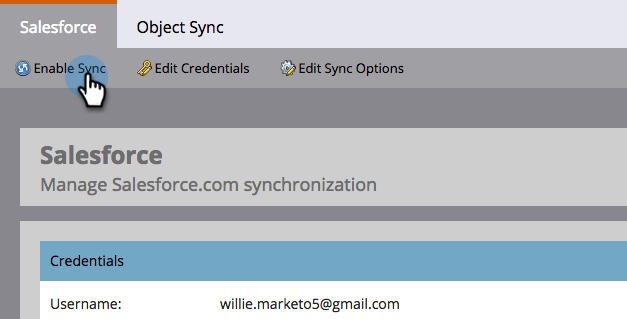

# Aangepaste objectsynchronisatie {#custom-object-sync}

Aangepaste objecten die in uw Veeva CRM-instantie zijn gemaakt, kunnen ook deel uitmaken van het Marketo Engage. Hier is hoe u het kunt instellen.

>[!NOTE]
>
>**Beheerdersmachtigingen vereist**

>[!PREREQUISITES]
>
>Als u een aangepast object wilt gebruiken, moet dit zijn gekoppeld aan een contact- of accountobject in Veeva CRM.

## Aangepast object inschakelen {#enable-custom-object}

1. Klik in Marketo op **[!UICONTROL Admin]** vervolgens **[!UICONTROL Veeva Objects Sync]**.

   

1. Als dit uw eerste aangepaste object is, klikt u op **[!UICONTROL Sync Schema]**.

   

1. Klik op **[!UICONTROL Disable Global Sync]**.

   

   >[!NOTE]
   >
   >De eerste synchronisatie van het schema van aangepaste Veeva-objecten kan een paar minuten duren.

1. Sleep het aangepaste object dat u wilt synchroniseren naar het canvas.

   

   >[!NOTE]
   >
   >Aangepaste objecten moeten unieke namen hebben. Marketo ondersteunt geen twee verschillende aangepaste objecten met dezelfde naam.

1. Klik op **[!UICONTROL Enable Sync]**.

   

1. Klikken **[!UICONTROL Enable Sync]** opnieuw.

   

1. Ga terug naar de **[!UICONTROL Veeva]** tab.

   

1. Klik op **[!UICONTROL Enable Sync]**.

   

1. Als u al uw aangepaste veeva-objecten wilt weergeven, klikt u op **[!UICONTROL Admin]** en **[!UICONTROL Veeva Objects Sync]**.

   

   >[!NOTE]
   >
   >Marketo ondersteunt alleen aangepaste entiteiten die een tot twee niveaus diep zijn gekoppeld aan standaardentiteiten.

Uitstekend! U kunt nu gegevens uit dit aangepaste object gebruiken in slimme campagnes en slimme lijsten.

>[!MORELIKETHIS]
>
>* [Het synchroniseren van Vraag en Vraag Zeer belangrijke Berichten](/help/marketo/product-docs/crm-sync/veeva-crm-sync/sync-details/syncing-call-and-call-key-messages.md){target="_blank"}
>* [Aangepast objectveld toevoegen/verwijderen als slimme lijst/triggerbeperkingen](/help/marketo/product-docs/crm-sync/veeva-crm-sync/sync-details/add-remove-custom-object-field-as-smart-list-trigger-constraints.md){target="_blank"}
