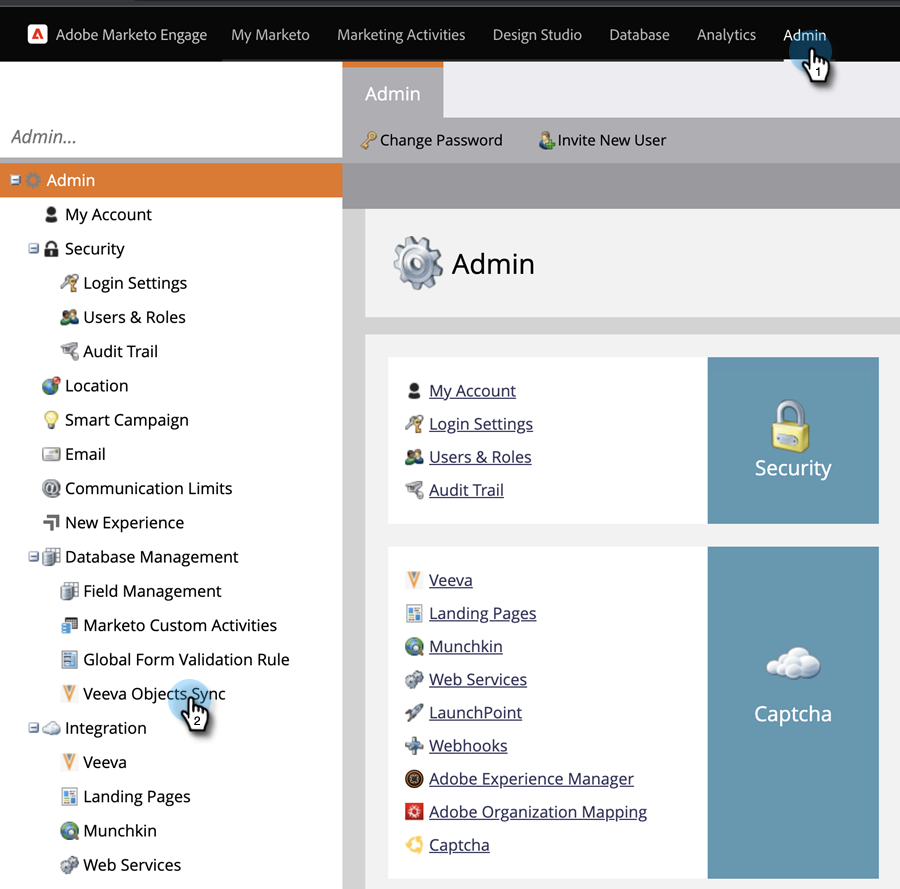
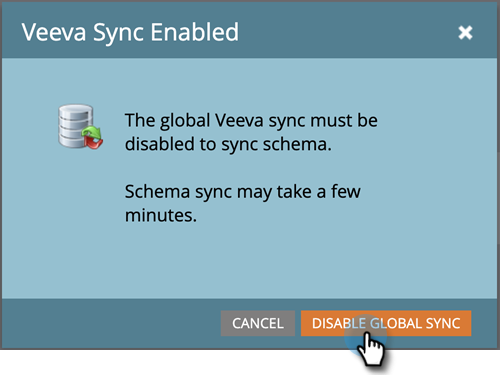

# Aangepaste objectsynchronisatie inschakelen/uitschakelen {#enable-disable-custom-object-sync}

Aangepaste objecten die in uw [!DNL Veeva] CRM-instantie zijn gemaakt, kunnen ook deel uitmaken van Marketo Engage. Hieronder wordt beschreven hoe u dit instelt.

## Aangepaste objectsynchronisatie inschakelen of uitschakelen {#enable-or-disable-the-custom-object-sync}

>[!NOTE]
>
>**vereiste toestemmingen Admin**

1. Klik in Marketo op **[!UICONTROL Admin]** en vervolgens op **[!UICONTROL Veeva Objects Sync]** .

   

1. Klik op **[!UICONTROL Sync Schema]** als dit uw eerste aangepaste object is. Als dat niet het geval is, klikt u op **[!UICONTROL Refresh Schema]** om te controleren of u het meest recente bestand hebt.

   

1. Als de algemene synchronisatie wordt uitgevoerd, schakelt u deze uit door op **[!UICONTROL Disable Global Sync]** te klikken.

   

   >[!NOTE]
   >
   >Een synchronisatie van het schema voor aangepaste objecten van [!DNL Veeva] kan een paar minuten duren.

1. Klik op **[!UICONTROL Refresh Schema]**.

   

Selecteer het object dat u wilt synchroniseren en klik op **[!UICONTROL Enable Sync]** .

>[!TIP]
>
>Marketo kan een aangepast object alleen synchroniseren als het een directe relatie heeft met het object Contact of Account in [!DNL Veeva] CRM.

1. Klik nogmaals op **[!UICONTROL Enable Sync]** .

   

1. Ga terug naar de tab [!UICONTROL Veeva] en klik op **[!UICONTROL Enable Sync]** .

   

## Aangepaste objecten gebruiken {#using-your-custom-objects}

>[!NOTE]
>
>U kunt aangepaste objecten niet gebruiken in slimme campagnes met triggers.

1. Sleep in uw [!UICONTROL Smart List] over het filter &quot;**[!UICONTROL Has Opportunity]**&quot; en stel dit in op **[!UICONTROL True]** .

   

1. Gebruik eventueel filterbeperkingen om de focus te beperken.

   

Uitstekend! U kunt de gegevens van dit aangepaste object nu gebruiken in [!UICONTROL Smart Campaigns] en [!UICONTROL Smart Lists] .

>[!MORELIKETHIS]
>
>[&#x200B; voeg/verwijder het Gebied van de Objecten van de Douane als Slimme Beperkingen List/Trigger &#x200B;](/help/marketo/product-docs/crm-sync/veeva-crm-sync/sync-details/add-remove-custom-object-field-as-smart-list-trigger-constraints.md){target="_blank"} toe
