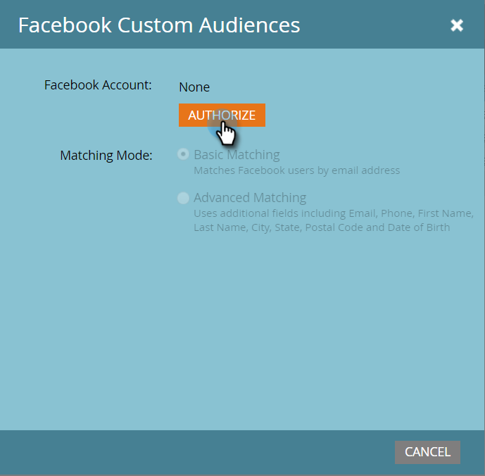

# [!DNL Facebook] Aangepast publiek toevoegen als [!DNL LaunchPoint] service {#add-facebook-custom-audiences-as-a-launchpoint-service}

>[!NOTE]
>
>**Vereiste Bevoegdheden Admin**

Met deze integratie kunt u publieksgegevens van statische en slimme lijsten van Marketo naar [!DNL Facebook] verzenden voor gebruik als aangepast publiek in [!DNL Facebook] Advertentiecampagnes. Hier is hoe u het kunt instellen.

1. Ga naar Marketo **[!UICONTROL Admin]** .

   

1. Ga naar **[!UICONTROL LaunchPoint]** , klik op **[!UICONTROL New]** en selecteer **[!UICONTROL New Service]** .

   

1. Voer een **[!UICONTROL Display Name]** voor uw service in en selecteer de service **[!UICONTROL Facebook Custom Audiences]** in de vervolgkeuzelijst **[!UICONTROL Service]** .

   

1. Open een nieuw lusje in zelfde browser en ga naar [&#x200B; facebook.com &#x200B;](https://www.facebook.com/). Meld u aan bij [!DNL Facebook] met het account dat u voor de integratie wilt gebruiken.

   >[!CAUTION]
   >
   >Opdat Marketo publiek over de veelvoudige Rekeningen van de Manager van de Advertentie verzendt, moet de [!DNL Facebook] gebruiker u in de volgende stappen goedkeurt toegang tot *hebben allen* van deze rekeningen.

   

1. Ga terug naar Marketo nadat u zich hebt aangemeld bij [!DNL Facebook] . Klik op **[!UICONTROL Authorize]**.

   

   >[!NOTE]
   >
   >U *moet* a [!DNL Facebook] rekening van BedrijfsManager gebruiken opdat uw integratie van het publiek van de Douane werkt. Leren hoe te opstelling een rekening Bedrijfs van de Manager, verwijs naar [[!DNL Facebook]  Hulp &#x200B;](https://www.facebook.com/business/help/1710077379203657).

1. Klik desgevraagd op **[!UICONTROL OK]** om de installatie van de Marketo-app in [!DNL Facebook] te accepteren.

   

1. U bent nu geautoriseerd! Selecteer een overeenkomende modus en klik op **[!UICONTROL Create]** .

   >[!NOTE]
   >
   >**[!UICONTROL Basic Matching]** gebruikt alleen e-mailadressen. **[!UICONTROL Advanced Matching]** gebruikt zeven extra velden, die de gelijke snelheid verhogen, voor meer omzetting. Als het privacybeleid van uw bedrijf het delen van extra velden echter niet toestaat of als deze niet in uw gegevens zijn opgenomen, selecteert u [!UICONTROL Basic Matching] .

   

   Geweldig werk! U kunt nu naar elke statische of slimme lijst in Marketo gaan en de publieksgegevens doorsturen naar [!DNL Facebook] .

   >[!CAUTION]
   >
   >Oh, alvorens u gaat, ben zeker om [&#x200B; {de Termen van het Soorten van het Soorten publiek van 1}  [!DNL Facebook] binnen uw &#x200B;](https://www.facebook.com/ads/manage/customaudiences/tos.php) rekening goed te keuren! [!DNL Facebook] Zonder dit te doen, zullen de publieksupdates ontbreken.

>[!MORELIKETHIS]
>
>* [&#x200B; creeer een Publiek van de Douane in  [!DNL Facebook]](/help/marketo/product-docs/demand-generation/facebook/create-a-custom-audience-in-facebook.md)
>
>* [&#x200B; de Lood van de opstelling  [!DNL Facebook] &#x200B;](/help/marketo/product-docs/demand-generation/facebook/set-up-facebook-lead-ads.md)
