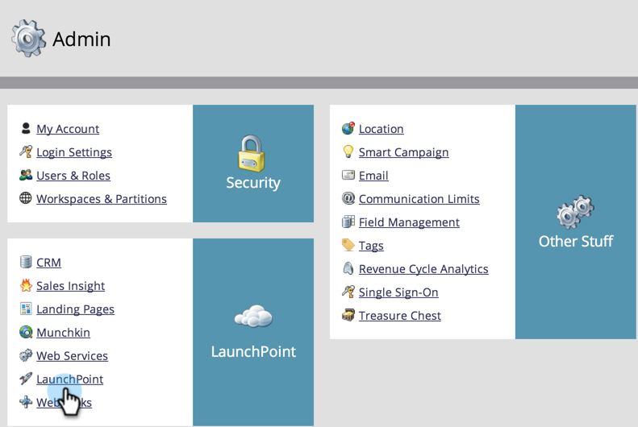

# Google Customer Match toevoegen als een [!DNL LaunchPoint] -service {#add-google-customer-match-as-a-launchpoint-service}

Met deze integratie kunt u een Marketo-publiek naar Google sturen dat u als doel wilt instellen met [!DNL Google AdWords] en doelgroepen in YouTube, Search en [!DNL Gmail] .

>[!NOTE]
>
>**Vereiste Bevoegdheden Admin**

1. Ga naar **[!UICONTROL Admin]** .

   

1. Klik op **[!UICONTROL LaunchPoint]**.

   

1. Selecteer **[!UICONTROL New]** dan **[!UICONTROL New Service]** .

   

1. Voer een **[!UICONTROL Display Name]** in en selecteer **[!UICONTROL Google Customer Match]** in de vervolgkeuzelijst **[!UICONTROL Service]** . Klik op **[!UICONTROL Create]**.

   

1. Klik op [!DNL Google AdWords] om een **[!UICONTROL Authorize]** -account te verbinden.

   

1. Google wordt op een nieuw tabblad geopend. Meld u vanaf hier aan bij uw [!DNL Google AdWords] -account.

   >[!CAUTION]
   >
   >Opdat Marketo publiek over veelvoudige [!DNL AdWords] Rekeningen verzendt, moet de gebruiker van Google u in de volgende stappen goedkeurt toegang tot _hebben allen_ van deze rekeningen.

   

1. Controleer de gewenste machtigingen en klik op **[!UICONTROL Allow]** .

   

1. Uw [!DNL Google AdWords] -account is nu verbonden met Marketo. Klik op **[!UICONTROL Create]**.

   

   Geweldig! U ziet nu een service [!DNL LaunchPoint] die overeenkomt met Google op het tabblad Geïnstalleerde services.

>[!NOTE]
>
>Bij de integratie van Google Customer Match kunnen slechts één beheerdersaccount en alle subaccounts binnen die beheerdersaccount worden gebruikt. Meerdere beheeraccounts worden niet ondersteund.
