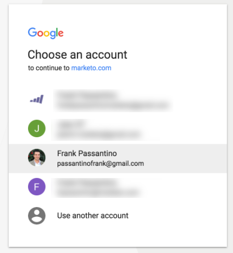

# Google Customer Match toevoegen als een opstartpuntservice {#add-google-customer-match-as-a-launchpoint-service}

Met deze integratie kunt u een publiek van het Marketo Engage naar Google sturen om te worden gericht gebruikend Google AdWords, evenals herdoelpubliek over YouTube, Onderzoek, en Gmail.

>[!IMPORTANT]
>
>Vanwege de recente update van de Google Ads API is de synchronisatiefunctionaliteit tussen Adobe en Google tijdelijk uitgeschakeld. Adobe controleert momenteel de Google-vereisten met betrekking tot de update.

>[!NOTE]
>
>**Beheerdersmachtigingen vereist**

1. Ga naar **[!UICONTROL Admin]**.

   

1. Klik op **[!UICONTROL LaunchPoint]**.

   

1. Selecteren **[!UICONTROL New]** dan **[!UICONTROL New Service]**.

   

1. Voer een **[!UICONTROL Display Name]** en selecteert u **[!UICONTROL Google Customer Match]** van de **[!UICONTROL Service]** vervolgkeuzelijst. Klik op **[!UICONTROL Create]**.

   

1. Als u een Google AdWords-account wilt verbinden, klikt u op **[!UICONTROL Authorize]**.

   

1. Google wordt op een nieuw tabblad geopend. Meld u vanaf hier aan bij uw Google AdWords-account.

   >[!CAUTION]
   >
   >Marketo kan alleen een publiek naar meerdere AdWords-accounts sturen als de Google-gebruiker die u in de volgende stappen autoriseert, toegang heeft tot _alles_ van deze rekeningen.

   

1. Controleer de aangevraagde machtigingen en klik op **[!UICONTROL Allow]**.

   

1. Je Google AdWords-account is nu verbonden met Marketo. Klik op **[!UICONTROL Create]**.

   

   Geweldig! U zult nu de Gelijke Publiek van Google die als dienst LaunchPoint op het Geïnstalleerde lusje van de Diensten wordt vermeld zien.

>[!NOTE]
>
>Bij de integratie van Google Customer Match kunnen slechts één beheerdersaccount en alle subaccounts binnen die beheerdersaccount worden gebruikt. Meerdere beheeraccounts worden niet ondersteund.
