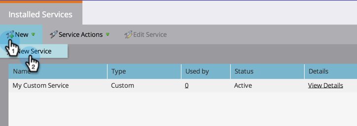

# [!DNL LinkedIn] Gelijktijdig publiek toevoegen als een [!DNL LaunchPoint] -service {#add-linkedin-matched-audiences-as-a-launchpoint-service}

>[!IMPORTANT]
>
>LinkedIn voert een upgrade uit van de marketing-API&#39;s die door Marketo Engage LinkedIn-integratie worden gebruikt. Deze veranderingen zullen re-authentificatie van alle diensten LinkedIn LaunchPoint in uw **Admin** > **LaunchPoint** menu tussen 7 Juni en 15 December, 2024 vereisen, om de dienstonderbreking te vermijden. Voor meer informatie, gelieve te zien [&#x200B; Veelgestelde vragen van de Migratie &#x200B;](https://nation.marketo.com/t5/employee-blogs/linkedin-re-authentication-required/ba-p/347794){target="_blank"}.

>[!NOTE]
>
>**Vereiste Bevoegdheden Admin**

Sluit uw Marketo-account aan op [!DNL LinkedIn] Gelijkend publiek om een statische Marketo-lijst of een slimme lijst te gebruiken als een [!DNL LinkedIn] publiekssegment.

1. Ga naar de sectie **[!UICONTROL Admin]** .

   

1. Selecteer **[!UICONTROL LaunchPoint]** .

   

1. Selecteer **[!UICONTROL New]** en **[!UICONTROL New Service]** .

   

1. Voer een **[!UICONTROL Display Name]** in en kies **[!UICONTROL LinkedIn Matched Audiences]** . Klik op **[!UICONTROL Create]**.

   

1. Klik op [!DNL LinkedIn] om een **[!UICONTROL Authorize]** -account te verbinden.

   

   >[!CAUTION]
   >
   >Opdat Marketo publiek over veelvoudige [!DNL LinkedIn] Advertentierekeningen verzendt, moet de [!DNL LinkedIn] gebruiker u in de volgende stappen goedkeurt toegang tot *hebben allen* van deze Advertentieramingen in hun Manager van de Campagne.

1. [!DNL LinkedIn] wordt op een nieuw tabblad geopend. Meld u vanaf hier aan bij uw [!DNL LinkedIn] -account.

   

1. Controleer de gewenste machtigingen en klik op **[!UICONTROL Allow]** .

   

1. Uw [!DNL LinkedIn] -account is nu verbonden met Marketo. Klik op **[!UICONTROL Create]**.

   

   Geweldig! U ziet nu [!DNL LinkedIn] Gelijktijdig publiek dat wordt vermeld als een [!DNL LaunchPoint] -service op het tabblad Geïnstalleerde services.

   

>[!MORELIKETHIS]
>
>[&#x200B; Gebruik een Lijst van Marketo of een Slimme Lijst als Segment van het a [!DNL LinkedIn]  publiek &#x200B;](/help/marketo/product-docs/demand-generation/social/social-functions/use-a-marketo-list-or-smart-list-as-a-linkedin-audience-segment.md)
