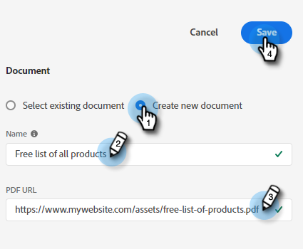

# Stream Designer {#stream-designer}

Er zijn _veel_ streamcombinaties mogelijk. Dit artikel bevat een voorbeeld waarin de marketeter de sitebezoeker vraagt of hij productvragen heeft. Zo ja, dan kan de bezoeker een afspraak plannen. Zo neen, dan kan de bezoeker zich bij een mailinglijst aansluiten voor toekomstige correspondentie. Ze krijgen ook een gratis PDF aangeboden. Het uiteindelijke doel is of een afspraak te plannen of de e-mail van de bezoeker te verzamelen.

>[!PREREQUISITES]
>
>Voordat u de documentkaart kunt gebruiken, moet u eerst [instellen](/help/marketo/product-docs/demand-generation/dynamic-chat/integrations/using-the-document-card.md){target="_blank"} in uw Adobe account.

## Streaming Designer-kaarten {#stream-designer-cards}

De stroomontwerper bevat veelvoudige kaarten u kunt toevoegen om het praatjegesprek te vormen.

<table>
 <tr>
  <td><strong>Bericht</strong></td>
  <td>Wordt gebruikt wanneer u een instructie wilt maken zonder dat er een reactie nodig is (bijvoorbeeld: "Hallo! Alle items zijn vandaag 25% korting met code SAVE25").
</td>
 </tr>
 <tr>
  <td><strong>Vraag</strong></td>
  <td>Wordt gebruikt wanneer u een meerkeuzevraag wilt stellen, waarvoor u de beschikbare antwoorden kunt opgeven (bijvoorbeeld: Welk type voertuig bent u geïnteresseerd? Reacties = SUV, Compact, Truck, enz.).</td>
 </tr>
 <tr>
  <td><strong>Document</strong></td>
  <td>Hiermee kunt u PDF-documenten insluiten in dialoogvensters en de activiteit van bezoekers in de documentbetrokkenheid bijhouden (hoeveel pagina's zijn weergegeven, of het document is gedownload en/of welke zoektermen zijn gebruikt).</td>
 </tr>
 <tr>
  <td><strong>Gegevens vastleggen</strong></td>
  <td>Gebruik deze optie wanneer u gegevens wilt verzamelen. De drie velden waaruit u kunt kiezen zijn E-mailadres, Telefoonnummer en Tekst (zodat de bezoeker zijn eigen bericht kan schrijven).</td>
 </tr>
 <tr>
  <td><strong>Aanstellingsplanner</strong></td>
  <td>Biedt de bezoeker een kalender met beschikbare datums om een follow-up te plannen. De beschikbaarheid van agenda's weerspiegelt <a href="/help/marketo/product-docs/demand-generation/dynamic-chat/dynamic-chat-overview.md#routing">de volgende agent in lijn</a>.</td>
 </tr>
 <tr>
  <td><strong>Doel</strong></td>
  <td>Dit is de enige kaart die bezoekers niet zullen zien. Het is aan u om te bepalen op welk punt een doel binnen de specifieke praatje wordt bereikt (bijvoorbeeld: als het verzamelen van de e-mail van de bezoeker uw doel is, plaats de Goal kaart onmiddellijk na Info vangt in de stroom).</td>
 </tr>
</table>

## Stroom Designer-pictogrammen {#stream-designer-icons}

Rechtsboven in Stream Designer ziet u een handvol pictogrammen. Dit is wat ze doen.

<table>
 <tr>
  <td></td>
  <td>Hiermee voegt u een raster toe aan de achtergrond voor diegenen die de voorkeur geven aan die weergave</td>
 </tr>
 <tr>
  <td></td>
  <td>Inzoomen, grotere kaarten maken</td>
 </tr>
 <tr>
  <td></td>
  <td>Uitzoomen, kleinere kaarten maken</td>
 </tr>
 <tr>
  <td></td>
  <td>Hiermee opent u een venster waarin u uw chat kunt testen (druk op dezelfde knop om te sluiten)</td>
 </tr>
 <tr>
  <td></td>
  <td>Hiermee rangschikt u alle kaarten in uw stream</td>
 </tr>
</table>

## Een stream maken {#create-a-stream}

1. Na u hebt [heeft uw dialoogvenster gemaakt](/help/marketo/product-docs/demand-generation/dynamic-chat/dialogues/create-a-dialogue.md){target="_blank"}klikt u op de knop **Stream Designer** tab.

   

1. Sleep de vraagkaart en zet deze neer.

   

1. Geef onder Chatbot Response je vraag hoe je wilt.

   

   >[!TIP]
   >
   >U kunt de ervaring voor bekende chatsbezoekers aanpassen door tokens te gebruiken (bijvoorbeeld: Hello `{{lead.leadFirstName:""}}`). Klik gewoon op het pictogram voor het accolade rechts en maak een selectie. Voeg een standaardwaarde tussen de quots toe als u anonieme bezoekers iets soorts wilt zien (bijvoorbeeld: Hello `{{lead.leadFirstName:"there"}}`).

   >[!NOTE]
   >
   >Poke is standaard ingesteld op Aan, waardoor de openingsvraag naast het chatpictogram wordt weergegeven zonder dat de bezoeker erop moet klikken om deze te zien. Poke is slechts beschikbaar op de eerste kaart in het gesprek.

1. Voer uw gebruikersreacties in en klik op **Opslaan**.

   

   >[!NOTE]
   >
   >**Opgeslagen waarden bewerken** Dit is een optionele stap voor diegenen die een andere waarde in de database willen opslaan dan wat bezoekers in de chatbot krijgen te zien voor toegewezen kenmerken in de vraagkaart (bezoekers zien bijvoorbeeld &quot;Zoekmachine optimaliseren&quot;, en slaan die waarde op als &quot;SEO.&quot;).

1. Voor &quot;ja&quot;willen wij een benoeming plannen, zodat onder die optie belemmering over de kaart van de Planner van de Benoeming.

   

1. Klik in de rechterkolom op **Opslaan**.

   

1. Aangezien dat een doel is, sleep de Goal card onder de Planner van de Aanstelling.

   

1. Geef uw doel een naam (of kies een bestaand doel) en klik op **Opslaan**.

   

1. Voor &quot;Nee&quot; willen we zien of ze zich bij de mailinglijst voegen. Sleep dus onder deze optie over een andere vraagkaart.

   

1. Voer uw reactie in en voeg antwoordopties toe voor de bezoeker. Klikken **Opslaan** wanneer gereed.

   

   >[!NOTE]
   >
   >U kunt meer reacties toevoegen door op **Antwoord toevoegen**.

1. Onder het antwoord &quot;Ja&quot; sleept u over de kaart voor het vastleggen van gegevens, zodat u de e-mail van de bezoeker kunt verzamelen.

   

1. Klik op de knop **Type** vervolgkeuzelijst en selecteer **E-mail**.

   

1. Voer een chatbotbericht en tijdelijke aanduiding in. Controleer of het kenmerk is toegewezen aan het juiste veld in Marketo en klik op **Opslaan**.

   

   <table>
    <tr>
     <td><strong>Type</strong></td>
     <td>Het type informatie dat u wilt vastleggen: Telefoon, Tekst, E-mail.</td>
    </tr>
    <tr>
     <td><strong>Chatbotbericht</strong></td>
     <td>Het bericht dat de bezoeker ziet hen ertoe aanzetten om de info te verstrekken.</td>
    </tr>
    <tr>
     <td><strong>Plaatsaanduiding</strong></td>
     <td>Voorbeeldtekst waarmee de bezoeker kan zien wat er moet worden ingevoerd.</td>
    </tr>
    <tr>
     <td><strong>Reactie toewijzen aan kenmerk</strong></td>
     <td>Hiermee kunt u de reactie van de bezoeker synchroniseren naar het corresponderende veld in de Person-record in uw Marketo-abonnement.</td>
    </tr>
   </table>

1. Aangezien het verzamelen van hun e-mail een doel is, sleept u de Goal-kaart onder Info Vastleggen.

   

1. Geef uw doel een naam (of kies een bestaand doel) en klik op **Opslaan**.

   

1. Vergeet niet een reactie toe te voegen als ze &quot;Nee&quot; zeggen. Een optie is om een berichtkaart hieronder te slepen en &quot;Toch bedankt&quot; te zeggen. In dit voorbeeld geven we ze een gratis PDF-document.

   

1. In dit voorbeeld maken we een nieuw document. Geef deze een naam, voer de URL in naar de PDF die u al hebt gehost en klik op **Opslaan**.

   

1. Selecteer de **Voorvertoning** schakelen om een voorvertoning van het dialoogvenster weer te geven.

   

1. Als u klaar bent om uw dialoogvenster te activeren, klikt u op **Publiceren**.

   

>[!NOTE]
>
>Voordat u op Publiceren klikt, moet u controleren of u [doel-URL(&#39;s) ingevoerd](/help/marketo/product-docs/demand-generation/dynamic-chat/dialogues/audience-criteria.md#target){target="_blank"}.

>[!MORELIKETHIS]
>
>* [Een dialoogvenster maken](/help/marketo/product-docs/demand-generation/dynamic-chat/dialogues/create-a-dialogue.md){target="_blank"}
>* [Criteria voor het publiek](/help/marketo/product-docs/demand-generation/dynamic-chat/dialogues/audience-criteria.md){target="_blank"}
>* [Rapporten](/help/marketo/product-docs/demand-generation/dynamic-chat/dialogues/reports.md){target="_blank"}
>* [De documentkaart gebruiken](/help/marketo/product-docs/demand-generation/dynamic-chat/integrations/using-the-document-card.md){target="_blank"}

