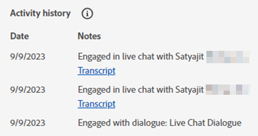

# Agent Inbox {#agent-inbox}

De agenten zullen levende chats binnen de Agent Inbox gebied. Naast de actieve gesprekken, kunnen zij vroegere gesprekken, bezoekersinformatie, en meer zien.

## Beschikbaarheid in-/uitschakelen {#availability-toggle}

Op de hoger-juiste kant van het scherm van de Agent Inbox, hebt u de optie om uw status te plaatsen beschikbaar of niet beschikbaar.

>[!IMPORTANT]
>
>**Dit wordt genegeerd** de [beschikbaarheid van livechat](/help/marketo/product-docs/demand-generation/dynamic-chat-two/setup-and-configuration/agent-settings.md#live-chat-availability) u in de Montages van de Agent vestigde. De status zal blijven tot of u het, of aan het volgende blok van tijd in uw beschikbaarheid terugschakelt.

## Live Chat accepteren {#accepting-a-live-chat}

Wanneer een levende praatje aan de agent wordt verpletterd, zullen zij een blauwe banner over de bovenkant van het scherm zien vragend hen om goed te keuren.

### Notities {#things-to-note}

* De agenten hebben 45 seconden om vóór de &quot;Accept praatjetijden uit te antwoorden.&quot;
* BROWSER TIDBIT
* Er is een grens van 10 levende chats per agent op dit ogenblik

## Gesprek {#conversations}

Op de linkerkant van het scherm van Agent Inbox, kunt u verkiezen om slechts de actieve gesprekken, of allen van hen te tonen.

## Bezoekersinformatie {#visitor-information}

Op de rechterkant van het scherm van Agent Inbox, zult u (van boven tot onder) hun kunnen zien: naam, baantitel, e-mailadres, telefoonaantal, en de status van CRM. Alle informatie die niet wordt doorgegeven, wordt weergegeven als een streepje (-).

## Activiteitenoverzicht {#activity-history}

Onder de bezoekersinformatie bevindt zich de activiteitengeschiedenis. Bekijk activiteitstypen en datums en bekijk zelfs chattranscripties.

>[!NOTE]
>
>Informatie wordt alleen gedurende de afgelopen 90 dagen weergegeven.

Actieve gesprekken - Alle gesprekken - Kalender die de informatie van de Bezoeker deelt - Recente activiteiten van de Dynamic Chat
