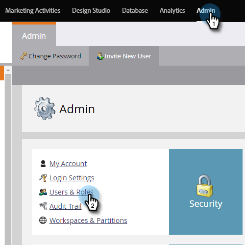

# Chatgebruikers toevoegen of verwijderen {#add-or-remove-chat-users}

Voer de onderstaande stappen uit om chatgebruikers toe te voegen of te verwijderen.

## Chatgebruiker toevoegen {#add-a-chat-user}

1. Aanmelden bij de [Adobe Admin Console](https://adminconsole.adobe.com/).

   

1. Klikken **Dynamic Chat**.

   

   >[!NOTE]
   >
   >Als u meerdere Marketo-abonnementen hebt, selecteert u de gewenste abonnement vóór de volgende stap.

1. Klik op de knop **Gebruikers** tab.

   

1. Klik op de knop **Gebruiker toevoegen** knop.

   

1. Voer de naam, gebruikersgroep of het e-mailadres in van de gebruiker die u wilt toevoegen. Voornaam en achternaam zijn optioneel.

   

1. Klik op de knop **+** en selecteer het gewenste productprofiel.

   

1. Klikken **Opslaan**.

   

## Toegang tot Dynamic Chat toevoegen aan Marketo-rol {#add-dynamic-chat-access-to-marketo-role}

Als de nieuwe toegevoegde rol van Marketo van de Gebruiker van het Praatje nog geen toestemming van de Dynamic Chat heeft, is hier hoe te om het toe te voegen.

1. Klik in Marketo op **Beheerder** en selecteert u **Gebruikers en rollen**.

   

1. Klik op de knop **Rollen** tab.

   

1. Selecteer in de lijst de rol die u wilt wijzigen en klik op **Rol bewerken**.

   

1. Selecteren **Access Dynamic Chat** en klik op **Opslaan**.

   

## Een chatgebruiker verwijderen {#remove-a-chat-user}

1. Aanmelden bij de [Adobe Admin Console](https://adminconsole.adobe.com/).

   

1. Klikken **Dynamic Chat**.

   

   >[!NOTE]
   >
   >Als u meerdere Marketo-abonnementen hebt, selecteert u de gewenste abonnement vóór de volgende stap.

1. Klik op de knop **Gebruikers** tab.

   

1. Selecteer de gebruiker die u wilt verwijderen.

   

1. Klik op de knop **Gebruiker verwijderen** knop.

   

1. Klikken **Gebruiker verwijderen** ter bevestiging.

   

>[!MORELIKETHIS]
>
>* [Adobe Admin Console-gebruikers](https://helpx.adobe.com/enterprise/using/users.html)
>* [Gebruikers afzonderlijk beheren](https://helpx.adobe.com/enterprise/using/manage-users-individually.html)
