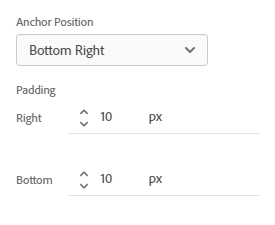
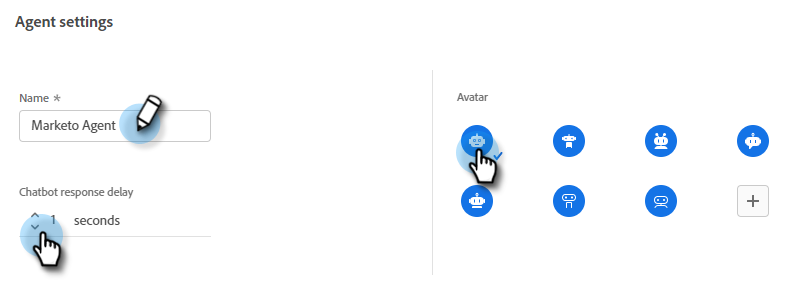

# Configuratie {#configuration}

Leer hoe u de vormgeving van uw venster in het dialoogvenster Chatbot aanpast.

Klik op **Configuratie**.

Er zijn verschillende aanpassingsopties.

## Tabblad Stijl {#style-tab}

### Stijl {#style}

Hier definieert u de vormgeving van het chatbot waar je dialoogvensters worden weergegeven, zoals kleuren, lettertypen, plaatsing van de bot widget en de naam/avatar van de chatbot.

De kleur van elke categorie wordt bepaald door een [hexadecimale kleurwaarde](https://color.adobe.com/create/color-wheel){target="_blank"} (bijvoorbeeld wit = #ffffff, rood = #bf1932, enz.).

Met het anker kan uw sitebezoeker het chatbox openen of sluiten. U kunt kiezen of u dat pictogram rechtsonder of linksonder wilt weergeven. U kunt ook de opvulling vergroten/verkleinen (de hoeveelheid ruimte tussen het pictogram en de onderkant van de webpagina).

### Instellingen agent {#agent-settings}

In de Montages van de Agent, kunt u een etiket aan uw praatbox (ex: &quot;Adobe Bot&quot;) toevoegen die bij de bovenkant van het zal verschijnen. U kunt de reactievertraging (in seconden) ook bepalen, en uw praatjeavatar veranderen. Als u uw eigen avatar-afbeelding wilt uploaden, klikt u op de knop **+** knop.

>[!NOTE]
>
>Aangepaste avatars moeten vierkante afbeeldingen zijn van minder dan 256 kb en kleiner dan 200 x 200 px. Tot de ondersteunde bestandstypen behoren .jpg, .png, .gif, .webp, .svg.

Wanneer u klaar bent met het aanbrengen van veranderingen, herinner me om te klikken **Opslaan**.

## Tab Privacy {#privacy-tab}

Klik op de knop **Privacy** om de URL van het privacybeleid van uw site toe te voegen of te bewerken (optioneel).

## Tabblad Installatie {#installation-tab}

Als u de chatbot op uw website wilt weergeven, moet u eerst het JavaScript-fragment voor Dynamics Chat installeren. Klik op dit tabblad om de benodigde code te zoeken of te kopiëren. Als u niet bekend bent met deze bewerking, neemt u contact op met uw webteam of IT-afdeling voor hulp.

>[!TIP]
>
>Als uw site een Content Security Policy gebruikt, moet u mogelijk de volgende URL&#39;s whitelist om de chatbot naar behoren te laten werken:
>
>* `*.adoberesources.net`
>* `*.adobe.io`
>* `*.typekit.net`

>[!NOTE]
>
>Marketo Support is niet ingesteld voor hulp bij het oplossen van problemen met HTML. Neem contact op met een webontwikkelaar voor hulp bij HTML.
