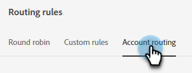

# Routering {#routing}

In Dynamic Chat geboekte vergaderingen kunnen op twee manieren worden gerouteerd. Afgeronde lijn of een aangepaste lijn.

Ronde lijn: vergaderingen worden opeenvolgend toegewezen aan agenten. Dus als u vijf agenten hebt en agent drie nam de laatste vergadering, agent vier zal volgende krijgen, gevolgd door agent vijf, dan terug naar agent één.

Aangepaste regel: u kunt specifieke agenten kiezen om vergaderingen te ontvangen op basis van kenmerken die u selecteert.

## Een aangepaste regel maken {#create-a-custom-rule}

In dit voorbeeld sturen wij alle vergaderingen van de afgeleide staten van CA, OF, en WA naar agent John.

1. Klik onder Configuratie op **Routeringsregels**.

   

1. Klik op de knop **Aangepaste regels** tab.

   

1. Klikken **Regel maken**.

   

1. Geef uw regel een naam. U kunt desgewenst een beschrijving toevoegen en het prioriteitsniveau instellen. Klikken **Volgende**.

   

1. Kies de gewenste agent(s).

   

1. Sleep over de gewenste kenmerken.

   

1. Zoek en selecteer de gewenste waarde(n).

   

1. Wanneer alle gewenste waarden zijn geselecteerd, klikt u op **Opslaan**.

   

## Account routeren {#account-routing}

Identificeer en upload uw doelaccount en de respectievelijke verkoopeigenaren en routeer bezoekers die van deze accounts komen rechtstreeks naar de respectievelijke accounteigenaar.

Team dat verplettert - DELETE DEZE VERWIJZINGEN VOOR NU

Lidmaatschap van slimme lijstroutering - MOGELIJK VERTRAAGD
