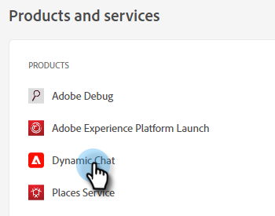

# Chatgebruikers toevoegen of verwijderen {#add-or-remove-chat-users}

Voer de onderstaande stappen uit om chatgebruikers toe te voegen of te verwijderen.

## Chatgebruiker toevoegen {#add-a-chat-user}

1. Meld u aan bij [Adobe Admin Console](https://adminconsole.adobe.com/).

   

1. Klik **Dynamisch chatten**.

   

   >[!NOTE]
   >
   >Als u meer dan één Marketo-abonnement hebt, selecteert u het gewenste abonnement vóór de volgende stap).

1. Klik op het tabblad **Gebruikers**.

   

1. Klik op de knop **Gebruiker toevoegen**.

   

1. Voer de naam, gebruikersgroep of het e-mailadres in van de gebruiker die u wilt toevoegen. Voornaam en achternaam zijn optioneel.

   

1. Klik op het pictogram **+** en selecteer het gewenste productprofiel.

   

1. Klik **Opslaan**.

   

De gebruiker ontvangt vervolgens een e-mail om zich aan te melden bij Marketo.

## Een chatgebruiker verwijderen {#remove-a-chat-user}

1. Meld u aan bij [Adobe Admin Console](https://adminconsole.adobe.com/).

   

1. Klik **Dynamisch chatten**.

   

   >[!NOTE]
   >
   >Als u meer dan één Marketo-abonnement hebt, selecteert u het gewenste abonnement vóór de volgende stap).

1. Klik op het tabblad **Gebruikers**.

   

1. Selecteer de gebruiker die u wilt verwijderen.

   

1. Klik op de knop **Gebruiker verwijderen**.

   

1. Klik **Verwijder Gebruiker** om te bevestigen.

   

>[!MORELIKETHIS]
>
>* [Adobe Admin Console-gebruikers](https://helpx.adobe.com/enterprise/using/users.html)
>* [Gebruikers afzonderlijk beheren](https://helpx.adobe.com/enterprise/using/manage-users-individually.html)

