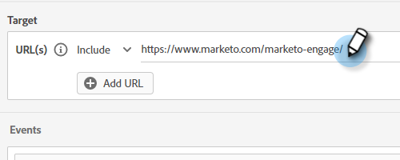

# Criteria voor het publiek {#audience-criteria}

Net als in Marketo Engage Smart Lists kunt u met de kenmerken Audience Criteria (criteria voor doelgroepen) een doelgroep definiëren. U kunt bekende of onbekende personen als doel instellen met afgeleide, persoon- of bedrijfskenmerken (of een combinatie daarvan).

## Prioriteit {#priority}

De prioriteit bepaalt welke Dialoog een lood ontvangt in het geval zij voor meer dan één kwalificeren. Het is gevestigd wanneer u eerst [ uw Dialoog ](/help/marketo/product-docs/demand-generation/dynamic-chat/automated-chat/create-a-dialogue.md){target="_blank"} creeert. U kunt de prioriteit voor een bestaand dialoogvenster wijzigen door het dialoogvenster te openen en naar **[!UICONTROL Dialogue Details]** te gaan op het tabblad Audience Criteria.

## Gebeurtenissen {#events}

Met gebeurtenissen kunt u bezoekers aanwijzen op basis van hoeveel ze schuiven of hoe lang ze zich op uw pagina/site bevinden. In het onderstaande voorbeeld richten we ons op bezoekers die al meer dan 20 seconden op een specifieke pagina staan.

1. Pak de **[!UICONTROL Time on Page]** -gebeurtenis en sleep deze naar rechts.

   

1. Stel de tijd &quot;[!UICONTROL Greater Than]&quot; in op 20 seconden.

   

1. Voeg de URL van de gewenste pagina toe in de sectie [[!UICONTROL Target]](#target) .

   

## Attributen {#attributes}

**Bekende Mensen**

Er zijn _vele_ kenmerkcombinaties om van te kiezen. In het onderstaande voorbeeld richten we ons op alle bekende mensen in Californië die werken bij een bedrijf met meer dan 50 werknemers.

1. Pak het kenmerk **[!UICONTROL Person State]** en sleep het naar rechts.

   

1. _[!UICONTROL Is]_wordt standaard ingesteld. Typ in het veld Waarden selecteren de tekst CA (u kunt ook op de vervolgkeuzelijst klikken en in de lijst selecteren).

   

1. Pak het **[!UICONTROL Company Size]** attribuut en sleep het aan waar het _zegt belemmering en laat vallen hier een attribuut_.

   

   >[!NOTE]
   >
   >U kunt ook een kenmerk kiezen door op het pictogram **+** ervan te klikken.

1. Klik op de vervolgkeuzelijst met operatoren en selecteer **[!UICONTROL Greater Than]** .

   

1. Typ 50 en klik ergens anders op het scherm om op te slaan.

   

En dat is het!

**Anonieme Mensen**

Er is een gemakkelijke manier om mensen specifiek te richten die nog niet in uw gegevensbestand zijn. In dit voorbeeld richten we ons op alle anonieme mensen in het gebied van New York.

1. Pak het kenmerk **[!UICONTROL Person Email]** en sleep het naar rechts.

   

1. Klik op de vervolgkeuzelijst met operatoren en selecteer **[!UICONTROL Is Empty]** .

   

1. Pak het **[!UICONTROL Inferred State]** attribuut en sleep het aan waar het _zegt belemmering en laat vallen hier een attribuut_.

   

   >[!NOTE]
   >
   >Wanneer iemand uw website bezoekt, [ Munchkin ](/help/marketo/product-docs/administration/additional-integrations/add-munchkin-tracking-code-to-your-website.md){target="_blank"} koekjes hen en hen in het systeem zet. Wij kijken omhoog hun IP in een speciaal gegevensbestand en leiden allerlei goede info.

1. _[!UICONTROL Is]_wordt standaard ingesteld. Typ in het veld Waarden selecteren de waarde NY (u kunt ook op de vervolgkeuzelijst klikken en een waarde in de lijst selecteren).

   

## Lidmaatschap {#membership}

Gebruik Marketo Engage Smart Lists voor het doelpubliek van uw dialoogvenster.

>[!AVAILABILITY]
>
>Lid van de Slimme Lijst of Lid van de criteria van de Lijst vereist Dynamic Chat Prime. Neem contact op met het Adobe-accountteam (uw accountmanager) voor meer informatie.

1. Pak **[!UICONTROL Member of Smart List]** onder Lidmaatschap en zet het neer op het canvas.

   

1. Selecteer de gewenste slimme lijst.

   

## Groepen toevoegen {#add-groups}

U kunt ook kenmerken groeperen, voor het geval dat u alle kenmerken samen met &quot;alle of een&quot; van een ander kenmerk wilt hebben. U kunt meerdere groepen toevoegen.

## Target {#target}

Hier voert u de URL&#39;s in waarop u een specifiek dialoogvenster wilt weergeven. U kunt ook uitsluitingen toevoegen.

Acceptabele indelingen:

* `http://website.com`
* `https://*.website.com`
* `http://website.com/folder/*`
* `https://*.website.com/folder/*`

>[!NOTE]
>
>* Het gebruiken van een asterisk doet dienst als vangst-all wilkaart. Dit betekent dat `https://*.website.com` het dialoogvenster op elke pagina van de site plaatst, inclusief subdomeinen (bijvoorbeeld: `support.website.com` ). En `https://website.com/folder/*` plaatst het dialoogvenster op elke HTML-pagina in de volgende map (in dit geval is de map &quot;sport&quot;, dus: website.com/sports/baseball.html, website.com/sports/football.html, enz.).
>
>* URL-parameters worden momenteel niet ondersteund.

**Uitsluitingen**

De uitsluitingen van het gebruik om uw Dialoog te verzekeren verschijnen _niet_ op een specifieke pagina/een gebied van uw plaats. Uitsluitingen hebben dezelfde indeling als insluitingen.

>[!MORELIKETHIS]
>
>* [ creeer een Dialoog ](/help/marketo/product-docs/demand-generation/dynamic-chat/automated-chat/create-a-dialogue.md){target="_blank"}
>* [ stroom Designer ](/help/marketo/product-docs/demand-generation/dynamic-chat/automated-chat/stream-designer.md){target="_blank"}
