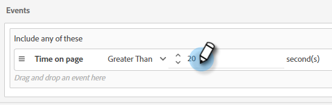
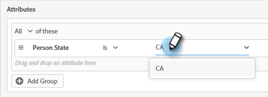
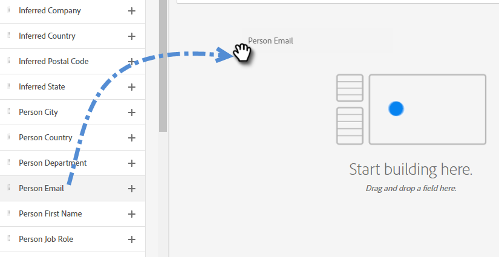
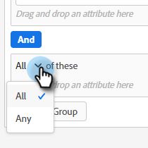

# Criteria voor het publiek {#audience-criteria}

Net als bij Slimme lijsten Marketo&#39;s Engage kunt u met de kenmerken Audience Criteria (criteria voor doelgroepen) het doelpubliek definiëren. U kunt bekende of onbekende personen als doel instellen met afgeleide, persoon- of bedrijfskenmerken (of een combinatie daarvan).

## Prioriteit {#priority}

De prioriteit bepaalt welke Dialoog een lood ontvangt in het geval zij voor meer dan één kwalificeren. Het is vastgesteld bij de eerste [uw dialoogvenster maken](/help/marketo/product-docs/demand-generation/dynamic-chat/automated-chat/create-a-dialogue.md){target="_blank"}. U kunt de prioriteit voor een bestaand dialoogvenster wijzigen door het dialoogvenster te openen en naar **[!UICONTROL Dialogue Details]** op het tabblad Audience Criteria.

## Gebeurtenissen {#events}

Met gebeurtenissen kunt u bezoekers aanwijzen op basis van hoeveel ze schuiven of hoe lang ze zich op uw pagina/site bevinden. In het onderstaande voorbeeld richten we ons op bezoekers die al meer dan 20 seconden op een specifieke pagina staan.

1. Pak de **[!UICONTROL Time on Page]** en sleep deze naar rechts.

   

1. Stel de tijd Groter dan in op 20 seconden.

   

1. Voeg de URL van de gewenste pagina toe in het dialoogvenster [Doel](#target) sectie.

   

## Attributen {#attributes}

**Bekende personen**

Er zijn _veel_ te kiezen kenmerkcombinaties. In het onderstaande voorbeeld richten we ons op alle bekende mensen in Californië die werken bij een bedrijf met meer dan 50 werknemers.

1. Pak de **[!UICONTROL Person State]** en sleep het naar rechts.

   

1. _Is_ is standaard ingesteld. Typ in het veld Waarden selecteren de tekst CA (u kunt ook op de vervolgkeuzelijst klikken en in de lijst selecteren).

   

1. Pak de **[!UICONTROL Company Size]** kenmerk en sleep het naar de gewenste locatie _een kenmerk hier slepen en neerzetten_.

   

   >[!NOTE]
   >
   >U kunt ook een kenmerk kiezen door op het desbetreffende kenmerk te klikken **+** pictogram.

1. Klik op de vervolgkeuzelijst met operatoren en selecteer **[!UICONTROL Greater Than]**.

   

1. Typ 50 en klik ergens anders op het scherm om op te slaan.

   

En dat is het!

**Anonieme mensen**

Er is een gemakkelijke manier om mensen specifiek te richten die nog niet in uw gegevensbestand zijn. In dit voorbeeld richten we ons op alle anonieme mensen in het gebied van New York.

1. Pak de **[!UICONTROL Person Email]** en sleep het naar rechts.

   

1. Klik op de vervolgkeuzelijst met operatoren en selecteer **[!UICONTROL Is Empty]**.

   

1. Pak de **[!UICONTROL Inferred State]** kenmerk en sleep het naar de gewenste locatie _een kenmerk hier slepen en neerzetten_.

   

   >[!NOTE]
   >
   >Wanneer iemand uw website bezoekt, [Munchkin](/help/marketo/product-docs/administration/additional-integrations/add-munchkin-tracking-code-to-your-website.md){target="_blank"} cookies ze en zet ze in het systeem. Wij kijken omhoog hun IP in een speciaal gegevensbestand en leiden allerlei goede info.

1. _Is_ is standaard ingesteld. Typ in het veld Waarden selecteren de waarde NY (u kunt ook op de vervolgkeuzelijst klikken en een waarde in de lijst selecteren).

   

## Lidmaatschap {#membership}

Gebruik de Slimme Lijsten van het Marketo Engage voor het doelpubliek van uw Dialoog.

>[!AVAILABILITY]
>
>Lid van Slimme Lijst of Lid van de criteria van de Lijst vereist de Primeur van de Dynamic Chat. Neem contact op met het accountteam van de Adobe (uw accountmanager) voor meer informatie.

1. Onder Lidmaatschap, greep **[!UICONTROL Member of Smart List]** en zet het neer op het canvas.

   

1. Selecteer de gewenste slimme lijst.

   

## Groepen toevoegen {#add-groups}

U kunt ook kenmerken groeperen, voor het geval dat u alle kenmerken samen met &quot;alle of een&quot; van een ander kenmerk wilt hebben. U kunt meerdere groepen toevoegen.

## Doel {#target}

Hier voert u de URL&#39;s in waarop u een specifiek dialoogvenster wilt weergeven. U kunt ook uitsluitingen toevoegen.

Acceptabele indelingen:

* `http://website.com`
* `https://*.website.com`
* `http://website.com/folder/*`
* `https://*.website.com/folder/*`

>[!NOTE]
>
>Het gebruiken van een asterisk doet dienst als vangst-all wilkaart. Dus `https://*.website.com` zou het dialoogvenster op elke pagina van de site plaatsen, inclusief subdomeinen (bijvoorbeeld: `support.website.com`). en `https://website.com/folder/*` plaatst u het dialoogvenster op elke pagina HTML in de volgende map (in dit geval is de map &quot;sport&quot;, dus: website.com/sports/baseball.html, website.com/sports/football.html, enz.).

**Uitsluitingen**

Uitsluitingen gebruiken om ervoor te zorgen dat uw dialoogvenster dit doet _niet_ worden weergegeven op een specifieke pagina of een specifiek gebied van uw site. Uitsluitingen hebben dezelfde indeling als insluitingen.

>[!MORELIKETHIS]
>
>* [Een dialoogvenster maken](/help/marketo/product-docs/demand-generation/dynamic-chat/automated-chat/create-a-dialogue.md){target="_blank"}
>* [Stream Designer](/help/marketo/product-docs/demand-generation/dynamic-chat/automated-chat/stream-designer.md){target="_blank"}
