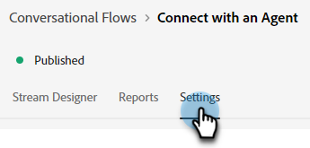

# Overzicht van conversiesnelheid {#conversational-flow-overview}

Een gespreksstroom ontwerpen en deze activeren voor elke bezoeker op basis van een specifieke actie (bijvoorbeeld klikken op een knop Bellen naar actie, Bij laden van de pagina, de tijd die op de pagina wordt doorgebracht, enz.).

>[!NOTE]
>
>Gespreksende stromen en Levende Chat zijn gedeelde proefeigenschappen die een gecombineerde levensgrens van 100 overeenkomsten voor die op het Uitgezochte Dynamic Chat hebben. Wanneer deze grens wordt bereikt, zullen alle gepubliceerde Stromen van de Gesprek ophouden teweegbrengend en de bezoekers die om met een levende agent verzoeken te chatten zullen het globale reservebericht ontvangen. Neem contact op met uw accountvertegenwoordiger om de upgradeopties voor pakketten te bespreken.

## Dialoogvensters versus omgekeerde stromen {#dialogues-vs-conversational-flows}

Dialoogvensters en conversatiestromen hebben verschillende gelijkenissen, maar het zijn twee verschillende kenmerken.

<table> 
 <tbody> 
  <tr> 
   <th style="width:50%">Dialoogvensters</th> 
   <th style="width:50%">Conversatiestromen</th>
  </tr> 
  <tr> 
   <td>De dialogen zijn gericht-u ontwerpt een gesprek voor een specifieke pagina en een publiek dat op parameters wordt gebaseerd u uitvoerde.</td> 
   <td>De stromen van de dialoog worden teweeggebracht-u ontwerpt een gesprek dat op de actie van een bezoeker kan worden teweeggebracht, zoals het invullen van een formulier, het klikken van een verbinding, enz.</td>
  </tr>
   <tr> 
   <td>Wordt alleen ondersteund in de interface Chatbot.</td> 
   <td>Momenteel gesteund in een pop-up interface, met meer geplande interfaces.</td>
  </tr>
  </tr>
   <tr> 
   <td>Er kunnen meerdere dialoogvensters worden gemaakt voor hetzelfde segment van leads, met een prioriteitsvolgorde, zodat elke bezoeker de dialoog met prioriteit in de juiste volgorde ziet terwijl hij of zij doorgaat.</td> 
   <td>De samenkomende stromen hebben geen prioritaire orde en kunnen om het even welk aantal tijden door de zelfde lood worden teweeggebracht die op de bepaalde vraag-aan-actie wordt gebaseerd.</td>
  </tr>
  <tr>
   <td>Chatbotgesprekken worden aangedreven door Dialogen.</td>
   <td><a href="/help/marketo/product-docs/demand-generation/dynamic-chat/automated-chat/conversational-flow-settings-for-marketo-engage-forms.md" target="_blank">Gesprek Forms</a> in Marketo Engage worden aangedreven door Conversationele Stromen.</td>
  </tr>
 </tbody> 
</table>

## Tabblad Stream Designer {#stream-designer-tab}

De Ontwerper van de Stroom voor de Stroom van de Gesprek is bijna identiek aan die voor Dialogen. [Meer informatie hierover hier](/help/marketo/product-docs/demand-generation/dynamic-chat/automated-chat/stream-designer.md){target="_blank"}.

## Tabblad Rapporten {#reports-tab}

Op het tabblad Rapporten kunt u meetgegevens bekijken over hoe goed uw Conversationele stroom presteert.

Weergave van de betrokkenheidsgraad, conversiesnelheid, filter op bekende en/of onbekende bezoekers en meer.

## Tabblad Instellingen {#settings-tab}

In de bovenste helft van het tabblad Instellingen kunt u de naam van de Conversationele stroom bijwerken, een optionele beschrijving toevoegen en de taal wijzigen.

>[!NOTE]
>
>Als u een andere taal selecteert, wordt alleen de taal van de systeemtekst gewijzigd. U bent verantwoordelijk voor het vertalen van inhoud.

### Gesprek SDK {#conversations-sdk}

In de onderste helft van het lusje van Montages, pas de trekker van de Gesprek aan, die ook als Gesprek SDK wordt bekend. U kunt bepalen of het gesprek wordt geactiveerd op uw website wanneer een bezoeker op een koppeling klikt of wanneer de pagina wordt geladen.

>[!TIP]
>
>Zie [Gesprek SDK](https://experienceleague.adobe.com/tools/marketo-dynamic-chatbot/conversations-sdk/){target="_blank"} in actie!

>[!MORELIKETHIS]
>
>[Een wisselstroom maken](/help/marketo/product-docs/demand-generation/dynamic-chat/automated-chat/create-a-conversational-flow.md){target="_blank"}
