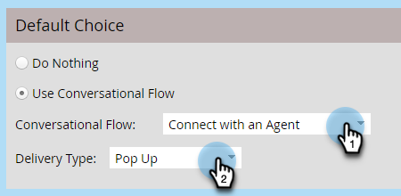

# Instellingen voor conversie-stroom voor Marketo Engage Forms{#conversational-flow-settings-for-marketo-engage-forms}

Maak Marketo Engage Forms conversationeel door ze te integreren met Dynamic Chat Conversational Flows. Kwalificeer direct lood gebruikend vormgegevens of het Slimme lidmaatschap van de Lijst voor vergaderingsboekingen, de verbindingen van het Witboek, of douanedoelstellingen.

>[!AVAILABILITY]
>
>Lid van de Slimme Lijst of Lid van de criteria van de Lijst vereist Dynamic Chat Prime. Neem contact op met het Adobe-accountteam (uw accountmanager) voor meer informatie.

1. Zoek en selecteer het formulier (of maak een nieuw formulier).

   

1. Klik op **[!UICONTROL Edit Draft]**.

   

1. Klik op de pagina voor formulierbewerking op **[!UICONTROL Form Settings]** en vervolgens op **[!UICONTROL Settings]** .

   

1. Klik op de schuifregelaar **[!UICONTROL Conversational Flow Settings]** om deze in te schakelen.

   

1. Er wordt een standaardkeuzemodaal weergegeven. Selecteer uw voorkeur. In dit voorbeeld kiezen we **[!UICONTROL Use Conversational Flow]** .

   

1. Selecteer de gewenste **[!UICONTROL Conversational Flow]** en **[!UICONTROL Delivery Type]** .

   

   >[!NOTE]
   >
   >[ Leer meer over de Omzettingsstromen ](/help/marketo/product-docs/demand-generation/dynamic-chat/automated-chat/conversational-flow-overview.md){target="_blank"}

   **OPTIONELE STAP**: U kunt **[!UICONTROL Add Choice]** klikken om praatjebezoekers te richten die aan een specifieke criteria voldoen. U kunt maximaal negen keuzes toevoegen voor een totaal van tien.

   

   >[!NOTE]
   >
   >De browser van de bezoeker moet vóór het verzenden van het formulier cookie&#39;d zijn als bekende persoon om in aanmerking te komen voor lid van de Static/Smart List.

   **OPTIONELE STAP**: Klik **+** teken binnen elke stap om meer attributen toe te voegen, toestaand u om uw gericht publiek (de beschikbare attributen zijn de gebieden u voor de vorm hebt gekozen) te versmallen. In dit voorbeeld richten we ons op Adobe Technical Writers in Californië.

   

   >[!NOTE]
   >
   >Criteria Logic ingesteld op &quot;all&quot; betekent dat elk kenmerk moet zijn vervuld om in aanmerking te komen. Criteria Logic ingesteld op &quot;om het even welk&quot;betekent om het even welk van de attributen zal voldoende zijn.

   **OPTIONELE STAP**: Als u twee of meer keuzen toevoegt, kunt u hen opnieuw rangschikken door hun op of neer pijlen te klikken.

   

1. Klik op **[!UICONTROL Finish]** als u klaar bent.

   
