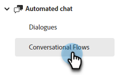

# Een wisselstroom maken {#create-a-conversational-flow}

Hier is hoe te om een nieuwe Conversationele Stroom te creëren.

1. Onder [!UICONTROL Automated Chat], klikt u op **[!UICONTROL Conversational Flows]**.

   

1. Klik op **[!UICONTROL Create Conversational Flow]**.

   

1. Kies een lege Conversationele Stroom, of één van de pre-bevolkte malplaatjes. Voer een naam in (beschrijving is optioneel), wijzig de taal (optioneel) en klik op **[!UICONTROL Create]**.

   

   >[!NOTE]
   >
   >Hierdoor wordt alleen de taal van de systeemtekst gewijzigd. U bent verantwoordelijk voor het vertalen van inhoud.

1. Net als in Dialogen is het nu tijd om [een stream maken](/help/marketo/product-docs/demand-generation/dynamic-chat/automated-chat/stream-designer.md#create-a-stream){target="_blank"}.

>[!MORELIKETHIS]
>
>[Overzicht van conversiesnelheid](/help/marketo/product-docs/demand-generation/dynamic-chat/automated-chat/conversational-flow-overview.md){target="_blank"}
