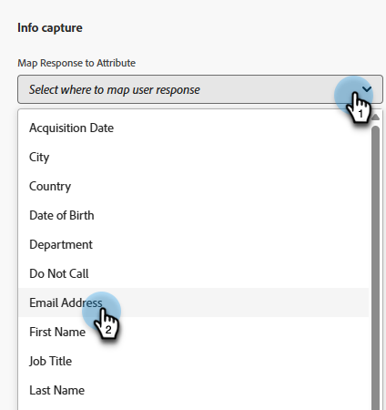
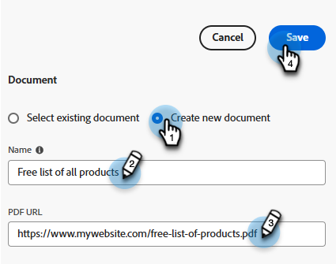

# Stream Designer {#stream-designer}

Er zijn _veel_ streamcombinaties mogelijk. Dit artikel bevat een voorbeeld waarin de marketeter de sitebezoeker vraagt of hij productvragen heeft. Zo ja, dan kan de bezoeker een afspraak plannen. Zo neen, dan kan de bezoeker zich bij een mailinglijst aansluiten voor toekomstige correspondentie. Ze krijgen ook een gratis PDF aangeboden. Het uiteindelijke doel is of een afspraak te plannen of de e-mail van de bezoeker te verzamelen.

>[!PREREQUISITES]
>
>Voordat u de documentkaart kunt gebruiken, moet u eerst [instellen](/help/marketo/product-docs/demand-generation/dynamic-chat/integrations/adobe-pdf-embed-api.md){target="_blank"} in uw Adobe account.

## Streaming Designer-kaarten {#stream-designer-cards}

De Ontwerper van de Stroom bevat veelvoudige kaarten u kunt toevoegen om het praatjegesprek te vormen.

<table>
 <tr>
  <td style="width:25%"><strong>Bericht</strong></td>
  <td>Wordt gebruikt wanneer u een instructie wilt maken zonder dat er een reactie nodig is (bijvoorbeeld: "Hallo! Alle items zijn vandaag 25% korting met code SAVE25").
</td>
 </tr>
 <tr>
  <td style="width:25%"><strong>Vraag</strong></td>
  <td>Wordt gebruikt wanneer u een meerkeuzevraag wilt stellen, waarvoor u de beschikbare antwoorden kunt opgeven (bijvoorbeeld: Welk type voertuig bent u geïnteresseerd? Reacties = SUV, Compact, Truck, enz.).</td>
 </tr>
 <tr>
  <td style="width:25%"><strong>Document</strong></td>
  <td>Hiermee kunt u PDF-documenten insluiten in dialoogvensters en de activiteit van bezoekers in de documentbetrokkenheid bijhouden (hoeveel pagina's zijn weergegeven, of het document is gedownload en/of welke zoektermen zijn gebruikt).</td>
 </tr>
 <tr>
  <td style="width:25%"><strong>Informatie vastleggen</strong></td>
  <td>Wordt gebruikt wanneer u gegevens wilt verzamelen (bijvoorbeeld naam, e-mailadres, functie, enz.). Nadat u hebt bepaald op welk veld de reactie moet worden toegeschreven, kunt u kiezen of de bezoeker zijn reactie laat typen of opties in een keuzelijst selecteert die u bepaalt (tip: de laatste kan helpen met de schoonheid van de database). U kunt er ook voor kiezen om de gegevens die u momenteel voor hen hebt vermeld, te overschrijven met hun antwoord, of de vraag volledig over te slaan als u al een waarde voor hen hebt.</td>
 </tr>
 <tr>
  <td style="width:25%"><strong>Boeking van vergadering</strong></td>
  <td>Biedt de bezoeker een kalender met beschikbare datums om een vergadering te plannen. Kies de kalenderbeschikbaarheid via ronde lijn, een specifieke agent, of het gebruiken van douaneregels. Klikken <b>Kenmerk toevoegen</b> als u de naam of het e-mailadres van de agent wilt vastleggen en dit aan de persoonlijke record van de bezoeker van de chat wilt toewijzen voor toekomstig opvragen (tip: maak een <a href="/help/marketo/product-docs/administration/field-management/create-a-custom-field-in-marketo.md" target="_blank">aangepast veld</a> om de informatie van de agent aan zoals in kaart te brengen om een standaardgebied van het Marketo Engage niet te beschrijven).</td>
 </tr>
 <tr>
  <td style="width:25%"><strong>Doel</strong></td>
  <td>Dit is de enige kaart die bezoekers niet zullen zien. Het is aan u om te bepalen op welk punt een doel binnen de specifieke praatje wordt bereikt (bijvoorbeeld: als het verzamelen van de e-mail van de bezoeker uw doel is, plaats de Goal kaart onmiddellijk na Info vangt in de stroom).</td>
 </tr>
 <tr>
  <td style="width:25%"><strong>Actie*</strong></td>
  <td>Vergelijkbaar met verborgen velden in een formulier, kunt u met de actiekaart elk lead- of bedrijfskenmerk vullen (met een <a href="/help/marketo/product-docs/administration/field-management/custom-field-type-glossary.md#string">gegevenstype tekenreeks</a>) met impliciete waarden die u wilt vastleggen op basis van een hoofdrecord. U kunt de actiekaart op elk punt in het gesprek toevoegen en respectieve attributen met een waarde of inheemse tokens bijwerken die automatisch de respectieve waarde bevolken.
  
<i>* Voor deze kaart is de Dynamic Chat-primeur vereist. Neem contact op met het accountteam van de Adobe (uw accountmanager) voor meer informatie.</i></td>
 </tr>
 <tr>
  <td style="width:25%"><strong>Live chatten</strong></td>
  <td>Gebruik de live chatkaart wanneer bezoekers met een live agent willen chatten.
  <li>De live chatkaart moet de laatste kaart in de vertakking zijn.</li>
  <li>Bezoekers worden naar een agent geleid zodra ze deze kaart in de stream bereiken. Het wordt daarom aanbevolen om aan deze kaart een vraagkaart toe te voegen waarin bezoekers wordt gevraagd of ze met een liveagent willen chatten.</li></td>
 </tr>
 <tr>
  <td style="width:25%"><strong>Gegenereerde reacties*</strong></td>
  <td>Creeer een bericht voor de bezoeker voor wanneer zij een bepaald punt in het gesprek bereiken. Stel een aantal vragen die ze kunnen stellen in om de gewenste prestatiekernindicator te bereiken.
  
<i>* Voor deze kaart is de Dynamic Chat-primeur vereist. Neem contact op met het accountteam van de Adobe (uw accountmanager) voor meer informatie.</i></td>
 </tr>
 <tr>
  <td style="width:25%"><strong>Voorwaardelijke vertakking</strong></td>
  <td>U kunt vertakkingen maken in uw dialoogvenster op basis van verschillende voorwaarden. Verschillende inhoud presenteren aan verschillende personen in dezelfde dialoog op basis van de kenmerken van leads en bedrijven in Marketo Engage.</td>
 </tr>
 <tr>
  <td style="width:25%"><strong>Conversatievloeistroom</strong></td>
  <td>Verstrek meerdere stappen in een stroom binnen uw Dialogen door de Conversationele kaart van de Stroom te gebruiken.</td>
 </tr>
</table>

## Stroom Designer-pictogrammen {#stream-designer-icons}

Rechtsboven in Stream Designer ziet u een handvol pictogrammen. Dit is wat ze doen.

<table>
 <tr>
  <td style="width:10%"></td>
  <td>Inzoomen, grotere kaarten maken</td>
 </tr>
 <tr>
  <td style="width:10%"></td>
  <td>Uitzoomen, kleinere kaarten maken</td>
 </tr>
 <tr>
  <td style="width:10%"></td>
  <td>Hiermee opent u een venster waarin u uw chat kunt testen (druk op dezelfde knop om te sluiten)</td>
 </tr>
 <tr>
  <td style="width:10%"></td>
  <td>Hiermee kunt u zoeken naar kaarttypen of inhoud in uw stream</td>
 </tr>
 <tr>
  <td style="width:10%"></td>
  <td>Hiermee rangschikt u alle kaarten in uw stream</td>
 </tr>
</table>

## Een stream maken {#create-a-stream}

U kunt streams maken voor dialoogvensters of [Gesprek Forms](/help/marketo/product-docs/demand-generation/dynamic-chat/automated-chat/conversational-flow-overview.md){target="_blank"}. In dit voorbeeld maken we er een voor een dialoogvenster.

1. Na u hebt [heeft uw dialoogvenster gemaakt](/help/marketo/product-docs/demand-generation/dynamic-chat/automated-chat/create-a-dialogue.md){target="_blank"}klikt u op de knop **[!UICONTROL Stream Designer]** tab.

   

1. Sleep de [!UICONTROL Question] kaart.

   

1. Onder [!UICONTROL Chatbot Response]Zeg je vraag hoe je wilt.

   

   >[!TIP]
   >
   >U kunt de ervaring voor bekende chatsbezoekers aanpassen door tokens te gebruiken (bijvoorbeeld: Hello `{{lead.leadFirstName:""}}`). Klik gewoon op het pictogram voor het accolade rechts en maak een selectie. Voeg een standaardwaarde tussen de aanhalingstekens toe als u wilt dat anonieme bezoekers iets soortgelijks zien (bijvoorbeeld: Hello `{{lead.leadFirstName:"there"}}`).

   >[!NOTE]
   >
   >Poke is standaard ingesteld op Aan, waardoor de openingsvraag naast het chatpictogram wordt weergegeven zonder dat de bezoeker erop moet klikken om deze te zien. Poke is slechts beschikbaar op de eerste kaart in het gesprek.

1. Voer uw gebruikersreacties in en klik op **[!UICONTROL Save]**.

   

   >[!NOTE]
   >
   >**[!UICONTROL Edit Stored Values]** Dit is een optionele stap voor diegenen die een andere waarde in de database willen opslaan dan wat bezoekers in de chatbot krijgen te zien voor toegewezen kenmerken in de vraagkaart (bezoekers zien bijvoorbeeld &quot;Zoekmachine optimaliseren&quot;, en slaan die waarde op als &quot;SEO.&quot;).

1. Voor &quot;ja&quot;willen wij een benoeming plannen, zodat onder die optie belemmering over de kaart van de Planner van de Benoeming.

   

1. Klik in de rechterkolom op **[!UICONTROL Save]**.

   

1. Aangezien dat een doel is, sleept u de [!UICONTROL Goal] kaart onder de benoemingsplanner.

   

1. Geef uw doel een naam (of kies een bestaand doel) en klik op **[!UICONTROL Save]**.

   

1. Voor &quot;Nee&quot; willen we zien of ze zich bij de mailinglijst voegen. Sleep dus onder deze optie over een andere lijst [!UICONTROL Question] kaart.

   

1. Voer uw reactie in en voeg antwoordopties toe voor de bezoeker. Klikken **[!UICONTROL Save]** wanneer gereed.

   

   >[!NOTE]
   >
   >U kunt meer reacties toevoegen door op **[!UICONTROL Add Response]**.

1. Onder het antwoord &quot;Ja&quot; sleept u over de kaart voor het vastleggen van gegevens, zodat u de e-mail van de bezoeker kunt verzamelen.

   

1. Klik op de knop **[!UICONTROL Type]** vervolgkeuzelijst en selecteer **[!UICONTROL Email]**.

   

1. Voer een chatbotbericht en tijdelijke aanduiding in. Controleer of het kenmerk is toegewezen aan het juiste veld in het Marketo Engage en klik op **[!UICONTROL Save]**.

   

   <table>
    <tr>
     <td style="width:30%"><strong>Type</strong></td>
     <td>Het type informatie dat u wilt vastleggen: Telefoon, Tekst, E-mail.</td>
    </tr>
    <tr>
     <td style="width:30%"><strong>Chatbotbericht</strong></td>
     <td>Het bericht dat de bezoeker ziet hen ertoe aanzetten om de info te verstrekken.</td>
    </tr>
    <tr>
     <td style="width:30%"><strong>Plaatsaanduiding</strong></td>
     <td>Voorbeeldtekst waarmee de bezoeker kan zien wat er moet worden ingevoerd.</td>
    </tr>
    <tr>
     <td style="width:30%"><strong>Reactie toewijzen aan kenmerk</strong></td>
     <td>Hiermee kunt u de reactie van de bezoeker synchroniseren naar het corresponderende veld in de Persoonlijke record in uw abonnement op het Marketo Engage.</td>
    </tr>
   </table>

1. Aangezien het verzamelen van hun e-mail een doel is, sleept u de [!UICONTROL Goal] kaart onder Info vastleggen.

   

1. Geef uw doel een naam (of kies een bestaand doel) en klik op **[!UICONTROL Save]**.

   

1. Vergeet niet een reactie toe te voegen als ze &quot;Nee&quot; zeggen. Een optie is om een berichtkaart hieronder te slepen en &quot;Toch bedankt&quot; te zeggen. In dit voorbeeld geven we ze een gratis PDF-document.

   

1. In dit voorbeeld maken we een nieuw document. Geef deze een naam, voer de URL in naar de PDF die u al hebt gehost en klik op **[!UICONTROL Save]**.

   

1. Selecteer de **[!UICONTROL Preview]** schakelen om een voorvertoning van het dialoogvenster weer te geven.

   

1. Als u klaar bent om uw dialoogvenster te activeren, klikt u op **[!UICONTROL Publish]**.

   

>[!NOTE]
>
>Voordat u klikt [!UICONTROL Publish], vergeet niet om te controleren of u [doel-URL(&#39;s) ingevoerd](/help/marketo/product-docs/demand-generation/dynamic-chat/automated-chat/audience-criteria.md#target){target="_blank"}.

>[!MORELIKETHIS]
>
>* [Een dialoogvenster maken](/help/marketo/product-docs/demand-generation/dynamic-chat/automated-chat/create-a-dialogue.md){target="_blank"}
>* [Criteria voor het publiek](/help/marketo/product-docs/demand-generation/dynamic-chat/automated-chat/audience-criteria.md){target="_blank"}
>* [Adobe PDF Embed-API](/help/marketo/product-docs/demand-generation/dynamic-chat/integrations/adobe-pdf-embed-api.md){target="_blank"}
