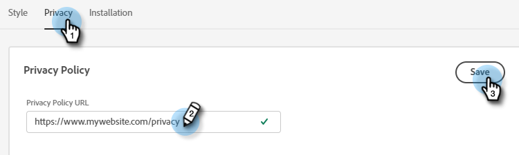

# Configuratie {#configuration}

Leer hoe u de vormgeving van uw venster in het dialoogvenster Chatbot aanpast.

Om te beginnen, klik **Configuratie**.

Er zijn verschillende aanpassingsopties.

## Tabblad Stijl {#style-tab}

**Stijl**

Dit is waar u de blik en het gevoel van het praatje zult bepalen waar uw Dialogen zullen worden getoond, met inbegrip van: kleuren, lettertypen, plaatsing van de bot-widget en de naam/avatar van de chatbot.

De kleur van elke categorie wordt bepaald door een [hexadecimale kleurwaarde](https://color.adobe.com/create/color-wheel) (bijvoorbeeld wit = #ffffff, rood = #bf1932, enz.).

Met het anker kan uw sitebezoeker het chatbox openen of sluiten. U kunt kiezen of u dat pictogram rechtsonder of linksonder wilt weergeven. U kunt ook de opvulling vergroten/verkleinen (de hoeveelheid ruimte tussen het pictogram en de onderkant van de webpagina).

**Instellingen agent**

In de Montages van de Agent, kunt u een etiket aan uw praatbox toevoegen (bijvoorbeeld: &quot;Adobe Bot&quot;) die bovenaan wordt weergegeven. U kunt de reactievertraging (in seconden) ook bepalen, en uw praatjeavatar veranderen.

Wanneer u klaar bent met het aanbrengen van veranderingen, herinner me om **sparen** te klikken.

## Tab Privacy {#privacy-tab}

Klik op het tabblad **Privacy** om de URL van het privacybeleid van uw site toe te voegen of te bewerken (optioneel).

## Tabblad Installatie {#installation-tab}

Als u de chatbot op uw website wilt weergeven, moet u eerst het Dynamic Chat JavaScript-fragment installeren. Klik op dit tabblad om de benodigde code te zoeken of te kopiëren. Als u niet bekend bent met deze bewerking, neemt u contact op met uw webteam of IT-afdeling voor hulp.

>[!NOTE]
>
>Marketo Support is niet ingesteld als hulp bij het oplossen van problemen met HTML. Neem contact op met een webontwikkelaar voor HTML-ondersteuning.
