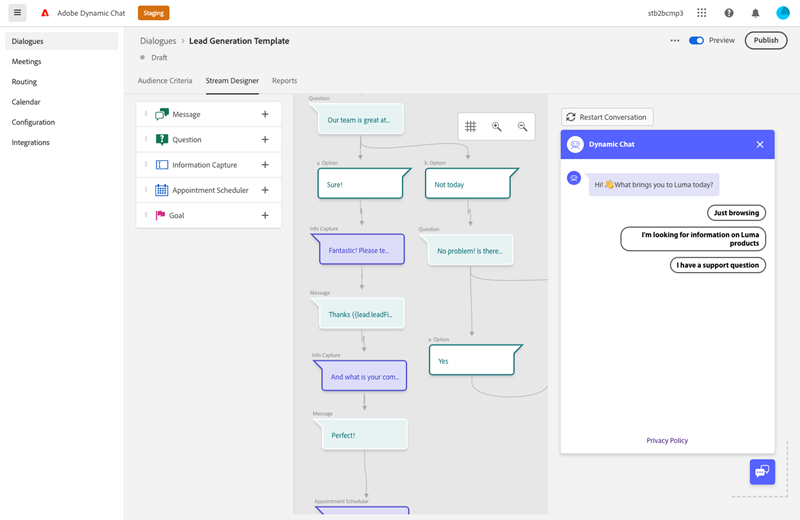

# Overzicht van dialoogvensters {#dialogue-overview}

Dialogen zijn individuele praatjegesprekken. In elke Dialoog, beslist u waar het specifieke praatjegesprek wordt getoond, aan wie het zal worden getoond, en wat de inhoud van het gesprek zal zijn. Elke Dialoog heeft ook zijn eigen rapportpagina waar u doeltreffendheid kunt controleren.

## Criteria voor het publiek {#audience-criteria}

De [Criteria voor het publiek](/help/marketo/product-docs/demand-generation/dynamic-chat/dialogues/audience-criteria.md){target=&quot;_blank&quot;} sectie van een Dialoog is waar u zult bepalen waar en aan wie uw praatjegesprek zal worden getoond

## Stream Designer {#stream-designer}

De [Stream Designer](/help/marketo/product-docs/demand-generation/dynamic-chat/dialogues/stream-designer.md)In de sectie {target=&quot;_blank&quot;} van een dialoogvenster ontwerpt u het gesprek dat u met uw websitebezoekers wilt voeren.

## Rapporten {#reports}

De [Rapporten](/help/marketo/product-docs/demand-generation/dynamic-chat/dialogues/reports.md)In de sectie {target=&quot;_blank&quot;} van een dialoogvenster ziet u hoe goed uw dialoogvenster presteert.

## Alle dialoogvensters in-/uitschakelen {#disable-enable-all-dialogues}

U kunt alle gepubliceerde dialoogvensters tegelijkertijd uitschakelen (en weer inschakelen).

1. Klik in Dynamisch chatten op de knop **Configuratie** tab.

   

1. Schakelen tussen **Chat ingeschakeld** Schakel uit om alle dialoogvensters uit te schakelen (en weer in te schakelen om weer in te schakelen).

   
