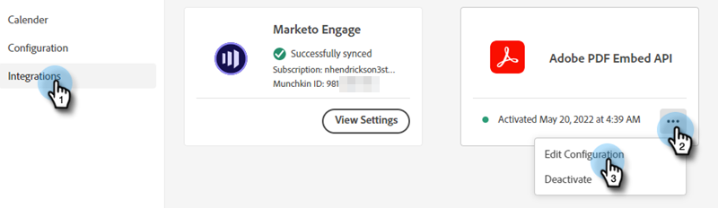

# De documentkaart gebruiken {#using-the-document-card}

Met de documentkaart kunt u PDF-documenten insluiten in dialoogvensters en de activiteit van bezoekers in de documentbetrokkenheid bijhouden. Hier is hoe je het instelt.

1. Navigeren naar [Adobe PDF Embed-API](https://udp.adobe.io/document-services/apis/pdf-embed/){target=&quot;_blank&quot;}.

1. Klikken **Credentials ophalen**.

   

1. Meld u aan bij uw Adobe-account.

   

1. Voer uw gegevens in, accepteer de voorwaarden en klik op **Credentials maken**.

   

1. Klikken **Kopiëren** om uw client-id te kopiëren.

   

1. Terug in dynamische chat, klik **Integraties**. Klik op de gegevens onder de Adobe PDF Embed API en selecteer **Configuratie bewerken**.

   

1. Plak uw client-id en klik op **Bijwerken**.

   

U kunt nu de Document-kaart in uw dialoogvensters gebruiken. [Stream Designer](/help/marketo/product-docs/demand-generation/dynamic-chat/dialogues/stream-designer.md)!
