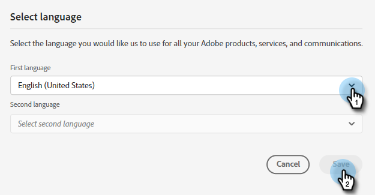

# [!DNL Dynamic Chat] Overzicht {#dynamic-chat-overview}

Met Dynamic Chat kunt u een gebruiksvriendelijke interface gebruiken voor zowel personen als accounts die uw website bezoeken. Verzamel relevante inhoud, zoals naam, contactgegevens en vrije tekst. De bezoekers van de plaats kunnen ook met een levende agent en zelfs boekvergaderingen met uw Team van de Verkoop chatten. Gegevens over Dynamic Chat-activiteiten en -betrokkenheid kunnen worden gebruikt om leden toe te voegen aan Marketo-programma&#39;s en om activiteiten via meerdere kanalen te activeren.

>[!TIP]
>
>Bezoek [&#x200B; deze pagina &#x200B;](https://experienceleague.adobe.com/docs/marketo-learn/tutorials/dynamic-chat/dynamic-chat-overview.html?lang=nl-NL){target="_blank"} om zelfstudievideo&#39;s van Dynamic Chat te bekijken.

## Integraties {#integrations}

Een belangrijk onderdeel van Dynamic Chat is de mogelijkheid om native verbinding te maken met uw Marketo-abonnement. Als u de volledige mogelijkheden van deze integratie wilt benutten, moet u eerst de gegevenssynchronisatie starten. Afhankelijk van de grootte van uw gegevensbestand van Marketo, kan het tot 24 uren voor gegevens voor de aanvankelijke, [&#x200B; eenmalig synchronisatie &#x200B;](/help/marketo/product-docs/demand-generation/dynamic-chat/integrations/adobe-marketo-engage.md){target="_blank"} vergen om te voltooien.

Het volgende wordt gesynchroniseerd:

* Persoonsveldgegevens
* Bedrijfsveldgegevens
* Activiteitsgegevens

## Dialoogvensters {#dialogues}

Dialoogvensters vertegenwoordigen één chatgesprek. Beschouw het als een container met alle informatie die u nodig hebt om een aansprekende chatdialoog met uw websitebezoekers te voeren. In elk dialoogvenster kunt u opgeven op welke pagina(&#39;s) u het dialoogvenster wilt weergeven, aan wie u het dialoogvenster wilt laten weergeven, en kunt u de inhoud en de stroom van het dialoogvenster zelf opgeven. Bovendien kunt u metriek vinden om te zien hoe goed uw Dialoog presteert. [&#x200B; leer meer over Dialogen &#x200B;](/help/marketo/product-docs/demand-generation/dynamic-chat/automated-chat/dialogue-overview.md){target="_blank"}.

## Configuratie {#configuration}

In het lusje van de Configuratie, pas de blik en het gevoel van uw diverse Dialogen aan. Wijzig lettertype, kleuren, responstijd en meer! [&#x200B; leer meer over Configuratie &#x200B;](/help/marketo/product-docs/demand-generation/dynamic-chat/setup-and-configuration/configuration.md){target="_blank"}.

## Kalender {#calendar}

Verbind uw Vooruitzichten of Gmail kalender voor gebruik in benoeming die in het praatje plant. [&#x200B; leer meer over Kalender &#x200B;](/help/marketo/product-docs/demand-generation/dynamic-chat/setup-and-configuration/agent-settings.md#connect-calendar){target="_blank"}

## Vergaderingen {#meetings}

Hier ziet u alle afspraken die door websitebezoekers zijn gepland via uw verschillende dialoogvensters. [&#x200B; leer meer over Vergaderingen &#x200B;](/help/marketo/product-docs/demand-generation/dynamic-chat/meeting-list.md){target="_blank"}

## Routering {#routing}

Dit is waar u een lijst van alle agenten kunt zien die hun kalenders hebben aangesloten, welke orde zij aan websitebezoekers zullen worden voorgesteld, en douane het verpletteren regels tot stand brengen. [&#x200B; leer meer over het Verpletteren &#x200B;](/help/marketo/product-docs/demand-generation/dynamic-chat/setup-and-configuration/routing.md){target="_blank"}

## Live Chat {#live-chat}

Bied uw gekwalificeerde Webbezoekers aan om met uw verkoopvertegenwoordigers via [&#x200B; levend praatje &#x200B;](/help/marketo/product-docs/demand-generation/dynamic-chat/live-chat/live-chat-overview.md){target="_blank"} te verbinden.

## Conversatievloeistroom {#conversational-flow}

[&#x200B; Ontwerp een gesprek &#x200B;](/help/marketo/product-docs/demand-generation/dynamic-chat/automated-chat/conversational-flow-overview.md){target="_blank"} dat door een bezoeker kan worden teweeggebracht die op een actie wordt gebaseerd u aanwijst (b.v., die een vorm invullen, een verbinding, enz. klikken).

## Generatieve AI {#generative-ai}

[&#x200B; Generatieve AI &#x200B;](/help/marketo/product-docs/demand-generation/dynamic-chat/generative-ai/overview.md){target="_blank"} in Adobe Dynamic Chat verwerkt intent signalen, gebruikersvoorkeur, en voorbij gedrag in echt - tijd om relevante, gepersonaliseerde berichten voor praatjebezoekers te produceren.

## De taal wijzigen {#changing-the-language}

Voer de onderstaande stappen uit om uw Dynamic Chat-taal te wijzigen.

>[!IMPORTANT]
>
>Het veranderen van uw taal op het profielniveau zal de taal voor _alle_ toepassingen van Experience Cloud, niet alleen [!DNL Dynamic Chat] veranderen.

1. Klik in uw Experience Cloud-account op het instellingenpictogram en kies **[!UICONTROL Preferences]** .

   

1. Klik op de huidige taal onder uw e-mailadres.

   

1. Kies de nieuwe taal (de tweede taal is optioneel) en klik op **[!UICONTROL Save]** .

   

   >[!NOTE]
   >
   >Er zijn echter enkele tientallen talen die u kunt kiezen uit [!DNL Dynamic Chat] , die alleen het volgende ondersteunen: Engels, Frans, Duits, Japans, Spaans, Italiaans, Braziliaans Portugees, Koreaans, Vereenvoudigd Chinees en Traditioneel Chinees.

Wanneer u de taal bijwerkt, verandert alles in de app zelf, behalve de woorden die u persoonlijk hebt ingevuld (bijvoorbeeld reacties op de stream).

## Limieten voor Dynamic Chat-gegevensbewaring {#dynamic-chat-data-retention-limits}

Hieronder staan slechts enkele limieten/parameters in Dynamic Chat. Voor een volledige lijst, gelieve de Marketo Engage [&#x200B; pagina van de Beschrijving van het Product &#x200B;](https://helpx.adobe.com/nl/legal/product-descriptions/adobe-marketo-engage---product-description.html){target="_blank"} te zien.

<table>
  <th>Gegevenstype</th>
  <th>Bewaarperiode</th>
 <tr>
  <td>Anonieme lead zonder betrokkenheid</td>
  <td>90 dagen</td>
 </tr>
 <tr>
  <td>Goederenactiviteit</td>
  <td>24 maanden</td>
 </tr>
 <tr>
  <td>Documentactiviteit</td>
  <td>24 maanden</td>
 </tr>
 <tr>
  <td>Geïnteractiveerd met dialoogactiviteit</td>
  <td>90 dagen</td>
 </tr>
 <tr>
  <td>Boekingactiviteit vergadering</td>
  <td>24 maanden</td>
 </tr>
</table>

## Veelgestelde vragen {#faq}

Gelieve te zien [&#x200B; FAQ van Dynamic Chat &#x200B;](/help/marketo/product-docs/demand-generation/dynamic-chat/faq.md){target="_blank"}.
