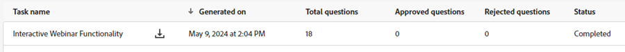

# Vragengeneratie {#question-generation}

Bekijk al uw taken en de bijbehorende details, zoals het tijdstip waarop deze zijn gegenereerd, het totale aantal vragen, de goedkeuringsstatus en nog veel meer.

## Vragen genereren {#generate-questions}

1. Klik onder Generative AI op **Bijgewerkte reacties**.

   

1. Klikken **Vragen genereren**.

   

1. Geef uw taak een naam en voer een bron-URL (maximaal 50) in waaruit alle inhoud wordt geëxtraheerd. Voer de gewenste onderwerpen/trefwoorden in en druk op Enter op het toetsenbord. Klik wanneer gereed **Genereren**.

   

   >[!IMPORTANT]
   >
   >Om ervoor te zorgen dat Marketo Engage inhoud van verstrekte URLs kan schrapen, moet u verscheidene IP adressen eerst lijsten van gewenste personen. [Zie hieronder voor meer informatie](#ip-addresses-to-allowlist).

1. Op basis van uw inhoud kan het genereren van vragen en antwoorden tot 30 minuten duren. Klikken **OK**.

   

>[!TIP]
>
>De status op de pagina wordt niet in real-time bijgewerkt. Druk op Vernieuwen om te zien wanneer het van &quot;Verwerken&quot; naar &quot;Voltooien&quot; gaat.

## Vragen en antwoorden downloaden {#download-questions-and-responses}

>[!NOTE]
>
>Gegenereerde vragen en antwoorden kunnen ook worden weergegeven in het dialoogvenster [Responsbibliotheek](/help/marketo/product-docs/demand-generation/dynamic-chat/generative-ai/response-library.md).

1. Zoek de gewenste taak en klik op het downloadpictogram naast de naam ervan.

   

1. Zoek de downloadmap in uw browser en selecteer het bestand. Dit kan er anders uitzien, afhankelijk van uw browser.

   

1. In het Excel-bestand **Taakdetails** Hierin worden verschillende details over de taak weergegeven, waaronder instructies over het toevoegen/bewerken van vragen en/of antwoorden.

   

   >[!NOTE]
   >
   >Als u toch besluit om vragen en/of antwoorden in bulk te bewerken, [leren hoe u ze hier opnieuw kunt uploaden](/help/marketo/product-docs/demand-generation/dynamic-chat/generative-ai/response-library.md).

1. De **Vragen en antwoorden** bevat aanvullende details, zoals de gegenereerde vragen en antwoorden.

   

## IP Adressen aan Lijst van gewenste personen {#ip-addresses-to-allowlist}

Zorg ervoor dat alle IP-adressen hieronder door uw webteam zijn gevoegd op lijst van gewenste personen om ervoor te zorgen dat de inhoud van uw URL&#39;s kan worden opgehaald tijdens het genereren van vragen en antwoorden.

<table width="150">
  <tr>
    <td>20 167 0 149</td>
  </tr>
  <tr>
    <td>20 248 129 111</td>
  </tr>
  <tr>
    <td>20 167 0 146</td>
  </tr>
  <tr>
    <td>Op 20.167.0.2005</td>
  </tr>
  <tr>
    <td>20 248 135 80</td>
  </tr>
  <tr>
    <td>20 92 173 115</td>
  </tr>
  <tr>
    <td>Op 20.167.0.195</td>
  </tr>
  <tr>
    <td>20 248 128 31</td>
  </tr>
  <tr>
    <td>20 167 148</td>
  </tr>
  <tr>
    <td>20 167 163</td>
  </tr>
  <tr>
    <td>20 167 192</td>
  </tr>
  <tr>
    <td>20 167 1 155</td>
  </tr>
  <tr>
    <td>20 248 135 132</td>
  </tr>
  <tr>
    <td>20 248 135 108</td>
  </tr>
  <tr>
    <td>20 248 134 140</td>
  </tr>
  <tr>
    <td>20 167 1 242</td>
  </tr>
  <tr>
    <td>Op 20.167.0.1988</td>
  </tr>
  <tr>
    <td>20 248 133 185</td>
  </tr>
  <tr>
    <td>20 248 134 190</td>
  </tr>
  <tr>
    <td>20 167 1 254</td>
  </tr>
  <tr>
    <td>20 248 128 118</td>
  </tr>
  <tr>
    <td>20 248 131 252</td>
  </tr>
  <tr>
    <td>20 167 0 188</td>
  </tr>
  <tr>
    <td>Op 20.16.2011</td>
  </tr>
  <tr>
    <td>20 211 64 11</td>
  </tr>
  <tr>
    <td>20 76 243,87</td>
  </tr>
  <tr>
    <td>20.76.244.212</td>
  </tr>
  <tr>
    <td>20 76 245,48</td>
  </tr>
  <tr>
    <td>20 76 245,76</td>
  </tr>
  <tr>
    <td>20 76 246,63</td>
  </tr>
  <tr>
    <td>20 76 246 146</td>
  </tr>
  <tr>
    <td>20 76 246 248</td>
  </tr>
  <tr>
    <td>20 76 247,92</td>
  </tr>
  <tr>
    <td>20 76 247 134</td>
  </tr>
  <tr>
    <td>20 76 247 244</td>
  </tr>
  <tr>
    <td>20 93 168 10</td>
  </tr>
  <tr>
    <td>20 93 168,44</td>
  </tr>
  <tr>
    <td>20 93 168 137</td>
  </tr>
  <tr>
    <td>20 93 169 20</td>
  </tr>
  <tr>
    <td>20 93 169 115</td>
  </tr>
  <tr>
    <td>20 93 169 214</td>
  </tr>
  <tr>
    <td>20 93 170 130</td>
  </tr>
  <tr>
    <td>20 93 170 138</td>
  </tr>
  <tr>
    <td>20 93 170 149</td>
  </tr>
  <tr>
    <td>20 93 172 63</td>
  </tr>
  <tr>
    <td>20 93 173 217</td>
  </tr>
  <tr>
    <td>20 93 173 243</td>
  </tr>
  <tr>
    <td>20 93 174 120</td>
  </tr>
  <tr>
    <td>20 93 174 159</td>
  </tr>
  <tr>
    <td>20 105 224,16</td>
  </tr>
  <tr>
    <td>20.10.235.102</td>
  </tr>
  <tr>
    <td>20.10.235.103</td>
  </tr>
  <tr>
    <td>20.10.235.143</td>
  </tr>
  <tr>
    <td>20.10.235.146</td>
  </tr>
  <tr>
    <td>20.10.235.147</td>
  </tr>
  <tr>
    <td>20.10.235.148</td>
  </tr>
  <tr>
    <td>20.10.235.188</td>
  </tr>
  <tr>
    <td>20.10.235.189</td>
  </tr>
  <tr>
    <td>20.10.235.246</td>
  </tr>
  <tr>
    <td>20.10.235.248</td>
  </tr>
  <tr>
    <td>20 10 235 255</td>
  </tr>
  <tr>
    <td>20.10.236,96</td>
  </tr>
  <tr>
    <td>20.10.236,97</td>
  </tr>
  <tr>
    <td>20.10.236.110</td>
  </tr>
  <tr>
    <td>20.10.236.111</td>
  </tr>
  <tr>
    <td>20.10.235.254</td>
  </tr>
  <tr>
    <td>20 10 236 138</td>
  </tr>
  <tr>
    <td>20.10.236.139</td>
  </tr>
  <tr>
    <td>20.10.236.140</td>
  </tr>
  <tr>
    <td>20 10 236 141</td>
  </tr>
  <tr>
    <td>20.10.236,84</td>
  </tr>
  <tr>
    <td>20.10.236,85</td>
  </tr>
  <tr>
    <td>20 10 236 86</td>
  </tr>
  <tr>
    <td>20 10 236 87</td>
  </tr>
  <tr>
    <td>20 119 144,14</td>
  </tr>
  <tr>
    <td>20.75.41.107</td>
  </tr>
  <tr>
    <td>20 75 43 104</td>
  </tr>
  <tr>
    <td>20.75.43.107</td>
  </tr>
  <tr>
    <td>20 75 43 113</td>
  </tr>
  <tr>
    <td>20 75 43 124</td>
  </tr>
  <tr>
    <td>Op 20.75.43.2004</td>
  </tr>
  <tr>
    <td>Op 20.75.43.2007</td>
  </tr>
  <tr>
    <td>20 75 43 214</td>
  </tr>
  <tr>
    <td>20 75 43 220</td>
  </tr>
  <tr>
    <td>20 75 44,0</td>
  </tr>
  <tr>
    <td>20 75 44,9</td>
  </tr>
  <tr>
    <td>20 75 44 52</td>
  </tr>
  <tr>
    <td>20 75 44 66</td>
  </tr>
  <tr>
    <td>20 75 44 82</td>
  </tr>
  <tr>
    <td>20.75.44.105</td>
  </tr>
  <tr>
    <td>20.75.44.108</td>
  </tr>
  <tr>
    <td>20 75 44 133</td>
  </tr>
  <tr>
    <td>20 75 44 135</td>
  </tr>
  <tr>
    <td>20 75 44 137</td>
  </tr>
  <tr>
    <td>20 75 44 147</td>
  </tr>
  <tr>
    <td>20 75 44 154</td>
  </tr>
  <tr>
    <td>20.75.44.195</td>
  </tr>
  <tr>
    <td>20.75.44.1988</td>
  </tr>
  <tr>
    <td>20 75 45 32</td>
  </tr>
  <tr>
    <td>20 119 136 14</td>
  </tr>
  <tr>
    <td>172 177 93 157</td>
  </tr>
  <tr>
    <td>52 252 22 155</td>
  </tr>
  <tr>
    <td>20 62 18 64</td>
  </tr>
  <tr>
    <td>52 179 234,0</td>
  </tr>
  <tr>
    <td>52 179 234,1</td>
  </tr>
  <tr>
    <td>52 179 237,99</td>
  </tr>
  <tr>
    <td>52 179 237 148</td>
  </tr>
  <tr>
    <td>52 252 23 246</td>
  </tr>
  <tr>
    <td>52 253 64 47</td>
  </tr>
  <tr>
    <td>52 253 64 124</td>
  </tr>
  <tr>
    <td>52 253 64 125</td>
  </tr>
  <tr>
    <td>52 253 65,84</td>
  </tr>
  <tr>
    <td>52 253 65 85</td>
  </tr>
  <tr>
    <td>52 254 103 240</td>
  </tr>
  <tr>
    <td>52 253 65 92</td>
  </tr>
  <tr>
    <td>52 253 65 93</td>
  </tr>
  <tr>
    <td>52 177 89 135</td>
  </tr>
  <tr>
    <td>52 253 69 207</td>
  </tr>
  <tr>
    <td>52 253 69 240</td>
  </tr>
  <tr>
    <td>52 167 19 211</td>
  </tr>
  <tr>
    <td>52 177 147 229</td>
  </tr>
  <tr>
    <td>40 65 238,53</td>
  </tr>
  <tr>
    <td>52 177 147 249</td>
  </tr>
  <tr>
    <td>20 44 83 102</td>
  </tr>
  <tr>
    <td>52 177 148 19</td>
  </tr>
  <tr>
    <td>20 49 97 17</td>
  </tr>
  <tr>
    <td>20.14.171,7</td>
  </tr>
  <tr>
    <td>172 177 93 157</td>
  </tr>
  <tr>
    <td>20 213 91 77</td>
  </tr>
  <tr>
    <td>20 105 150 224</td>
  </tr>
  <tr>
    <td>13.68.17.252</td>
  </tr>
</table>