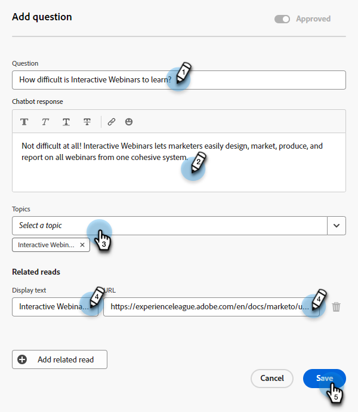

# Responsbibliotheek {#response-library}

In één plaats, bekijk al uw vragen, hun goedkeuringsstatus, en de taaknaam/het onderwerp(en) die aan hen worden toegewezen.

## Handmatig een vraag toevoegen {#manually-add-a-question}

1. Klik onder Generative AI op **Bijgewerkte reacties**.

   

1. Klik op de knop **Responsbibliotheek** tab.

   

1. Klikken **Vraag toevoegen**.

   

1. Voer uw vraag en antwoord in. Wijs een onderwerp toe en voeg een facultatieve URL toe die de gebruikers met bezoekers kunnen delen. Klikken **Opslaan** wanneer gereed.

   

1. Klik op Vernieuwen en uw nieuwe vraag wordt bovenaan weergegeven met de status &quot;Verwerken&quot;.

   

1. Klik na een paar minuten nogmaals en de status verandert in &quot;Goedgekeurd&quot;.

   

## Een individuele vraag/antwoord bewerken {#generate-a-new-question}

>[!NOTE]
>
>Aan alle gegenereerde vragen en antwoorden wordt standaard de status &#39;need review&#39; toegewezen. Alleen &quot;goedgekeurde&quot; vragen en antwoorden worden beschikbaar gesteld voor chatbezoekers.

1. In de **Responsbibliotheek** klikt u op de gewenste vraag.

   

1. Breng de gewenste wijzigingen aan en klik op **Opslaan**.

   

## Vragen/antwoorden bulksgewijs bewerken en uploaden {#bulk-edit-and-upload-questions-responses}

Hieronder vindt u instructies voor het aanbrengen van bulkbewerkingen in het gedownloade Excel-bestand. Ze kunnen ook worden weergegeven op het tabblad Taakdetails van het bestand.

<table>
<thead>
  <tr>
    <th>Handeling</th>
    <th>Instructies</th>
  </tr>
</thead>
<tbody>
  <tr>
    <td>Een vraag bewerken</td>
    <td>Voer de nieuwe vraag in de kolom "editedQuestion" (kolom H) in</td>
  </tr>
  <tr>
    <td>Een reactie bewerken</td>
    <td>Voer de nieuwe reactie in kolom "editedResponse" (kolom I) in</td>
  </tr>
  <tr>
    <td>Nieuwe vraag toevoegen</td>
    <td>Voer de nieuwe vraag in de kolom "editedQuestion" (kolom H) in en laat questionResponseld leeg. U moet een aangewezen onderwerp in kolom "onderwerpen"(kolom C) en een bronURL in kolom "sourceUr!"ook ingaan</td>
  </tr>
  <tr>
    <td>Een vraag en antwoord toevoegen</td>
    <td>Voer de nieuwe vraag in de kolom "editedQuestion" (kolom H), de nieuwe reactie in de kolom "editedResponse" (kolom I) in en laat questionResponseld leeg. U moet een aangewezen onderwerp in kolom "onderwerpen"ook ingaan (kolom C)</td>
  </tr>
</tbody>
</table>

1. Nadat u alle gewenste wijzigingen hebt aangebracht in het bestand, gaat u terug naar het tabblad Reactiebibliotheek en klikt u op Reacties uploaden.

   

1. Voer de toepasselijke taaknaam in. Sleep het bestand en zet het neer of blader er naar op het apparaat en selecteer het. Klikken **Opslaan** wanneer gereed.

   

1. De bevestiging verschijnt en u bent allen geplaatst.

   

## Uw vragen filteren {#filter-your-questions}

Standaard worden vragen op volgorde vermeld op tijd/aanmaakdatum, waarbij de nieuwste vragen als eerste worden weergegeven. Als u een specifieke vraag zoekt, past u filters toe om uw zoekopdracht te verfijnen. Filter op onderwerpen, taaknaam en/of goedkeuringsstatus.

