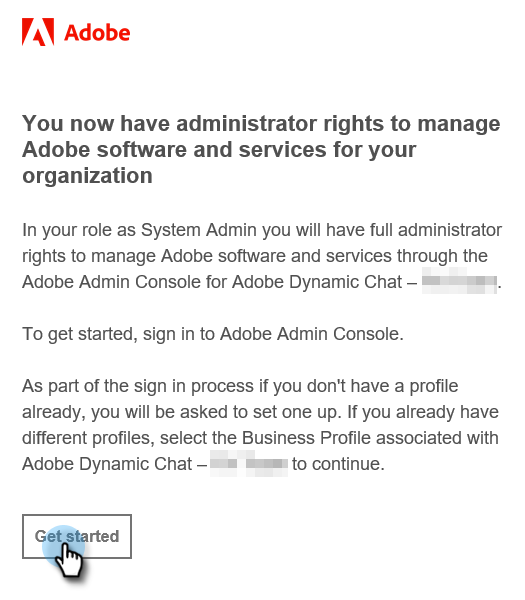

# Eerste instelling {#initial-setup}

## Access Admin Console {#access-admin-console}

Voer de onderstaande stappen uit om Dynamic Chat in te stellen.

>[!NOTE]
>
>**Beheerdersmachtigingen vereist.**

1. Nadat Dynamic Chat is ingeschakeld voor uw Marketo-instantie, ontvangt de toegewezen systeembeheerder een welkomstbericht. Klik in die e-mail op **Aan de slag**.

   

1. Als u eerder een toepassing met een Adobe ID hebt geopend, gaat u rechtstreeks naar de Adobe Admin Console. Als dat niet het geval is, [stelt u uw Adobe ID](https://helpx.adobe.com/manage-account/using/create-update-adobe-id.html) in.

   

## Gebruikers toevoegen {#add-users}

1. Nadat u zich hebt aangemeld bij de Admin Console, voegt u gebruikers toe. We hebben dat proces [gedocumenteerd hier](/help/marketo/product-docs/demand-generation/dynamic-chat/add-or-remove-chat-users.md#add-a-chat-user).

## Machtigingen toevoegen in Marketo {#add-permissions-in-marketo}

Na het toevoegen van gebruikers in binnen Admin Console, moet u toestemmingen in Marketo verlenen opdat zij tot de Dynamische kortere weg van het Praatje van Marketo toegang hebben.

1. Klik in Marketo op **Admin**.

1. Zoek en dubbelklik op de gewenste gebruiker.

1. Voeg **Dynamisch Chat benaderen** toe en klik **Opslaan**.

>[!IMPORTANT]
>
>Volg de stappen in de bovenstaande volgorde. Als iemand eerst toestemming krijgt in Marketo, ziet hij of zij de Dynamic Chat-tegel, maar heeft hij of zij geen toegang tot de gebruiker.

De volgende stap bestaat uit het [verbinden van Dynamisch Chat met Marketo](/help/marketo/product-docs/demand-generation/dynamic-chat/connect-dynamic-chat-to-marketo.md).
