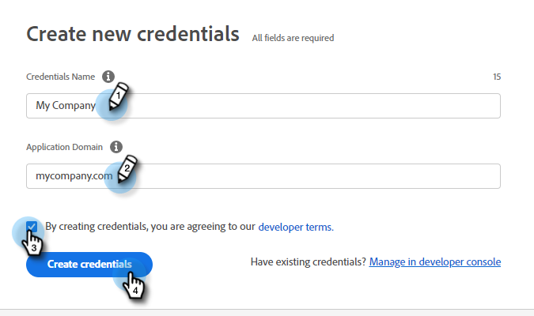

# Adobe PDF Embed-API {#adobe-pdf-embed-api}

Met de documentkaart kunt u PDF-documenten insluiten in dialoogvensters en de activiteit van bezoekers in de documentbetrokkenheid bijhouden. Hier is hoe u het kunt instellen.

1. Navigeren naar [Adobe PDF Embed-API](https://udp.adobe.io/document-services/apis/pdf-embed/){target="_blank"}.

1. Klik op **[!UICONTROL Get Credentials]**.

   

1. Meld u aan bij uw Adobe-account.

   

1. Voer uw gegevens in, accepteer de voorwaarden en klik op **[!UICONTROL Create Credentials]**.

   

   >[!IMPORTANT]
   >
   >U moet het domein gebruiken waarop u het chatbot gaat hosten (bijvoorbeeld, als u het chatbot op mycompany.com host, moet u dat in Stap 4 invoeren).

1. Klikken **[!UICONTROL Copy]** om uw client-id te kopiëren.

   

1. Terug in Dynamic Chat, klik **[!UICONTROL Integrations]**. Klik op de Adobe PDF Embed API-kaart op **[!UICONTROL Activate]**.

   

1. Plak uw [!UICONTROL Client ID] en klik op **[!UICONTROL Save]**.

   

U kunt nu de Document-kaart in uw dialoogvensters gebruiken. [Stream Designer](/help/marketo/product-docs/demand-generation/dynamic-chat/automated-chat/stream-designer.md){target="_blank"}!
