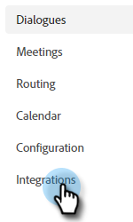

# Dynamic Chat verbinden met Marketo {#connect-dynamic-chat-to-marketo}

## Dynamic Chat verbinden {#connecting-dynamic-chat}

Nadat u de [eerste installatie](/help/marketo/product-docs/demand-generation/dynamic-chat/initial-setup.md){target="_blank"}, is het tijd om de eenmalige synchronisatie uit te voeren die de Dynamic Chat verbindt met uw Marketo-abonnement.

1. Klik in Mijn Marketo op de knop **Dynamische chat** tegel.

   

   >[!NOTE]
   >
   >Neem contact op met uw Marketo Admin als u de tegel niet ziet.

1. Als u eerder een toepassing met een Adobe ID hebt betreden, zult u direct aan Dynamic Chat worden genomen. Zo niet, [Adobe ID instellen](https://helpx.adobe.com/manage-account/using/create-update-adobe-id.html){target="_blank"}.

1. Selecteer **Integraties**.

   

1. Klik op de Marketo-kaart op **Synchronisatie starten**.

   

1. Selecteer maximaal 50 kenmerken (standaard- of aangepaste velden) van uw Marketo-instantie tot synchronisatie met Dynamic Chat voor gebruik bij doelgroepen, gegevenstoewijzing en personalisatie. Klikken **Volgende** wanneer gereed.

   

1. Bekijk uw selecties. Klikken **Bevestigen** om de synchronisatie te starten.

   

>[!NOTE]
>
>Het kan 2 tot 24 uur duren voordat de synchronisatie is voltooid, afhankelijk van de grootte van uw database.

## Een kenmerk toevoegen {#add-an-attribute}

Na de aanvankelijke synchronisatie, is hier hoe te om extra attributen toe te voegen.

1. In **Integraties**, zorg ervoor dat de **Adobe Marketo Engage** is geselecteerd en klikt u op **Kenmerk toevoegen**.

   

1. Selecteer de kenmerken die u wilt toevoegen en klik op **Volgende**.

   

1. Bekijk uw selecties en klik op **Bevestigen**.

   

## Een kenmerk verwijderen {#remove-an-attribute}

Na de aanvankelijke synchronisatie, is hier hoe te om een attribuut te verwijderen.

>[!NOTE]
>
>U zult slechts de optie zien om een attribuut te verwijderen als het momenteel niet in gebruik door enige Dialogs is.

1. In **Integraties**, zorg ervoor dat de **Adobe Marketo Engage** is geselecteerd en klikt u op het kenmerk dat u wilt verwijderen.

   

1. Klikken **Kenmerk verwijderen**.

   

>[!MORELIKETHIS]
>
>[Eerste instelling](/help/marketo/product-docs/demand-generation/dynamic-chat/initial-setup.md){target="_blank"}
