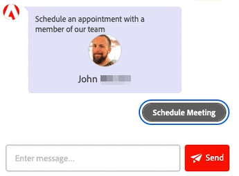

# Agent Inbox {#agent-inbox}

De agenten zullen levende chats binnen de Agent Inbox gebied. Naast de actieve gesprekken, kunnen zij vroegere gesprekken, bezoekersinformatie, en meer zien.

## Beschikbaarheid in-/uitschakelen {#availability-toggle}

Op de hoger-juiste kant van het scherm van de Agent Inbox, hebt u de optie om uw status te plaatsen beschikbaar of niet beschikbaar.

>[!IMPORTANT]
>
>**dit zal** met voeten treden de [ levende praatjebeschikbaarheid ](/help/marketo/product-docs/demand-generation/dynamic-chat/setup-and-configuration/agent-settings.md#live-chat-availability){target="_blank"} u in de Montages van de Agent vestigde. De status zal blijven tot of u het, of aan het volgende blok van tijd in uw beschikbaarheid terugschakelt.

>[!NOTE]
>
>Als u uw status instelt op niet beschikbaar, heeft dit geen invloed op actieve chats.

## Live Chatmeldingen {#live-chat-notifications}

Leer meer over berichten in het [ Levende Overzicht van het Praatje ](/help/marketo/product-docs/demand-generation/dynamic-chat/live-chat/live-chat-overview.md#live-chat-notifications){target="_blank"}.

## Gesprek {#conversations}

Op de linkerkant van het scherm van Agent Inbox, kunt u verkiezen om slechts de actieve gesprekken, of allen van hen te tonen.

>[!NOTE]
>
>Terwijl u vroegere (inactieve) gesprekken van zich en andere agenten kunt zien, zult u slechts uw eigen actieve gesprekken kunnen zien.

## Bezoekersinformatie {#visitor-information}

Op de rechterkant van het scherm van Agent Inbox, zult u (van boven tot onder) hun kunnen zien: naam, baantitel, e-mailadres, telefoonaantal, en de status van CRM. Alle informatie die niet wordt doorgegeven, wordt weergegeven als een streepje (-).

## Een sessie beëindigen {#end-a-session}

De agenten hebben de capaciteit om een zitting eenvoudig manueel te eindigen door de **zitting van het Eind** knoop naast de bezoekersinformatie te klikken.

## Sneltoetsen {#shortcuts}

>[!NOTE]
>
>Deze functie maakt deel uit van generatieve AI en is beschikbaar via het Dynamic Chat Prime-abonnement. Neem contact op met het Adobe-accountteam (uw accountmanager) voor meer informatie.

De kortere weg, die door de generatieve AI [ bibliotheek van de Reactie ](/help/marketo/product-docs/demand-generation/dynamic-chat/generative-ai/response-library.md) wordt aangedreven, is een grote manier om hulp op de vlucht te krijgen wanneer het babbelen met een bezoeker. Typ gewoon een slash (`/`) in het tekstvak en kies `ask` of `search` .

**vraag** is voor hulp met reacties op een vraag.

1. Typ of kies `/ask` in het tekstvak. Typ uw vraag en druk op Enter op het toetsenbord.

   

1. Er verschijnt een antwoord. Klik op het kopieerpictogram om het te laten plakken in het tekstvak. U kunt de tekst bewerken voordat u deze naar de bezoeker verzendt.

   

**Onderzoek** is voor hulp het vinden van pagina&#39;s met betrekking tot specifieke tekst.

1. Typ of kies `/search` in het tekstvak.

   

1. Typ wat u wilt zoeken en druk op Enter op het toetsenbord.

   

1. Toepasselijke koppelingen worden weergegeven. Klik op het kopieerpictogram om deze in het tekstvak te plakken. U kunt bewerkingen uitvoeren voordat u de gegevens naar de bezoeker verzendt.

   

## Activiteitenoverzicht {#activity-history}

Onder de bezoekersinformatie bevindt zich de activiteitengeschiedenis. Bekijk activiteitstypen en datums en bekijk zelfs chattranscripties.

>[!NOTE]
>
>Informatie wordt alleen gedurende de afgelopen 90 dagen weergegeven.

## Kalender delen {#calendar-sharing}

Onder aan het venster Live Chat bevindt zich een pictogram waarmee u de agenda van uw of een andere agent kunt delen met de chatbezoeker.

1. Klik op het kalenderpictogram.

   

1. Kies de gewenste agentenkalender en klik **verzenden**.

   

1. De bezoeker van de chat zal een vergadering kunnen boeken.

   

## Overzicht van gesprekken {#conversation-summary}

>[!NOTE]
>
>Deze functie maakt deel uit van generatieve AI en is beschikbaar via het Dynamic Chat Prime-abonnement. Neem contact op met het Adobe-accountteam (uw accountmanager) voor meer informatie.

Het Samenvatting van de Gesprek produceert een snelle samenvatting voor u in real time, met inbegrip van onderwerpen de bezoeker in heeft uitgedrukt geïnteresseerd. Deze vindt u rechtsonder in elk chatscherm.

>[!NOTE]
>
>Een voltooide Samenvatting van de Gesprek kan ook in het activiteitenlogboek van het Persoonsverslag van de bezoeker in uw Gegevensbestand van Marketo Engage worden gevonden.
