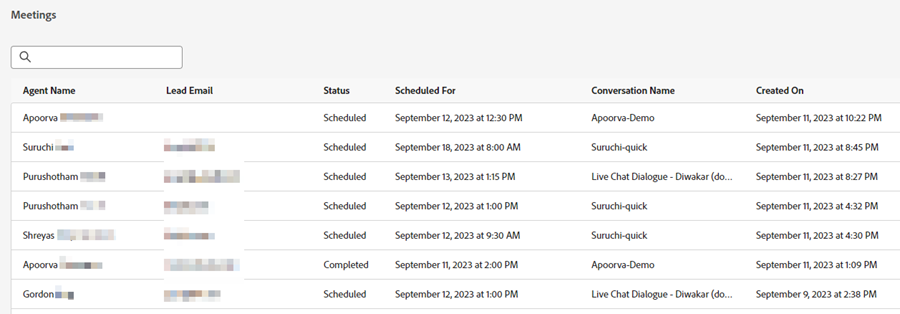

# Lijst met vergaderingen {#meeting-list}

Hier ziet u alle afspraken die door websitebezoekers zijn gepland via uw verschillende dialoogvensters. Hier zult u het e-mailadres van de persoon vinden die de benoeming boekte, welke agent zij de benoeming met boekte, wanneer de benoeming gepland is voor te komen, en of de geplande vergaderingstijd is overgegaan of niet.

>[!NOTE]
>
>Wanneer een vergadering op de kalender van een agent wordt geboekt, zal de agent een e-mailbericht over het boeken, met inbegrip van gedetailleerde informatie over de overeenkomst van Dynamic Chat van de bezoeker ontvangen.

## Mislukte meldingen van handelingen {#failed-action-notifications}

Wanneer een handeling zoals het boeken van een vergadering of een live chat mislukt, worden gebruikers via e-mail op de hoogte gesteld.

