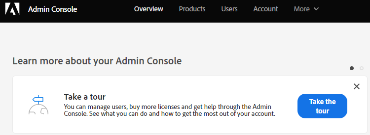

# Chatgebruikers toevoegen of verwijderen {#add-or-remove-chat-users}

Voer de onderstaande stappen uit om chatgebruikers toe te voegen of te verwijderen.

>[!NOTE]
>
>Standaard krijgen alle Marketo Engage Admins beheerdersrechten in Dynamic Chat.

## Chatgebruiker toevoegen {#add-a-chat-user}

1. Login aan [ Adobe Admin Console ](https://adminconsole.adobe.com/){target="_blank"}.

   

1. Klik op **[!UICONTROL Dynamic Chat]**.

   

   >[!NOTE]
   >
   >Als u meerdere Marketo-abonnementen hebt, selecteert u de gewenste abonnement vóór de volgende stap.

1. Klik op de tab **[!UICONTROL Users]** .

   

1. Klik op **[!UICONTROL Add User]** .

   

1. Voer de [!UICONTROL name, user group, or email address] in van de gebruiker die u wilt toevoegen. Voornaam en achternaam zijn optioneel.

   

1. Klik op het pictogram **+** en selecteer het gewenste productprofiel.

   

1. Klik op **[!UICONTROL Save]**.

   

   >[!NOTE]
   >
   >Nadat u een gebruiker in de Adobe Admin Console toevoegt, zou het tot twee uren voor hen kunnen vergen om op de pagina van het Beheer van de Agent van Dynamic Chat te verschijnen.

## Dynamic Chat Access toevoegen aan Marketo Role {#add-dynamic-chat-access-to-marketo-role}

Als de nieuwe Marketo-rol van de chatgebruiker nog geen [!DNL Dynamic Chat] -machtiging heeft, gaat u als volgt te werk om deze toe te voegen.

1. Klik in Marketo op **[!UICONTROL Admin]** en selecteer **[!UICONTROL Users & Roles]** .

   

1. Klik op de tab **[!UICONTROL Roles]** .

   

1. Selecteer in de lijst de rol die u wilt wijzigen en klik op **[!UICONTROL Edit Role]** .

   

1. Selecteer **[!UICONTROL Access Dynamic Chat]** en klik op **[!UICONTROL Save]** .

   

## Een chatgebruiker verwijderen {#remove-a-chat-user}

1. Login aan [ Adobe Admin Console ](https://adminconsole.adobe.com/){target="_blank"}.

   

1. Klik op **[!UICONTROL Dynamic Chat]**.

   

   >[!NOTE]
   >
   >Als u meerdere Marketo-abonnementen hebt, selecteert u de gewenste abonnement vóór de volgende stap.

1. Klik op de tab **[!UICONTROL Users]** .

   

1. Selecteer de gebruiker die u wilt verwijderen.

   

1. Klik op **[!UICONTROL Remove User]** .

   

1. Klik op **[!UICONTROL Remove User]** om te bevestigen.

   

>[!MORELIKETHIS]
>
>* [ de Gebruikers van Adobe Admin Console ](https://helpx.adobe.com/nl/enterprise/using/users.html){target="_blank"}
>* [ beheert Individueel Gebruikers ](https://helpx.adobe.com/nl/enterprise/using/manage-users-individually.html){target="_blank"}
